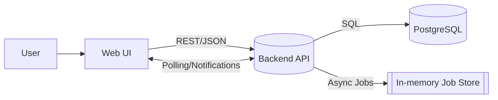

# Architecture Overview (MVP)

## Goals

- Keep it simple, maintainable, and extensible.
- Optimize for fast iteration and clear separation of concerns.
- Support core SRS features, folder/deck/card CRUD, import/export, and async jobs.

## High-Level Architecture

- Web UI (React + TypeScript)
- Backend API (Java 17 + Spring Boot 3)
- PostgreSQL 15+ (relational database)
- Optional: In‑memory job store for async operations (MVP)

## Main Components

- Frontend Web
  - Auth pages (Register/Login/Logout)
  - Folder/Deck tree and lists
  - Card editor and Review UI (SRS)
  - Import/Export flows with progress (async when large)
  - Settings (Profile, SRS)
- Backend API
  - Auth & Tokens (JWT access + refresh rotation)
  - Users/Profile/SRS settings
  - Folders/Decks/Cards (CRUD, move/copy/delete)
  - Review: session management, rating updates
  - Import/Export services (CSV/XLSX)
  - Async job orchestration + status endpoints
- Data Layer
  - Entities: users, folders, decks, cards, srs_settings, card_box_position, review_logs, refresh_tokens
  - Constraints: folder depth <= 10, unique names in scope, soft delete via deleted_at
  - Indices: (user_id, due_date, current_box), folders.path, FKs

## Key Cross-Cutting Concerns

- Security: bcrypt password hashing; HTTPS; JWT auth; refresh rotation; soft delete filtering
- Validation: input validation at API; business rule checks (depth limits, uniqueness)
- Performance: pagination, lazy loading, query indexes; async for large jobs
- Observability: structured logging, basic metrics; job progress tracking

## Deployment (MVP)

- Single backend service + PostgreSQL instance
- Containerized via Docker Compose (optional)
- Environment: dev/local and simple production

## Out of Scope (MVP)

- OAuth providers, shared/public content, real‑time collaboration, full‑blown queue/broker

## Non-Functional Targets

- P95 API < 300 ms typical; folder tree load < 300 ms
- Uptime 99.9%, daily backups, transactional integrity on critical ops

## Technology Decisions (Rationale)
- Spring Boot 3 + Java 17: mature ecosystem, strong validation, security, and JPA support.
- PostgreSQL: robust relational DB, JSON support if needed, indexing strategies for SRS queries.
- JWT + refresh rotation: stateless access tokens with secure, revocable refresh path.
- In-memory job store (MVP): fast and simple at small scale; migrate to broker later.

## Security & Auth
- Passwords: bcrypt hashing (cost 12), never log/store plaintext.
- JWT access token (15m) with claims: userId, email, iat, exp.
- Refresh token: random secret, stored hashed, rotated on use, 7-day expiry.
- Cookies: refresh token in HTTP-only, Secure, SameSite=Strict.
- CSRF: refresh endpoint uses POST only; origin/referrer checks optional; SameSite=Strict reduces risk.
- Authorization: resource ownership checks (user_id) for folders/decks/cards; soft-deleted hidden by default.

## Error Handling Strategy
- Global exception mapping → standard error JSON: { error, message, details? } with HTTP codes 400/401/403/404/409/429/500.
- Validation errors include field-level details for UI.
- Transaction boundaries ensure atomic ops (e.g., move/copy, soft-delete subtrees).

## Async Jobs (MVP)
- Use ConcurrentHashMap for job states: { status, progress, total, message, resultId? } + TTL cleanup.
- Long-running tasks: folder copy (51–500 items), deck copy (1,001–10,000 cards), large import/export.
- Progress updates: granular counters; timeouts with best-effort rollback.
- Migration path: message broker + workers when scaling out.

## Data Management
- Soft delete via deleted_at; all queries exclude soft-deleted records.
- Folder tree: materialized path + depth constraint (<= 10), indexed path column.
- Review performance: composite index (user_id, due_date, current_box), limit batch size.
- Statistics: optional denormalized tables (folder_stats) with periodic refresh.

## Observability
- Structured logs (JSON) with request ids; log slow queries and job transitions.
- Basic metrics: request latency, error rates, job throughput, DB pool metrics.
- Health checks: liveness/readiness endpoints; DB connectivity check.

## Environments & Config
- Envs: DEV/LOCAL, PROD.
- Config via env vars: DB_URL, DB_USER, DB_PASS, JWT_SECRET, REFRESH_COOKIE_NAME, JOB_TTL_MINS, IMPORT_LIMITS.
- Docker Compose for local: api + postgres; seed scripts optional.

## Scalability Considerations
- Horizontal scale backend (stateless) behind a load balancer.
- Job store: move from in-memory → external (Redis/Queue) to support multi-instance.
- DB: tune indexes; consider partitioning review logs if very large.
