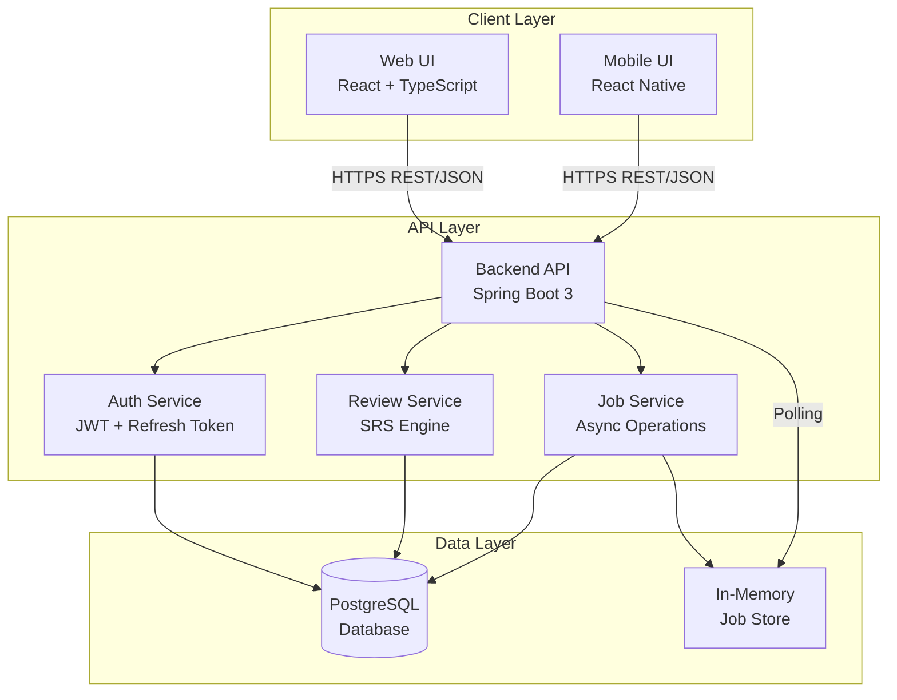

# Architecture Overview (MVP)

## Goals

- Keep it simple, maintainable, and extensible.
- Optimize for fast iteration and clear separation of concerns.
- Support core SRS features, folder/deck/card CRUD, import/export, and async jobs.
- Ensure data integrity, security, and performance for MVP scale.

## High-Level Architecture

- Web UI (React + TypeScript)
- Mobile UI (React Native) - Optional for MVP
- Backend API (Java 17 + Spring Boot 3)
- PostgreSQL 15+ (relational database)
- Optional: In‑memory job store for async operations (MVP)

## Main Components

### Frontend Web (React + TypeScript)

- **Auth Module**
  - Registration form (email, optional username, password)
  - Login form (username or email + password)
  - Token management (access token in memory, refresh token in HTTP-only cookie)
  - Auto token refresh interceptor
  - Protected route wrapper
  
- **Folder Management**
  - Hierarchical tree view (max depth 10)
  - Breadcrumb navigation
  - CRUD operations (create, rename, move, copy, delete)
  - Materialized path visualization
  - Folder statistics (recursive counts)
  
- **Deck Management**
  - Deck list view (paginated)
  - Deck details and metadata
  - CRUD operations
  - Move and copy operations (sync/async)
  
- **Card Management**
  - Card list (paginated)
  - Card editor (Front/Back text)
  - Validation (max 5,000 chars per side)
  - Bulk operations UI
  
- **Review Module (SRS)**
  - Review session UI (card front/back reveal)
  - Rating buttons (AGAIN/HARD/GOOD/EASY)
  - Progress tracking
  - Undo/Skip functionality
  - Edit card during review
  
- **Import/Export**
  - File upload wizard (CSV/XLSX)
  - Column mapping interface
  - Progress indicator (for async operations)
  - Validation error reporting
  - Export with scope selection (ALL/DUE_ONLY)
  
- **Settings**
  - Profile management (name, timezone, language, theme)
  - Password change
  - SRS settings (boxes, daily limits, review order, forgotten card action)
  
- **Statistics**
  - Dashboard with KPIs
  - Box distribution charts
  - Streak counter
  - Review history

### Backend API (Spring Boot 3)

- **Auth Module**
  - User registration (email validation, username uniqueness check)
  - Login (username/email detection, bcrypt password verification)
  - JWT access token generation (15 minutes expiry)
  - Refresh token rotation (7 days expiry, HTTP-only cookie)
  - Logout (current device and all devices)
  - Password change (revokes all refresh tokens)
  
- **User Management**
  - Profile CRUD (name, timezone, language, theme)
  - Username management (unique constraint validation)
  - User statistics tracking
  
- **SRS Settings**
  - Default settings initialization (7 boxes, daily limits)
  - Settings CRUD (total_boxes, review_order, daily limits, forgotten_card_action)
  - Box interval configuration
  
- **Folder Management**
  - Folder CRUD with depth validation (max 10)
  - Materialized path management
  - Move operation (cycle prevention, depth check)
  - Copy operation (sync ≤50 items, async 51-500 items)
  - Soft delete (recursive)
  - Recursive statistics calculation
  
- **Deck Management**
  - Deck CRUD (folder-scoped or root-level)
  - Unique name validation per folder
  - Move and copy operations
  - Soft delete
  
- **Card Management**
  - Card CRUD (Front/Back validation)
  - Soft delete
  - Bulk operations support
  
- **Review Service**
  - Session creation (scope: DECK or FOLDER)
  - Due card fetching (respects daily limits)
  - Card rating processing (AGAIN/HARD/GOOD/EASY)
  - SRS box algorithm execution
  - Due date calculation based on box intervals
  - Review log creation
  - Undo operation (windowed)
  - Skip operation (no SRS change)
  
- **Import/Export Service**
  - CSV/XLSX parsing (streaming)
  - File validation (size, format, columns)
  - Batch insertion (1,000 rows per transaction)
  - Per-row error reporting
  - Export generation (CSV/XLSX)
  - Async job handling for large operations
  
- **Job Service**
  - In-memory job store (ConcurrentHashMap)
  - Job status tracking (PENDING, IN_PROGRESS, SUCCEEDED, FAILED)
  - Progress updates (percentage)
  - TTL cleanup (1 hour)
  - Job result storage (for async operations)

### Data Layer (PostgreSQL)

- **Core Entities**
  - `users`: User accounts (email, username, password_hash, profile settings)
  - `srs_settings`: User SRS configuration (boxes, limits, order, forgotten action)
  - `folders`: Folder hierarchy (parent_id, path, depth, materialized path)
  - `decks`: Card decks (folder_id nullable for root)
  - `cards`: Flashcards (front, back, deck_id)
  - `card_box_position`: SRS state per user-card (current_box, due_date)
  - `review_logs`: Review history (rating, time_taken_ms, session_id)
  - `refresh_tokens`: Refresh token storage (hashed, expiry, revocation)
  
- **Constraints & Indexes**
  - Folder depth constraint: `CHECK (depth >= 0 AND depth <= 10)`
  - Unique constraints: `users.email`, `users.username`, `folders(user_id, parent_id, name)`, `decks(user_id, folder_id, name)`
  - Foreign key constraints with CASCADE/SET NULL as appropriate
  - Critical indexes: `(user_id, due_date, current_box)` for review queries, `folders(path)` for descendant queries
  - All foreign keys indexed for performance
  
- **Soft Delete Pattern**
  - `deleted_at` timestamp column on all entities
  - All queries exclude soft-deleted records by default
  - Restore capability within 30 days
  - Permanent cleanup via background job after 30 days

## Key Cross-Cutting Concerns

### Security

- **Password Security**: bcrypt hashing (cost factor 12), never log/store plaintext
- **HTTPS**: All communications encrypted in transit
- **JWT Authentication**: Stateless access tokens (15 minutes expiry)
- **Refresh Token Rotation**: One-time use tokens, rotated on refresh, stored hashed
- **Cookie Security**: HTTP-only, Secure, SameSite=Strict for refresh tokens
- **Authorization**: Resource ownership checks (user_id) for all operations
- **CSRF Protection**: POST-only refresh endpoint, SameSite=Strict reduces risk
- **Input Validation**: Comprehensive validation at API layer
- **SQL Injection Prevention**: Parameterized queries via JPA/Hibernate

### Validation

- **API Layer**: Spring Validation annotations (@Valid, @NotNull, @Size, etc.)
- **Business Rules**: Service layer enforces business logic (depth limits, uniqueness, daily limits)
- **Database Constraints**: Unique constraints, check constraints, foreign keys
- **File Validation**: Size limits (50MB), format validation (CSV/XLSX), row limits (10,000)

### Performance

- **Pagination**: All list endpoints paginated (default: folders/decks 50, cards 100)
- **Batch Operations**: Bulk inserts in transactions (1,000 rows per transaction)
- **Indexing Strategy**: Composite indexes for common query patterns
- **Async Operations**: Background jobs for large operations (folder copy >50 items, deck copy >1,000 cards)
- **Query Optimization**: Use JOINs instead of N+1 queries, LIMIT clauses, CTEs for complex queries
- **Materialized Path**: Fast descendant queries for folder hierarchy
- **Caching**: Optional denormalized tables for statistics (folder_stats)

### Observability

- **Structured Logging**: JSON format logs with request IDs, correlation IDs
- **Metrics**: Request latency (P95 < 300ms target), error rates, job throughput, DB pool metrics
- **Health Checks**: Liveness/readiness endpoints, DB connectivity checks
- **Error Tracking**: Standardized error responses with field-level details
- **Job Progress**: Real-time progress updates for async operations

## Deployment (MVP)

- Single backend service + PostgreSQL instance
- Containerized via Docker Compose (optional)
- Environment: dev/local and simple production

## Out of Scope (MVP)

- OAuth providers, shared/public content, real‑time collaboration, full‑blown queue/broker

## Non-Functional Targets

- P95 API < 300 ms typical; folder tree load < 300 ms
- Uptime 99.9%, daily backups, transactional integrity on critical ops

## Technology Decisions (Rationale)

- Spring Boot 3 + Java 17: mature ecosystem, strong validation, security, and JPA support.
- PostgreSQL: robust relational DB, JSON support if needed, indexing strategies for SRS queries.
- JWT + refresh rotation: stateless access tokens with secure, revocable refresh path.
- In-memory job store (MVP): fast and simple at small scale; migrate to broker later.

## Security & Auth

- Passwords: bcrypt hashing (cost 12), never log/store plaintext.
- JWT access token (15m) with claims: userId, email, iat, exp.
- Refresh token: random secret, stored hashed, rotated on use, 7-day expiry.
- Cookies: refresh token in HTTP-only, Secure, SameSite=Strict.
- CSRF: refresh endpoint uses POST only; origin/referrer checks optional; SameSite=Strict reduces risk.
- Authorization: resource ownership checks (user_id) for folders/decks/cards; soft-deleted hidden by default.

## Error Handling Strategy

- Global exception mapping → standard error JSON: { error, message, details? } with HTTP codes 400/401/403/404/409/429/500.
- Validation errors include field-level details for UI.
- Transaction boundaries ensure atomic ops (e.g., move/copy, soft-delete subtrees).

## Async Jobs (MVP)

- Use ConcurrentHashMap for job states: { status, progress, total, message, resultId? } + TTL cleanup.
- Long-running tasks: folder copy (51–500 items), deck copy (1,001–10,000 cards), large import/export.
- Progress updates: granular counters; timeouts with best-effort rollback.
- Migration path: message broker + workers when scaling out.

## Data Management

- Soft delete via deleted_at; all queries exclude soft-deleted records.
- Folder tree: materialized path + depth constraint (<= 10), indexed path column.
- Review performance: composite index (user_id, due_date, current_box), limit batch size.
- Statistics: optional denormalized tables (folder_stats) with periodic refresh.

## Observability

- Structured logs (JSON) with request ids; log slow queries and job transitions.
- Basic metrics: request latency, error rates, job throughput, DB pool metrics.
- Health checks: liveness/readiness endpoints; DB connectivity check.

## Environments & Config

- Envs: DEV/LOCAL, PROD.
- Config via env vars: DB_URL, DB_USER, DB_PASS, JWT_SECRET, REFRESH_COOKIE_NAME, JOB_TTL_MINS, IMPORT_LIMITS.
- Docker Compose for local: api + postgres; seed scripts optional.

## Scalability Considerations

### Horizontal Scaling

- **Stateless Backend**: Backend API is stateless (except in-memory job store), can scale horizontally
- **Load Balancer**: Multiple backend instances behind load balancer
- **Database Connection Pooling**: Configured connection pool for efficient DB access

### Job Store Migration Path

- **MVP**: In-memory ConcurrentHashMap (single instance only)
- **Future**: Migrate to Redis or message broker (RabbitMQ/Kafka) for multi-instance support
- **Job Persistence**: Consider persistent job store for reliability

### Database Optimization

- **Index Tuning**: Monitor query performance, add indexes as needed
- **Partitioning**: Consider partitioning `review_logs` table if it grows very large (>millions of rows)
- **Query Optimization**: Regular query analysis, EXPLAIN ANALYZE for slow queries
- **Connection Pooling**: Tune pool size based on load

### Caching Strategy

- **Statistics Caching**: Optional denormalized tables refreshed periodically
- **Session Caching**: Consider Redis for session state if needed
- **Folder Tree Caching**: Cache folder tree structure per user (invalidate on changes)

## Data Flow Patterns

### Request Flow

1. Client sends HTTP request with JWT access token
2. JWT filter validates token and extracts user context
3. Controller receives request, validates DTO
4. Service layer executes business logic
5. Repository layer executes database queries
6. Response serialized as JSON and returned to client

### Async Job Flow

1. Client initiates large operation (copy folder/deck, import cards)
2. Service determines sync vs async mode based on size thresholds
3. For async: Job enqueued in in-memory store, job_id returned (202 Accepted)
4. Background worker processes job in chunks
5. Progress updates written to job store
6. Client polls job status endpoint
7. On completion: Success notification, result_id returned

### Review Session Flow

1. Client requests review session (scope: DECK or FOLDER)
2. Service fetches due cards (respects daily limits, ordering)
3. Session created with card queue
4. Client fetches next card
5. User rates card (AGAIN/HARD/GOOD/EASY)
6. Service applies SRS algorithm, updates box/due_date, logs review
7. Next card returned or session complete
8. Undo available within time window (restores previous state)
