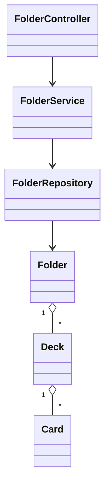

# Module Structure (MVP)

## Backend Modules (Spring Boot)

- auth
  - Endpoints: register, login, refresh, logout(s)
  - JWT issue/verify; refresh token rotation; bcrypt hashing
- users
  - Profile CRUD (name, timezone, language, theme)
  - SRS settings CRUD (total_boxes, daily limits, order, forgotten policy)
- folders
  - CRUD; rename/move/copy/delete (soft)
  - Depth <= 10; materialized path; recursive stats
- decks
  - CRUD; move/copy/delete (soft)
  - Unique per folder; root‑level supported
- cards
  - CRUD; soft delete; per‑deck ownership
- review
  - Start session (by deck/folder); fetch due cards (<= today)
  - Rate card (AGAIN/HARD/GOOD/EASY); update boxes/due dates
  - Undo, Skip; session lifecycle
- import_export
  - Import CSV/XLSX with validation, batching, duplicate policy
  - Export CSV/XLSX; ALL or DUE_ONLY; streaming
- jobs
  - Lightweight in‑memory job store (status, progress, TTL cleanup)
  - Used by folder/deck copy and import/export
- stats
  - User statistics (streak, totals, trends)
  - Folder/deck recursive metrics; box distribution

## Backend Layers

- Controller (REST): request/response mapping, validation
- Service: business rules (depth, uniqueness, limits), transactions
- Repository: JPA queries, indexes, pagination
- DTO/Mapper: entity ↔ DTO
- Config/Security: JWT filters, CORS, exception handling

## Frontend Modules (React + TS)

- auth: forms, token handling, protected routes
- folders: tree view, breadcrumb, modals (create/rename/move/copy/delete)
- decks: list, details, actions
- cards: list/editor (Front/Back), validation
- review: SRS session UI (front/back reveal, rating, undo/skip)
- importExport: upload wizard, mapping hints, progress display
- settings: profile + SRS settings forms
- stats: dashboard cards and simple charts
- lib: API client, hooks, state (Zustand/TanStack Query), error toasts

## Entities (Simplified)

- User(id, email, password_hash, name, timezone, language, theme, created_at, updated_at)
- SrsSettings(user_id, total_boxes, review_order, new_cards_per_day, max_reviews_per_day, forgotten_card_action, notification_enabled, notification_time)
- Folder(id, user_id, parent_id?, name, description?, path, depth, deleted_at?, created_at, updated_at)
- Deck(id, user_id, folder_id?, name, description?, deleted_at?, created_at, updated_at)
- Card(id, deck_id, front, back, deleted_at?, created_at, updated_at)
- CardBoxPosition(user_id, card_id, current_box, due_date)
- ReviewLog(id, user_id, card_id, session_id, rating, time_taken_ms, created_at)
- RefreshToken(id, user_id, token_hash, expires_at, revoked_at?)

## Validation & Constraints (Key)

- Folder depth <= 10; unique name per parent; trim names
- Deck name unique per folder (root treated as a folder)
- Card Front/Back required, <= 5000 chars
- Copy limits: folder <= 500 items; deck <= 10,000 cards (async thresholds applied)
- Import: file <= 50MB, rows <= 10,000; required columns Front/Back
- Export: max 50,000 rows; async > 5,000

## Class & Layer Diagram (Simplified)

## Transactions & Concurrency
- Create/Rename/Delete: short transaction per entity.
- Move folder: transaction updating parent_id, path, depth for subtree; optimistic locking/version recommended.
- Copy: sync path wrapped in a transaction; async path uses chunked transactions per batch.
- Import: batch transactions (~1k rows) to balance throughput and lock times.
- Undo rating: short transaction restoring prior SRS state and adjusting logs.

## Error Mapping (Common)
- 400 Bad Request: validation errors (fields included in response).
- 401 Unauthorized: missing/expired JWT.
- 403 Forbidden: resource ownership violations.
- 404 Not Found: missing IDs or filtered (soft-deleted) records.
- 409 Conflict: optimistic lock/version mismatch, duplicate name within parent.
- 413 Payload Too Large: file size > limits (import).
- 429 Too Many Requests: rate limiting (future).
- 500 Internal Server Error: unhandled exceptions.

## Naming & IDs
- IDs: UUID (v4) for entities and jobs.
- Timestamps: UTC in backend; convert to user timezone on display.
- Slugs/paths: internal materialized path uses UUIDs for robustness.
