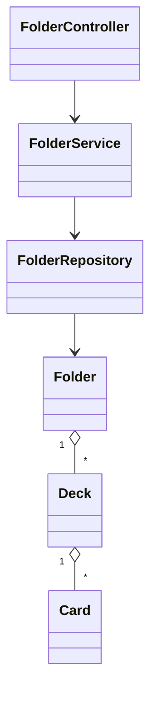

# Module Structure (MVP)

## Backend Modules (Spring Boot)

### auth Module
**Purpose**: Authentication and authorization

- **Endpoints**:
  - `POST /api/auth/register` - User registration
  - `POST /api/auth/login` - User login (username/email)
  - `POST /api/auth/refresh` - Refresh access token
  - `POST /api/auth/logout` - Logout current device
  - `POST /api/auth/logout-all` - Logout all devices
  
- **Components**:
  - `AuthController`: REST endpoints
  - `AuthService`: Business logic (registration, login, token management)
  - `JwtTokenProvider`: JWT generation and validation
  - `RefreshTokenService`: Refresh token rotation and management
  - `PasswordEncoder`: bcrypt password hashing (cost factor 12)
  - `JwtAuthenticationFilter`: JWT token validation filter
  
- **Key Features**:
  - Email uniqueness validation
  - Username uniqueness validation (case-sensitive)
  - Username/email detection in login
  - Refresh token rotation (one-time use)
  - Refresh token stored in HTTP-only cookie

### users Module
**Purpose**: User profile and settings management

- **Endpoints**:
  - `GET /api/users/me` - Get current user profile
  - `PATCH /api/users/me` - Update profile (name, timezone, language, theme)
  - `PATCH /api/users/me/password` - Change password
  - `GET /api/users/me/stats` - Get user statistics
  
- **Components**:
  - `UserController`: REST endpoints
  - `UserService`: Profile management logic
  - `PasswordService`: Password change logic (revokes all refresh tokens)
  - `UserRepository`: Data access layer
  
- **Key Features**:
  - Profile update with validation
  - Username management (unique constraint)
  - Password change with token revocation
  - Timezone and locale management

### srs_settings Module
**Purpose**: Spaced Repetition System configuration

- **Endpoints**:
  - `GET /api/srs-settings` - Get user SRS settings
  - `PATCH /api/srs-settings` - Update SRS settings
  
- **Components**:
  - `SrsSettingsController`: REST endpoints
  - `SrsSettingsService`: Settings CRUD logic
  - `SrsSettingsRepository`: Data access layer
  
- **Key Features**:
  - Default settings initialization (7 boxes, daily limits)
  - Settings validation (total_boxes 3-10, daily limits > 0)
  - Forgotten card action configuration (MOVE_TO_BOX_1, MOVE_DOWN_N_BOXES, REPEAT_IN_SESSION)
  - Review order configuration (DUE_DATE_ASC, RANDOM, CURRENT_BOX_ASC)

### folders Module
**Purpose**: Folder hierarchy management

- **Endpoints**:
  - `GET /api/folders?parentId=...` - List folders/decks (paginated)
  - `POST /api/folders` - Create folder
  - `PATCH /api/folders/{folderId}` - Rename/update folder
  - `POST /api/folders/{folderId}/move` - Move folder
  - `POST /api/folders/{folderId}/copy` - Copy folder (sync/async)
  - `DELETE /api/folders/{folderId}` - Soft delete folder
  - `GET /api/folders/{folderId}/stats` - Recursive statistics
  
- **Components**:
  - `FolderController`: REST endpoints
  - `FolderService`: Business logic (CRUD, move, copy, delete)
  - `FolderRepository`: Data access with materialized path queries
  - `FolderStatisticsService`: Recursive statistics calculation
  
- **Key Features**:
  - Materialized path for fast descendant queries
  - Depth validation (max 10 levels)
  - Cycle prevention in move operations
  - Sync copy (≤50 items) vs async copy (51-500 items)
  - Recursive soft delete
  - Unique name validation per parent

### decks Module
**Purpose**: Deck management

- **Endpoints**:
  - `GET /api/decks?folderId=...` - List decks (paginated)
  - `POST /api/decks` - Create deck
  - `GET /api/decks/{deckId}` - Get deck details
  - `PATCH /api/decks/{deckId}` - Update deck
  - `POST /api/decks/{deckId}/move` - Move deck
  - `POST /api/decks/{deckId}/copy` - Copy deck (sync/async)
  - `DELETE /api/decks/{deckId}` - Soft delete deck
  
- **Components**:
  - `DeckController`: REST endpoints
  - `DeckService`: Business logic (CRUD, move, copy)
  - `DeckRepository`: Data access layer
  
- **Key Features**:
  - Unique name validation per folder (or root)
  - Root-level deck support (folder_id nullable)
  - Sync copy (≤1,000 cards) vs async copy (1,001-10,000 cards)
  - Soft delete

### cards Module
**Purpose**: Flashcard management

- **Endpoints**:
  - `GET /api/decks/{deckId}/cards?page=...` - List cards (paginated)
  - `POST /api/decks/{deckId}/cards` - Create card
  - `GET /api/cards/{cardId}` - Get card details
  - `PATCH /api/cards/{cardId}` - Update card
  - `DELETE /api/cards/{cardId}` - Soft delete card
  
- **Components**:
  - `CardController`: REST endpoints
  - `CardService`: Business logic (CRUD)
  - `CardRepository`: Data access layer
  
- **Key Features**:
  - Front/Back validation (required, max 5,000 chars)
  - Soft delete
  - Per-deck ownership

### review Module
**Purpose**: SRS review session management

- **Endpoints**:
  - `POST /api/review/sessions` - Start review session
  - `GET /api/review/sessions/{sessionId}/next` - Get next card
  - `POST /api/review/sessions/{sessionId}/rate` - Rate card (AGAIN/HARD/GOOD/EASY)
  - `POST /api/review/sessions/{sessionId}/undo` - Undo last rating
  - `POST /api/review/sessions/{sessionId}/skip` - Skip current card
  
- **Components**:
  - `ReviewController`: REST endpoints
  - `ReviewService`: Session management logic
  - `SrsAlgorithmService`: SRS box algorithm execution
  - `CardBoxPositionService`: SRS state management
  - `ReviewLogService`: Review history logging
  
- **Key Features**:
  - Session creation (scope: DECK or FOLDER)
  - Due card fetching (respects daily limits)
  - Rating processing with SRS algorithm
  - Box advancement/regression logic
  - Due date calculation based on box intervals
  - Undo operation (windowed, restores previous state)
  - Skip operation (no SRS state change)
  - Review log creation

### import_export Module
**Purpose**: Bulk card import/export

- **Endpoints**:
  - `POST /api/decks/{deckId}/import` - Import cards from CSV/XLSX
  - `GET /api/decks/{deckId}/export?format=...&scope=...` - Export cards
  
- **Components**:
  - `ImportExportController`: REST endpoints
  - `CardImportService`: CSV/XLSX parsing and validation
  - `CardExportService`: Export generation (CSV/XLSX)
  - `ImportValidator`: File and row validation
  
- **Key Features**:
  - CSV/XLSX format support
  - File size validation (max 50MB)
  - Row limit validation (max 10,000 rows)
  - Column mapping (Front, Back required)
  - Per-row validation and error reporting
  - Batch insertion (1,000 rows per transaction)
  - Async mode for large imports
  - Export scope selection (ALL/DUE_ONLY)

### jobs Module
**Purpose**: Async job management

- **Endpoints**:
  - `GET /api/jobs/{jobId}` - Get job status
  
- **Components**:
  - `JobController`: REST endpoints
  - `JobService`: Job store management
  - `JobStore`: In-memory job storage (ConcurrentHashMap)
  - Background workers for async operations
  
- **Key Features**:
  - Job status tracking (PENDING, IN_PROGRESS, SUCCEEDED, FAILED)
  - Progress updates (percentage)
  - TTL cleanup (1 hour)
  - Used by folder/deck copy and import/export

### stats Module
**Purpose**: Statistics and analytics

- **Endpoints**:
  - `GET /api/users/me/stats` - User statistics
  - `GET /api/stats/box-distribution?scopeType=...&scopeId=...` - Box distribution
  
- **Components**:
  - `StatisticsController`: REST endpoints
  - `UserStatisticsService`: User-level statistics
  - `FolderStatisticsService`: Recursive folder statistics
  - `BoxDistributionService`: Box distribution calculation
  
- **Key Features**:
  - User statistics (streak, totals, trends)
  - Folder/deck recursive metrics
  - Box distribution charts
  - Due cards counting

## Backend Layers

### Controller Layer (REST API)
**Responsibility**: HTTP request/response handling, input validation

- Receives HTTP requests
- Validates request DTOs using Spring Validation annotations
- Maps HTTP requests to service method calls
- Maps service results to HTTP responses
- Handles HTTP status codes
- Exception handling via `@ControllerAdvice`

**Example Flow**:
```java
@RestController
@RequestMapping("/api/folders")
public class FolderController {
    @PostMapping
    public ResponseEntity<FolderDto> createFolder(@Valid @RequestBody CreateFolderDto dto) {
        // Validate input, call service, return response
    }
}
```

### Service Layer (Business Logic)
**Responsibility**: Business rules enforcement, transaction management

- Implements business logic
- Enforces business rules (depth limits, uniqueness, daily limits)
- Manages transactions (@Transactional)
- Coordinates between repositories
- Validates business constraints
- Handles complex operations (move, copy, async jobs)

**Key Business Rules Enforced**:
- Folder depth <= 10
- Unique names per parent
- Copy limits (folder ≤500 items, deck ≤10,000 cards)
- Daily review limits (new_cards_per_day, max_reviews_per_day)
- SRS box algorithm (AGAIN/HARD/GOOD/EASY)

### Repository Layer (Data Access)
**Responsibility**: Database queries, data persistence

- JPA/Hibernate queries
- Custom queries using JPQL or native SQL
- Pagination support
- Soft delete filtering (deleted_at IS NULL)
- Materialized path queries for folder hierarchy
- Composite indexes for performance

**Key Query Patterns**:
- Find by user_id (authorization)
- Find with soft delete exclusion
- Paginated queries (Pageable)
- Recursive queries (folder descendants)

### DTO/Mapper Layer
**Responsibility**: Entity ↔ DTO conversion

- Request DTOs (validation annotations)
- Response DTOs (data shaping)
- Entity to DTO mapping (MapStruct or manual)
- Prevents entity exposure in API
- Handles timezone conversion for display

### Configuration & Security Layer
**Responsibility**: Cross-cutting concerns

- **Security Configuration**:
  - JWT authentication filter
  - CORS configuration
  - Password encoder (bcrypt)
  - HTTP-only cookie configuration
  
- **Exception Handling**:
  - Global exception handler (@ControllerAdvice)
  - Standardized error responses
  - Field-level validation errors
  
- **Configuration**:
  - Database connection pool
  - JWT token settings
  - File upload limits
  - Async job configuration

## Frontend Modules (React + TypeScript)

### auth Module
**Purpose**: Authentication and authorization UI

- **Components**:
  - `RegisterForm`: User registration form
  - `LoginForm`: Login form (username/email + password)
  - `ProtectedRoute`: Route wrapper for authenticated routes
  - `AuthContext`: Authentication state management
  
- **Features**:
  - Form validation (email format, password strength, username format)
  - Auto token refresh interceptor
  - Token storage (access token in memory, refresh token in HTTP-only cookie)
  - Redirect handling after login/registration

### folders Module
**Purpose**: Folder hierarchy management UI

- **Components**:
  - `FolderTree`: Hierarchical tree view component
  - `Breadcrumb`: Navigation breadcrumb
  - `FolderModal`: Create/rename folder modal
  - `MoveFolderModal`: Move folder dialog
  - `CopyFolderModal`: Copy folder dialog (with progress for async)
  - `FolderStatistics`: Recursive statistics display
  
- **Features**:
  - Tree expansion/collapse
  - Drag-and-drop support (future)
  - Depth visualization (max 10 levels)
  - Real-time statistics updates

### decks Module
**Purpose**: Deck management UI

- **Components**:
  - `DeckList`: Paginated deck list view
  - `DeckCard`: Deck card component
  - `DeckDetails`: Deck details view
  - `DeckActions`: Move/copy/delete actions
  
- **Features**:
  - Filtering and sorting
  - Deck statistics display
  - Quick actions menu

### cards Module
**Purpose**: Flashcard management UI

- **Components**:
  - `CardList`: Paginated card list
  - `CardEditor`: Card editor (Front/Back text)
  - `CardForm`: Create/edit card form
  - `CardValidator`: Client-side validation
  
- **Features**:
  - Character count (max 5,000 per side)
  - Inline editing
  - Bulk selection

### review Module
**Purpose**: SRS review session UI

- **Components**:
  - `ReviewSession`: Main review session component
  - `CardDisplay`: Card front/back reveal animation
  - `RatingButtons`: AGAIN/HARD/GOOD/EASY buttons
  - `ProgressBar`: Review progress indicator
  - `UndoButton`: Undo last rating
  - `SkipButton`: Skip current card
  
- **Features**:
  - Card flip animation
  - Keyboard shortcuts (1/2/3/4 for ratings)
  - Progress tracking
  - Time tracking (time_taken_ms)
  - Undo functionality (windowed)

### importExport Module
**Purpose**: Bulk import/export UI

- **Components**:
  - `ImportWizard`: Step-by-step import wizard
  - `FileUpload`: File upload component
  - `ColumnMapping`: Column mapping interface
  - `ValidationPreview`: Preview with validation errors
  - `ProgressIndicator`: Async job progress display
  - `ExportDialog`: Export options dialog
  
- **Features**:
  - Drag-and-drop file upload
  - CSV/XLSX format detection
  - Column mapping hints
  - Per-row error display
  - Async job polling

### settings Module
**Purpose**: User settings UI

- **Components**:
  - `ProfileForm`: Profile update form
  - `PasswordForm`: Password change form
  - `SrsSettingsForm`: SRS configuration form
  - `ThemeSelector`: Theme switcher (Light/Dark/System)
  - `LanguageSelector`: Language switcher (VI/EN)
  
- **Features**:
  - Form validation
  - Real-time preview (theme)
  - Settings persistence

### stats Module
**Purpose**: Statistics and analytics UI

- **Components**:
  - `Dashboard`: Main dashboard with KPIs
  - `StreakCounter`: Consecutive study days
  - `BoxDistributionChart`: Box distribution visualization
  - `ReviewHistory`: Review history timeline
  
- **Features**:
  - Chart visualization (recharts or similar)
  - Time range filtering
  - Export statistics

### lib Module (Shared Utilities)
**Purpose**: Shared utilities and infrastructure

- **API Client**:
  - Axios instance with interceptors
  - Request/response transformation
  - Error handling
  
- **State Management**:
  - Zustand stores (or Redux Toolkit)
  - TanStack Query (React Query) for server state
  - Local state management
  
- **Hooks**:
  - `useAuth`: Authentication hook
  - `useFolder`: Folder operations hook
  - `useReview`: Review session hook
  - `useJob`: Async job polling hook
  
- **Utils**:
  - Error toast notifications
  - Date/time formatting (timezone-aware)
  - Form validation helpers
  - API error parsing

## Entities (Simplified)

- User(id, email, password_hash, name, timezone, language, theme, created_at, updated_at)
- SrsSettings(user_id, total_boxes, review_order, new_cards_per_day, max_reviews_per_day, forgotten_card_action, notification_enabled, notification_time)
- Folder(id, user_id, parent_id?, name, description?, path, depth, deleted_at?, created_at, updated_at)
- Deck(id, user_id, folder_id?, name, description?, deleted_at?, created_at, updated_at)
- Card(id, deck_id, front, back, deleted_at?, created_at, updated_at)
- CardBoxPosition(user_id, card_id, current_box, due_date)
- ReviewLog(id, user_id, card_id, session_id, rating, time_taken_ms, created_at)
- RefreshToken(id, user_id, token_hash, expires_at, revoked_at?)

## Validation & Constraints (Key)

- Folder depth <= 10; unique name per parent; trim names
- Deck name unique per folder (root treated as a folder)
- Card Front/Back required, <= 5000 chars
- Copy limits: folder <= 500 items; deck <= 10,000 cards (async thresholds applied)
- Import: file <= 50MB, rows <= 10,000; required columns Front/Back
- Export: max 50,000 rows; async > 5,000

## Class & Layer Diagram (Simplified)


## Transactions & Concurrency
- Create/Rename/Delete: short transaction per entity.
- Move folder: transaction updating parent_id, path, depth for subtree; optimistic locking/version recommended.
- Copy: sync path wrapped in a transaction; async path uses chunked transactions per batch.
- Import: batch transactions (~1k rows) to balance throughput and lock times.
- Undo rating: short transaction restoring prior SRS state and adjusting logs.

## Error Mapping (Common)
- 400 Bad Request: validation errors (fields included in response).
- 401 Unauthorized: missing/expired JWT.
- 403 Forbidden: resource ownership violations.
- 404 Not Found: missing IDs or filtered (soft-deleted) records.
- 409 Conflict: optimistic lock/version mismatch, duplicate name within parent.
- 413 Payload Too Large: file size > limits (import).
- 429 Too Many Requests: rate limiting (future).
- 500 Internal Server Error: unhandled exceptions.

## Naming & IDs
- IDs: UUID (v4) for entities and jobs.
- Timestamps: UTC in backend; convert to user timezone on display.
- Slugs/paths: internal materialized path uses UUIDs for robustness.
