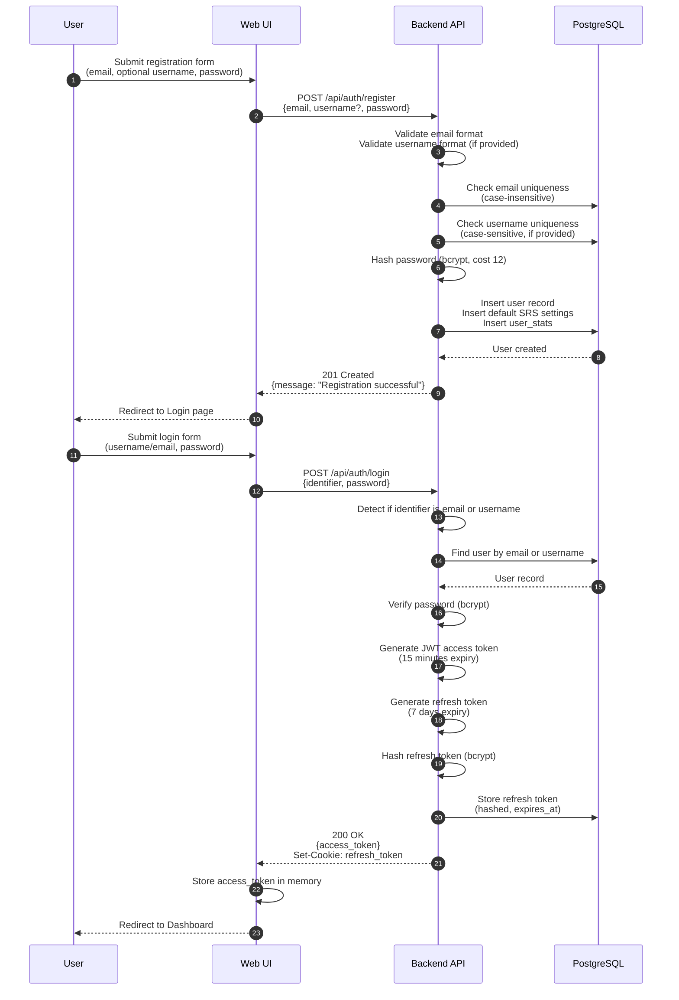
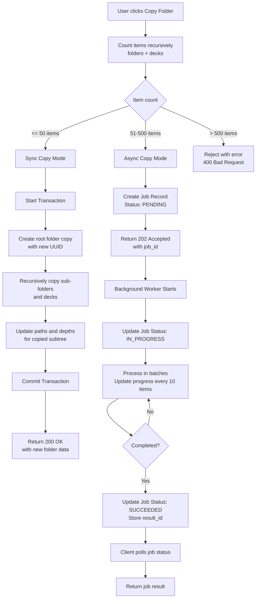
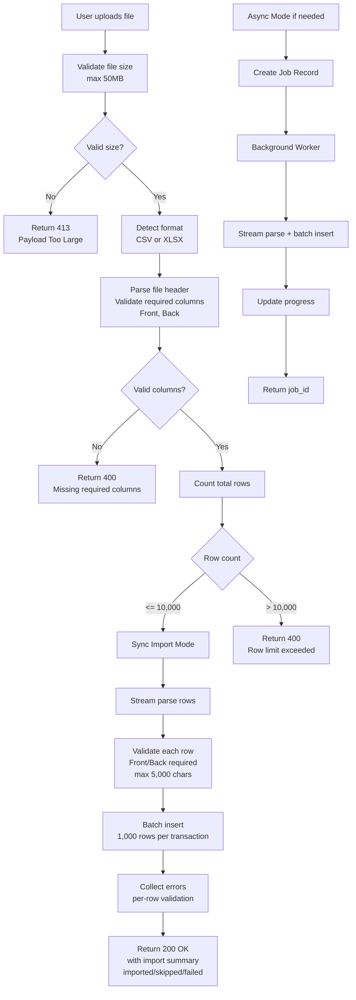

# Data Flow Diagrams (MVP)

This document captures key flows at a system level using Mermaid diagrams.

## User Registration & Login



## Folder Copy (Sync/Async)



## Import Cards (CSV/XLSX)



## Review Session & Rating

```mermaid
sequenceDiagram
  autonumber
  participant U as User
  participant FE as Web UI
  participant API as Backend API
  participant DB as PostgreSQL

  U->>FE: Start Review Session<br/>(scope: DECK or FOLDER)
  FE->>API: POST /api/review/sessions<br/>{scopeType, scopeId}
  API->>DB: Fetch user's SRS settings<br/>(daily limits, review order)
  DB-->>API: SRS settings
  API->>DB: Query due cards<br/>WHERE due_date <= today<br/>AND user_id = ?<br/>ORDER BY due_date ASC, current_box ASC<br/>LIMIT 200
  API->>DB: Check daily review count<br/>respect max_reviews_per_day
  DB-->>API: Due cards list
  API->>API: Create session queue
  API-->>FE: 200 OK<br/>{sessionId, firstCard, totalCards}
  
  U->>FE: View card Front
  FE->>FE: Start timer (time_taken_ms)
  U->>FE: Reveal card Back
  U->>FE: Rate card (GOOD)
  FE->>API: POST /api/review/sessions/{id}/rate<br/>{cardId, rating: "GOOD", timeTakenMs}
  
  API->>DB: Get current card SRS state<br/>(current_box, due_date)
  DB-->>API: Card box position
  API->>API: Apply SRS algorithm<br/>GOOD: increment box by 1<br/>Calculate new due_date
  API->>DB: Start Transaction
  API->>DB: Update card_box_position<br/>SET current_box = ?,<br/>due_date = ?,<br/>last_reviewed_at = NOW()
  API->>DB: Insert review_log<br/>(rating, time_taken_ms, session_id)
  API->>DB: Increment daily review counter
  API->>DB: Commit Transaction
  DB-->>API: Success
  API->>DB: Get next card from queue
  DB-->>API: Next card or null
  API-->>FE: 200 OK<br/>{nextCard, remaining, progress}
  
## Move Folder with Depth Validation

```mermaid
flowchart TD
  A[User requests move folder] --> B[Load source folder<br/>Load destination folder]
  B --> C{Validate ownership}
  C -->|Not owner| D[Return 403 Forbidden]
  C -->|Owner| E{Check cycle prevention}
  E -->|Moving into self| F[Return 400<br/>Cannot move into itself]
  E -->|Moving into descendant| G[Return 400<br/>Cannot move into descendant]
  E -->|Valid| H[Calculate new depth<br/>source_depth + destination_depth + 1]
  H --> I{New depth <= 10?}
  I -->|No| J[Return 400<br/>Max depth exceeded]
  I -->|Yes| K[Start Transaction]
  K --> L[Update source folder<br/>SET parent_id = destination_id<br/>SET depth = new_depth]
  L --> M[Update materialized path<br/>for source folder]
  M --> N[Recursively update paths<br/>and depths for all descendants]
  N --> O[Commit Transaction]
  O --> P[Return 200 OK<br/>with updated folder]
```
