# Data Flow Diagrams (MVP)

This document captures key flows at a system level using Mermaid diagrams.

## User Registration & Login

```mermaid
sequenceDiagram
  autonumber
  participant U as User
  participant FE as Web UI
  participant API as Backend API
  participant DB as PostgreSQL

  U->>FE: Submit registration form
  FE->>API: POST /api/auth/register
  API->>DB: Insert user (+ defaults)
  DB-->>API: OK
  API-->>FE: 201 Created
  FE-->>U: Redirect to Login

  U->>FE: Submit login form
  FE->>API: POST /api/auth/login
  API->>DB: Validate email + bcrypt(password)
  DB-->>API: User record
  API-->>FE: 200 + access_token, Set‑Cookie(refresh)
```



## Folder Copy (Sync/Async)

```mermaid
flowchart TD
  A[User clicks Copy Folder] --> B{Count items (recursive)}
  B -- <=50 --> S[Sync Copy]
  B -- 51..500 --> J[Enqueue Job]
  B -- >500 --> E[Reject]
  S --> T[Txn: Deep copy subtree]
  T --> C[Return new folder]
  J --> P[Process in background]
  P --> K[Progress updates]
  P --> D[Done -> notify]
```

## Import Cards (CSV/XLSX)

```mermaid
flowchart LR
  U[User] -->|Upload file| FE[Web UI]
  FE --> API[POST /api/decks/{id}/import]
  API --> V[Validate format/size]
  V -->|ok| M[Mode: sync or async]
  M -->|sync| B[Batch insert (1k/tx)]
  M -->|async| Q[Enqueue job]
  Q --> W[Worker: stream parse + batch insert]
  W --> R[Report: imported/skipped/failed]
  B --> R
  R --> FE
```

## Review Session & Rating


