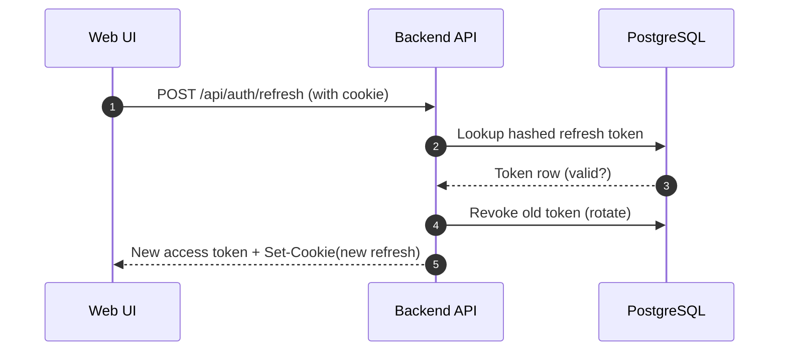
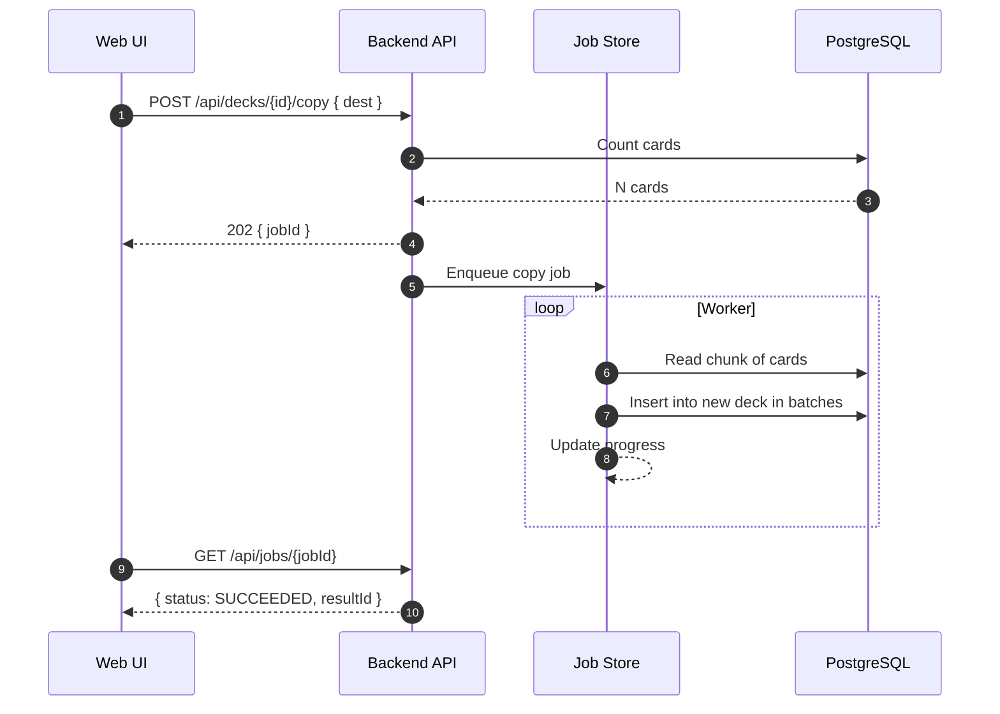
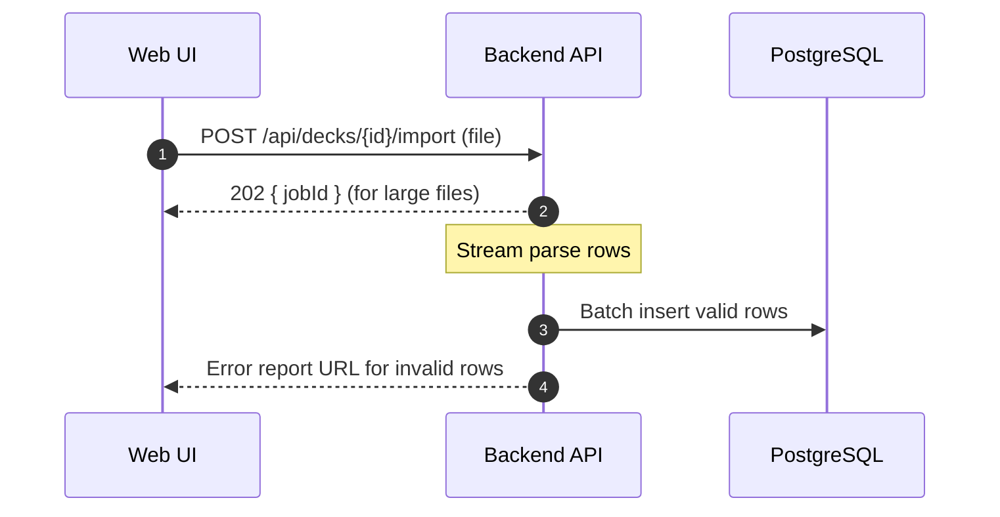

# Sequence Diagrams (MVP)

## 1) Refresh Token Rotation



## 2) Move Folder with Depth Check

```mermaid
sequenceDiagram
  autonumber
  participant FE as Web UI
  participant API as Backend API
  participant DB as PostgreSQL

  FE->>API: POST /api/folders/{id}/move { destination }
  API->>DB: Load folder + destination
  API-->>API: Validate: not self/descendant; new depth <= 10
  API->>DB: Txn: update parent_id/path/depth for subtree
  DB-->>API: OK
  API-->>FE: 200 Updated folder
```

## 3) Copy Deck (Async Path)



## 4) Import Cards (Validation Errors)



## 5) Review + Rate + Undo

```mermaid
sequenceDiagram
  autonumber
  participant FE as Web UI
  participant API as Backend API
  participant DB as PostgreSQL

  FE->>API: POST /api/review/sessions (scope)
  API->>DB: Fetch due cards
  API-->>FE: sessionId + first card
  FE->>API: POST /api/review/sessions/{id}/rate (GOOD)
  API->>DB: Update box/due_date; insert review_log
  API-->>FE: Next card
  FE->>API: POST /api/review/sessions/{id}/undo
  API->>DB: Restore previous SRS state; adjust log
  API-->>FE: Restored card
```
