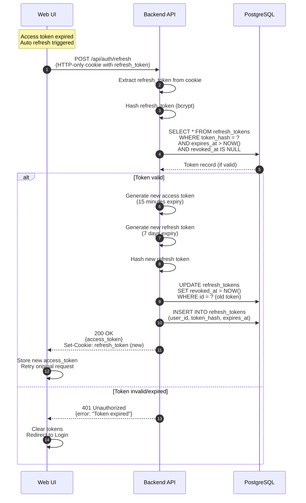
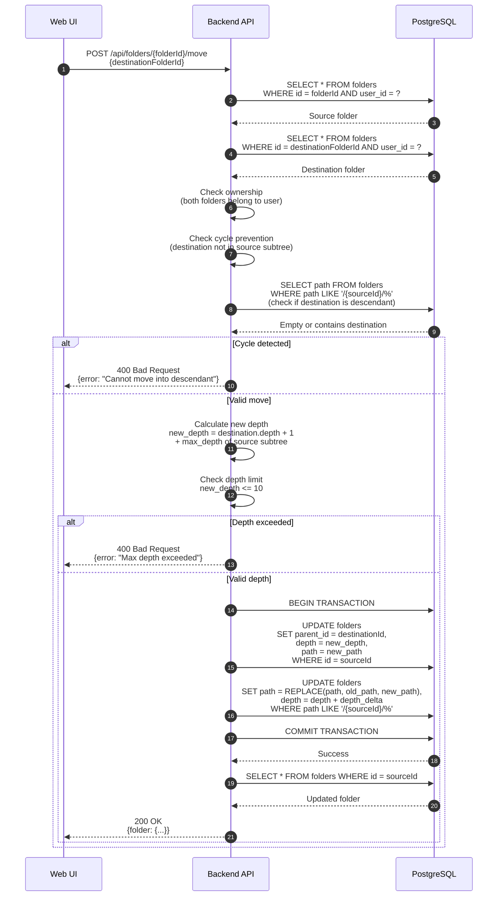
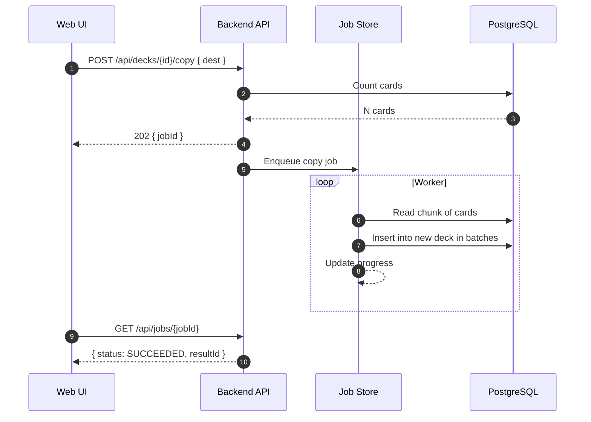
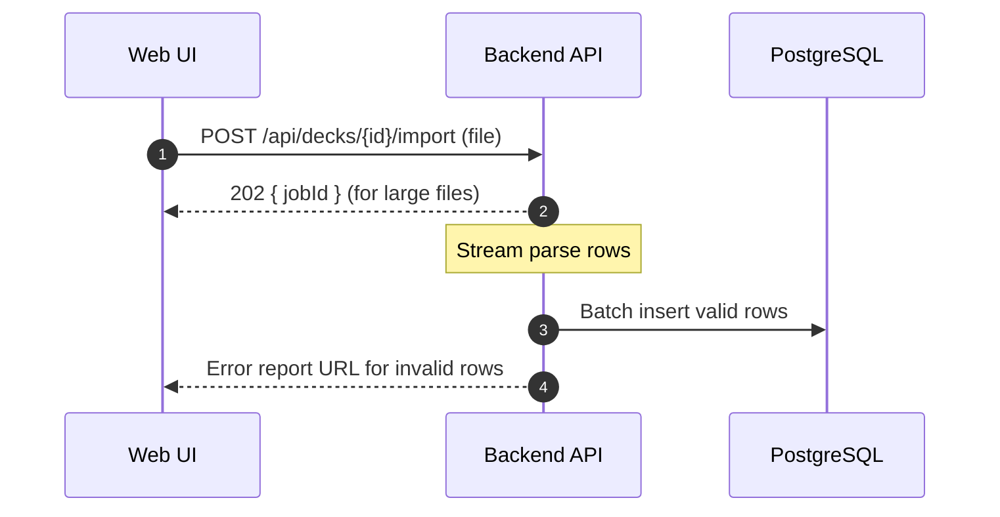
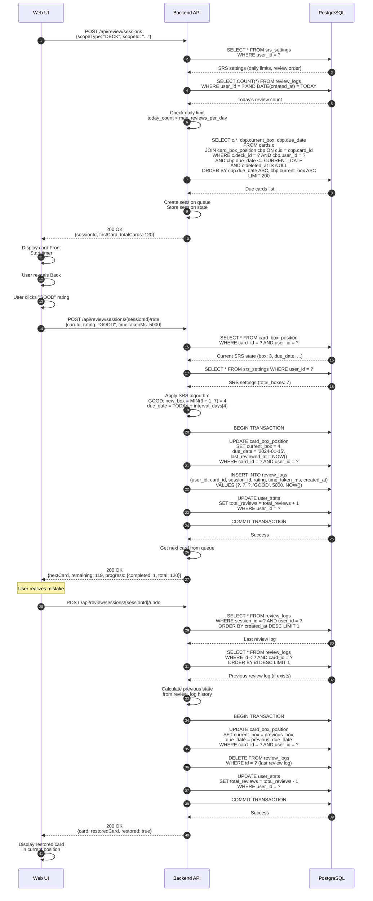

# Sequence Diagrams (MVP)

## 1) Refresh Token Rotation

```mermaid
sequenceDiagram
  autonumber
  participant FE as Web UI
  participant API as Backend API
  participant DB as PostgreSQL

  Note over FE: Access token expired<br/>Auto refresh triggered
  FE->>API: POST /api/auth/refresh<br/>(HTTP-only cookie with refresh_token)
  API->>API: Extract refresh_token from cookie
  API->>API: Hash refresh_token (bcrypt)
  API->>DB: SELECT * FROM refresh_tokens<br/>WHERE token_hash = ?<br/>AND expires_at > NOW()<br/>AND revoked_at IS NULL
  DB-->>API: Token record (if valid)
  
  alt Token valid
    API->>API: Generate new access token<br/>(15 minutes expiry)
    API->>API: Generate new refresh token<br/>(7 days expiry)
    API->>API: Hash new refresh token
    API->>DB: UPDATE refresh_tokens<br/>SET revoked_at = NOW()<br/>WHERE id = ? (old token)
    API->>DB: INSERT INTO refresh_tokens<br/>(user_id, token_hash, expires_at)
    API-->>FE: 200 OK<br/>{access_token}<br/>Set-Cookie: refresh_token (new)
    FE->>FE: Store new access_token<br/>Retry original request
  else Token invalid/expired
    API-->>FE: 401 Unauthorized<br/>{error: "Token expired"}
    FE->>FE: Clear tokens<br/>Redirect to Login
  end
```

## 2) Move Folder with Depth Check

```mermaid
sequenceDiagram
  autonumber
  participant FE as Web UI
  participant API as Backend API
  participant DB as PostgreSQL

  FE->>API: POST /api/folders/{folderId}/move<br/>{destinationFolderId}
  API->>DB: SELECT * FROM folders<br/>WHERE id = folderId AND user_id = ?
  DB-->>API: Source folder
  API->>DB: SELECT * FROM folders<br/>WHERE id = destinationFolderId AND user_id = ?
  DB-->>API: Destination folder
  
  API->>API: Check ownership<br/>(both folders belong to user)
  API->>API: Check cycle prevention<br/>(destination not in source subtree)
  API->>DB: SELECT path FROM folders<br/>WHERE path LIKE '/{sourceId}/%'<br/>(check if destination is descendant)
  DB-->>API: Empty or contains destination
  
  alt Cycle detected
    API-->>FE: 400 Bad Request<br/>{error: "Cannot move into descendant"}
  else Valid move
    API->>API: Calculate new depth<br/>new_depth = destination.depth + 1<br/>+ max_depth of source subtree
    API->>API: Check depth limit<br/>new_depth <= 10
    
    alt Depth exceeded
      API-->>FE: 400 Bad Request<br/>{error: "Max depth exceeded"}
    else Valid depth
      API->>DB: BEGIN TRANSACTION
      API->>DB: UPDATE folders<br/>SET parent_id = destinationId,<br/>depth = new_depth,<br/>path = new_path<br/>WHERE id = sourceId
      API->>DB: UPDATE folders<br/>SET path = REPLACE(path, old_path, new_path),<br/>depth = depth + depth_delta<br/>WHERE path LIKE '/{sourceId}/%'
      API->>DB: COMMIT TRANSACTION
      DB-->>API: Success
      API->>DB: SELECT * FROM folders WHERE id = sourceId
      DB-->>API: Updated folder
      API-->>FE: 200 OK<br/>{folder: {...}}
    end
  end
```

## 3) Copy Deck (Async Path)

```mermaid
sequenceDiagram
  autonumber
  participant FE as Web UI
  participant API as Backend API
  participant JOB as Job Store
  participant DB as PostgreSQL

  FE->>API: POST /api/decks/{id}/copy { dest }
  API->>DB: Count cards
  DB-->>API: N cards
  API-->>FE: 202 { jobId }
  API->>JOB: Enqueue copy job
  loop Worker
    JOB->>DB: Read chunk of cards
    JOB->>DB: Insert into new deck in batches
    JOB-->>JOB: Update progress
  end
  FE->>API: GET /api/jobs/{jobId}
  API-->>FE: { status: SUCCEEDED, resultId }
```

## 4) Import Cards (Validation Errors)

```mermaid
sequenceDiagram
  autonumber
  participant FE as Web UI
  participant API as Backend API
  participant DB as PostgreSQL

  FE->>API: POST /api/decks/{id}/import (file)
  API-->>FE: 202 { jobId } (for large files)
  Note over API: Stream parse rows
  API->>DB: Batch insert valid rows
  API-->>FE: Error report URL for invalid rows
```

## 5) Review + Rate + Undo

```mermaid
sequenceDiagram
  autonumber
  participant FE as Web UI
  participant API as Backend API
  participant DB as PostgreSQL

  FE->>API: POST /api/review/sessions<br/>{scopeType: "DECK", scopeId: "..."}
  API->>DB: SELECT * FROM srs_settings<br/>WHERE user_id = ?
  DB-->>API: SRS settings (daily limits, review order)
  API->>DB: SELECT COUNT(*) FROM review_logs<br/>WHERE user_id = ? AND DATE(created_at) = TODAY
  DB-->>API: Today's review count
  API->>API: Check daily limit<br/>today_count < max_reviews_per_day
  API->>DB: SELECT c.*, cbp.current_box, cbp.due_date<br/>FROM cards c<br/>JOIN card_box_position cbp ON c.id = cbp.card_id<br/>WHERE c.deck_id = ? AND cbp.user_id = ?<br/>AND cbp.due_date <= CURRENT_DATE<br/>AND c.deleted_at IS NULL<br/>ORDER BY cbp.due_date ASC, cbp.current_box ASC<br/>LIMIT 200
  DB-->>API: Due cards list
  API->>API: Create session queue<br/>Store session state
  API-->>FE: 200 OK<br/>{sessionId, firstCard, totalCards: 120}
  
  FE->>FE: Display card Front<br/>Start timer
  FE->>FE: User reveals Back
  FE->>FE: User clicks "GOOD" rating
  FE->>API: POST /api/review/sessions/{sessionId}/rate<br/>{cardId, rating: "GOOD", timeTakenMs: 5000}
  
  API->>DB: SELECT * FROM card_box_position<br/>WHERE card_id = ? AND user_id = ?
  DB-->>API: Current SRS state (box: 3, due_date: ...)
  API->>DB: SELECT * FROM srs_settings WHERE user_id = ?
  DB-->>API: SRS settings (total_boxes: 7)
  API->>API: Apply SRS algorithm<br/>GOOD: new_box = MIN(3 + 1, 7) = 4<br/>due_date = TODAY + interval_days[4]
  API->>DB: BEGIN TRANSACTION
  API->>DB: UPDATE card_box_position<br/>SET current_box = 4,<br/>due_date = '2024-01-15',<br/>last_reviewed_at = NOW()<br/>WHERE card_id = ? AND user_id = ?
  API->>DB: INSERT INTO review_logs<br/>(user_id, card_id, session_id, rating, time_taken_ms, created_at)<br/>VALUES (?, ?, ?, 'GOOD', 5000, NOW())
  API->>DB: UPDATE user_stats<br/>SET total_reviews = total_reviews + 1<br/>WHERE user_id = ?
  API->>DB: COMMIT TRANSACTION
  DB-->>API: Success
  API->>API: Get next card from queue
  API-->>FE: 200 OK<br/>{nextCard, remaining: 119, progress: {completed: 1, total: 120}}
  
  Note over FE: User realizes mistake
  FE->>API: POST /api/review/sessions/{sessionId}/undo
  API->>DB: SELECT * FROM review_logs<br/>WHERE session_id = ? AND user_id = ?<br/>ORDER BY created_at DESC LIMIT 1
  DB-->>API: Last review log
  API->>DB: SELECT * FROM review_logs<br/>WHERE id < ? AND card_id = ?<br/>ORDER BY id DESC LIMIT 1
  DB-->>API: Previous review log (if exists)
  API->>API: Calculate previous state<br/>from review_log history
  API->>DB: BEGIN TRANSACTION
  API->>DB: UPDATE card_box_position<br/>SET current_box = previous_box,<br/>due_date = previous_due_date<br/>WHERE card_id = ? AND user_id = ?
  API->>DB: DELETE FROM review_logs<br/>WHERE id = ? (last review log)
  API->>DB: UPDATE user_stats<br/>SET total_reviews = total_reviews - 1<br/>WHERE user_id = ?
  API->>DB: COMMIT TRANSACTION
  DB-->>API: Success
  API-->>FE: 200 OK<br/>{card: restoredCard, restored: true}
  FE->>FE: Display restored card<br/>in current position
```
