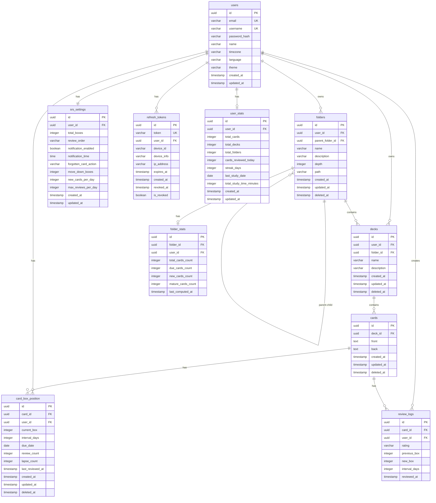

# Database Diagram (MVP)

This document provides a comprehensive overview of the RepeatWise database schema, including Entity-Relationship (ER) diagrams, table definitions, relationships, constraints, and indexes.

## ER Diagram



## Table Definitions

### users

**Purpose**: User accounts and authentication

**Columns**:
- `id` (UUID, PK): Primary key
- `email` (VARCHAR(255), UNIQUE, NOT NULL): User email (case-insensitive, unique)
- `username` (VARCHAR(30), UNIQUE, NOT NULL): Username (3-30 chars, alphanumeric + underscore, case-sensitive)
- `password_hash` (VARCHAR(60), NOT NULL): Bcrypt hash (cost factor 12)
- `name` (VARCHAR(100), NOT NULL): Display name
- `timezone` (VARCHAR(50), DEFAULT 'Asia/Ho_Chi_Minh'): IANA timezone
- `language` (VARCHAR(10), DEFAULT 'VI'): Language preference (VI or EN)
- `theme` (VARCHAR(10), DEFAULT 'SYSTEM'): UI theme (LIGHT, DARK, SYSTEM)
- `created_at` (TIMESTAMP, NOT NULL): Account creation timestamp
- `updated_at` (TIMESTAMP, NOT NULL): Last update timestamp

**Constraints**:
- `chk_username_format`: `username ~* '^[a-z0-9_]{3,30}$'`
- `chk_email_format`: Valid email format regex
- `chk_password_hash_bcrypt`: Length = 60 (bcrypt hash)
- `chk_name_not_empty`: Trimmed name not empty
- `chk_language_valid`: IN ('VI', 'EN')
- `chk_theme_valid`: IN ('LIGHT', 'DARK', 'SYSTEM')

**Indexes**:
- `idx_users_email`: UNIQUE on `LOWER(email)` (case-insensitive lookup)
- `idx_users_username`: UNIQUE on `LOWER(username)` (case-insensitive lookup)

**Relationships**:
- One-to-Many with `folders` (user owns folders)
- One-to-Many with `decks` (user owns decks)
- One-to-One with `srs_settings` (user has SRS settings)
- One-to-Many with `refresh_tokens` (user has refresh tokens)
- One-to-Many with `card_box_position` (user has SRS state per card)
- One-to-Many with `review_logs` (user creates review logs)
- One-to-One with `user_stats` (user has statistics)

---

### srs_settings

**Purpose**: User SRS (Spaced Repetition System) configuration

**Columns**:
- `id` (UUID, PK): Primary key
- `user_id` (UUID, FK → users.id, UNIQUE, NOT NULL): User reference
- `total_boxes` (INTEGER, DEFAULT 7): Total SRS boxes (3-10, default: 7)
- `review_order` (VARCHAR(20), DEFAULT 'RANDOM'): Review order (ASCENDING, DESCENDING, RANDOM)
- `notification_enabled` (BOOLEAN, DEFAULT TRUE): Enable notifications
- `notification_time` (TIME, DEFAULT '09:00'): Daily notification time
- `forgotten_card_action` (VARCHAR(30), DEFAULT 'MOVE_TO_BOX_1'): Action on AGAIN rating (MOVE_TO_BOX_1, MOVE_DOWN_N_BOXES, STAY_IN_BOX)
- `move_down_boxes` (INTEGER, DEFAULT 1): Boxes to move down (1-3, if forgotten_card_action = MOVE_DOWN_N_BOXES)
- `new_cards_per_day` (INTEGER, DEFAULT 20): Max new cards per day (1-100)
- `max_reviews_per_day` (INTEGER, DEFAULT 200): Max reviews per day (1-500)
- `created_at` (TIMESTAMP, NOT NULL): Creation timestamp
- `updated_at` (TIMESTAMP, NOT NULL): Last update timestamp

**Constraints**:
- `chk_total_boxes`: `total_boxes = 7` (MVP constraint, can be extended)
- `chk_review_order`: IN ('ASCENDING', 'DESCENDING', 'RANDOM')
- `chk_forgotten_card_action`: IN ('MOVE_TO_BOX_1', 'MOVE_DOWN_N_BOXES', 'STAY_IN_BOX')
- `chk_move_down_boxes`: BETWEEN 1 AND 3
- `chk_new_cards_per_day`: BETWEEN 1 AND 100
- `chk_max_reviews_per_day`: BETWEEN 1 AND 500

**Indexes**:
- `idx_srs_settings_user`: On `user_id` (for fast lookup)

**Relationships**:
- Many-to-One with `users` (settings belong to user)

---

### folders

**Purpose**: Hierarchical folder structure for organizing decks

**Columns**:
- `id` (UUID, PK): Primary key
- `user_id` (UUID, FK → users.id, NOT NULL): Owner user
- `parent_folder_id` (UUID, FK → folders.id, NULLABLE): Parent folder (NULL = root level)
- `name` (VARCHAR(100), NOT NULL): Folder name (unique per parent per user)
- `description` (VARCHAR(500)): Optional description
- `depth` (INTEGER, NOT NULL, DEFAULT 0): Tree depth (0-10)
- `path` (VARCHAR(1000), NOT NULL): Materialized path (e.g., `/uuid1/uuid2/uuid3`)
- `created_at` (TIMESTAMP, NOT NULL): Creation timestamp
- `updated_at` (TIMESTAMP, NOT NULL): Last update timestamp
- `deleted_at` (TIMESTAMP, NULLABLE): Soft delete timestamp

**Constraints**:
- `chk_name_not_empty`: Trimmed name not empty
- `chk_depth_max`: `depth >= 0 AND depth <= 10`
- `chk_path_format`: Path format regex `^(/[0-9a-f-]{36})+$`

**Indexes**:
- `idx_folders_user`: On `user_id` WHERE `deleted_at IS NULL`
- `idx_folders_parent`: On `(user_id, parent_folder_id)` WHERE `deleted_at IS NULL`
- `idx_folders_path`: On `(user_id, path)` WHERE `deleted_at IS NULL` (for descendant queries)
- `idx_folders_name_parent`: UNIQUE on `(user_id, COALESCE(parent_folder_id::TEXT, 'ROOT'), name)` WHERE `deleted_at IS NULL` (unique name per parent)

**Relationships**:
- Many-to-One with `users` (folder belongs to user)
- Many-to-One with `folders` (self-referential, parent-child relationship)
- One-to-Many with `folders` (folder has child folders)
- One-to-Many with `decks` (folder contains decks)
- One-to-One with `folder_stats` (folder has cached statistics)

---

### folder_stats

**Purpose**: Cached folder statistics with TTL (performance optimization)

**Columns**:
- `id` (UUID, PK): Primary key
- `folder_id` (UUID, FK → folders.id, NOT NULL): Folder reference
- `user_id` (UUID, FK → users.id, NOT NULL): User reference
- `total_cards_count` (INTEGER, DEFAULT 0): Total cards (recursive)
- `due_cards_count` (INTEGER, DEFAULT 0): Due cards today
- `new_cards_count` (INTEGER, DEFAULT 0): New cards (review_count = 0)
- `mature_cards_count` (INTEGER, DEFAULT 0): Mature cards (box >= 5)
- `last_computed_at` (TIMESTAMP, NOT NULL): Last computation timestamp (TTL = 5 minutes)

**Constraints**:
- `chk_total_cards`: `>= 0`
- `chk_due_cards`: `>= 0`
- `chk_new_cards`: `>= 0`
- `chk_mature_cards`: `>= 0`

**Indexes**:
- `idx_folder_stats_folder`: On `(folder_id, user_id)`
- `idx_folder_stats_lookup`: On `(folder_id, user_id, last_computed_at DESC)` (for TTL checks)
- `idx_folder_stats_unique`: UNIQUE on `(folder_id, user_id)` (one stats per folder per user)

**Relationships**:
- Many-to-One with `folders` (stats belong to folder)
- Many-to-One with `users` (stats belong to user)

**Design Notes**:
- Denormalized cache table for performance
- TTL = 5 minutes (recomputed after expiration)
- Recursive statistics (includes all descendants)

---

### decks

**Purpose**: Flashcard decks containing cards

**Columns**:
- `id` (UUID, PK): Primary key
- `user_id` (UUID, FK → users.id, NOT NULL): Owner user
- `folder_id` (UUID, FK → folders.id, NULLABLE): Parent folder (NULL = root level)
- `name` (VARCHAR(100), NOT NULL): Deck name (unique per folder per user)
- `description` (VARCHAR(500)): Optional description
- `created_at` (TIMESTAMP, NOT NULL): Creation timestamp
- `updated_at` (TIMESTAMP, NOT NULL): Last update timestamp
- `deleted_at` (TIMESTAMP, NULLABLE): Soft delete timestamp

**Constraints**:
- `chk_name_not_empty`: Trimmed name not empty

**Indexes**:
- `idx_decks_user`: On `user_id` WHERE `deleted_at IS NULL`
- `idx_decks_folder`: On `folder_id` WHERE `deleted_at IS NULL`
- `idx_decks_name_folder`: UNIQUE on `(user_id, COALESCE(folder_id::TEXT, 'ROOT'), name)` WHERE `deleted_at IS NULL` (unique name per folder)

**Relationships**:
- Many-to-One with `users` (deck belongs to user)
- Many-to-One with `folders` (deck belongs to folder, nullable for root)
- One-to-Many with `cards` (deck contains cards)

**Design Notes**:
- Supports root-level decks (folder_id = NULL)
- Unique name constraint per folder per user

---

### cards

**Purpose**: Flashcards with front and back text

**Columns**:
- `id` (UUID, PK): Primary key
- `deck_id` (UUID, FK → decks.id, NOT NULL): Parent deck
- `front` (TEXT, NOT NULL): Front side text (max 5,000 chars)
- `back` (TEXT, NOT NULL): Back side text (max 5,000 chars)
- `created_at` (TIMESTAMP, NOT NULL): Creation timestamp
- `updated_at` (TIMESTAMP, NOT NULL): Last update timestamp
- `deleted_at` (TIMESTAMP, NULLABLE): Soft delete timestamp

**Constraints**:
- `chk_front_not_empty`: Trimmed front not empty
- `chk_back_not_empty`: Trimmed back not empty
- `chk_front_length`: `LENGTH(front) <= 5000`
- `chk_back_length`: `LENGTH(back) <= 5000`

**Indexes**:
- `idx_cards_deck`: On `deck_id` WHERE `deleted_at IS NULL`

**Relationships**:
- Many-to-One with `decks` (card belongs to deck)
- One-to-Many with `card_box_position` (card has SRS state per user)
- One-to-Many with `review_logs` (card has review history)

**Design Notes**:
- Plain text only (MVP)
- Maximum 5,000 characters per side

---

### card_box_position

**Purpose**: SRS state per user per card (CRITICAL table for review performance)

**Columns**:
- `id` (UUID, PK): Primary key
- `card_id` (UUID, FK → cards.id, NOT NULL): Card reference
- `user_id` (UUID, FK → users.id, NOT NULL): User reference
- `current_box` (INTEGER, NOT NULL, DEFAULT 1): Current box (1-7)
- `interval_days` (INTEGER, NOT NULL, DEFAULT 1): Days until next review
- `due_date` (DATE, NOT NULL): Next review due date
- `review_count` (INTEGER, NOT NULL, DEFAULT 0): Total reviews
- `lapse_count` (INTEGER, NOT NULL, DEFAULT 0): Times forgotten (AGAIN rating)
- `last_reviewed_at` (TIMESTAMP, NULLABLE): Last review timestamp
- `created_at` (TIMESTAMP, NOT NULL): Creation timestamp
- `updated_at` (TIMESTAMP, NOT NULL): Last update timestamp
- `deleted_at` (TIMESTAMP, NULLABLE): Soft delete timestamp

**Constraints**:
- `chk_current_box`: `BETWEEN 1 AND 7`
- `chk_interval_days`: `>= 1`
- `chk_review_count`: `>= 0`
- `chk_lapse_count`: `>= 0`

**Indexes** (CRITICAL FOR PERFORMANCE):
- `idx_card_box_position_user_card`: UNIQUE on `(user_id, card_id)` WHERE `deleted_at IS NULL` (one state per user-card)
- `idx_card_box_user_due`: On `(user_id, due_date, current_box)` WHERE `deleted_at IS NULL` (MOST IMPORTANT for review queries)
- `idx_card_box_user_box`: On `(user_id, current_box)` WHERE `deleted_at IS NULL` (for box distribution)
- `idx_card_box_new`: On `(user_id, card_id)` WHERE `review_count = 0 AND deleted_at IS NULL` (for new cards)

**Relationships**:
- Many-to-One with `cards` (state belongs to card)
- Many-to-One with `users` (state belongs to user)

**Design Notes**:
- Most critical table for review session performance
- Composite index `(user_id, due_date, current_box)` optimized for review queries
- Tracks individual SRS state per user (same card can have different state for different users)

---

### review_logs

**Purpose**: Immutable review history for analytics, undo, and statistics

**Columns**:
- `id` (UUID, PK): Primary key
- `card_id` (UUID, FK → cards.id, NOT NULL): Card reference
- `user_id` (UUID, FK → users.id, NOT NULL): User reference
- `rating` (VARCHAR(10), NOT NULL): User rating (AGAIN, HARD, GOOD, EASY)
- `previous_box` (INTEGER, NOT NULL): Box before review
- `new_box` (INTEGER, NOT NULL): Box after review
- `interval_days` (INTEGER, NOT NULL): Interval assigned
- `reviewed_at` (TIMESTAMP, NOT NULL): Review timestamp

**Constraints**:
- `chk_rating`: IN ('AGAIN', 'HARD', 'GOOD', 'EASY')
- `chk_previous_box`: `BETWEEN 1 AND 7`
- `chk_new_box`: `BETWEEN 1 AND 7`
- `chk_interval_days_log`: `>= 1`

**Indexes**:
- `idx_review_logs_user_date`: On `(user_id, reviewed_at DESC)` (for user review history)
- `idx_review_logs_card`: On `card_id` (for card review history)
- `idx_review_logs_user_today`: On `(user_id, reviewed_at)` WHERE `reviewed_at >= CURRENT_DATE` (for daily statistics)

**Relationships**:
- Many-to-One with `cards` (log belongs to card)
- Many-to-One with `users` (log belongs to user)

**Design Notes**:
- Immutable table (no updates/deletes in normal flow)
- Used for undo functionality (windowed)
- Used for statistics and analytics

---

### refresh_tokens

**Purpose**: JWT refresh tokens for authentication and logout tracking

**Columns**:
- `id` (UUID, PK): Primary key
- `token` (VARCHAR(500), UNIQUE, NOT NULL): Refresh token string (should be hashed)
- `user_id` (UUID, FK → users.id, NOT NULL): User reference
- `device_id` (VARCHAR(100)): Device identifier
- `device_info` (VARCHAR(255)): Device information (browser, OS)
- `ip_address` (VARCHAR(50)): IP address at creation
- `expires_at` (TIMESTAMP, NOT NULL): Token expiration (7 days)
- `created_at` (TIMESTAMP, NOT NULL): Creation timestamp
- `revoked_at` (TIMESTAMP, NULLABLE): Revocation timestamp
- `is_revoked` (BOOLEAN, NOT NULL, DEFAULT FALSE): Revocation flag

**Constraints**:
- `chk_expires_at_future`: `expires_at > created_at`
- `chk_revoked_at_valid`: `revoked_at IS NULL OR revoked_at >= created_at`

**Indexes**:
- `idx_refresh_tokens_token`: UNIQUE on `token` (for token lookup)
- `idx_refresh_tokens_user_id`: On `user_id` WHERE `is_revoked = FALSE AND expires_at > NOW()` (for active tokens)
- `idx_refresh_tokens_user_device`: On `(user_id, device_id)` (for device-specific logout)
- `idx_refresh_tokens_expires_at`: On `expires_at` WHERE `is_revoked = FALSE` (for cleanup)

**Relationships**:
- Many-to-One with `users` (token belongs to user)

**Design Notes**:
- Supports multi-device logout
- Token rotation on refresh (one-time use)
- Soft delete via `is_revoked` for audit trail

---

### user_stats

**Purpose**: Denormalized user statistics for performance

**Columns**:
- `id` (UUID, PK): Primary key
- `user_id` (UUID, FK → users.id, UNIQUE, NOT NULL): User reference
- `total_cards` (INTEGER, DEFAULT 0): Total cards owned
- `total_decks` (INTEGER, DEFAULT 0): Total decks owned
- `total_folders` (INTEGER, DEFAULT 0): Total folders owned
- `cards_reviewed_today` (INTEGER, DEFAULT 0): Cards reviewed today
- `streak_days` (INTEGER, DEFAULT 0): Consecutive study days
- `last_study_date` (DATE, NULLABLE): Last study date
- `total_study_time_minutes` (INTEGER, DEFAULT 0): Total study time
- `created_at` (TIMESTAMP, NOT NULL): Creation timestamp
- `updated_at` (TIMESTAMP, NOT NULL): Last update timestamp

**Constraints**: None (denormalized table)

**Indexes**:
- `idx_user_stats_user`: UNIQUE on `user_id` (one stats record per user)

**Relationships**:
- One-to-One with `users` (stats belong to user)

**Design Notes**:
- Denormalized for performance (avoids expensive aggregations)
- Updated via background jobs or triggers
- Can be recalculated from source tables if needed

---

## Relationships Summary

### One-to-One Relationships
- `users` ↔ `srs_settings`: One user has one SRS settings
- `users` ↔ `user_stats`: One user has one statistics record
- `folders` ↔ `folder_stats`: One folder has one statistics record per user

### One-to-Many Relationships
- `users` → `folders`: One user owns many folders
- `users` → `decks`: One user owns many decks
- `users` → `refresh_tokens`: One user has many refresh tokens
- `users` → `card_box_position`: One user has many card states
- `users` → `review_logs`: One user creates many review logs
- `folders` → `folders`: One folder has many child folders (self-referential)
- `folders` → `decks`: One folder contains many decks
- `decks` → `cards`: One deck contains many cards
- `cards` → `card_box_position`: One card has many user states
- `cards` → `review_logs`: One card has many review logs

### Many-to-Many Relationships (Implicit)
- `users` ↔ `cards` (via `card_box_position`): Many users study many cards (each with own SRS state)

---

## Foreign Key Constraints

### Cascade Delete
- `folders.user_id` → `users.id` (ON DELETE CASCADE): Delete user folders when user deleted
- `folders.parent_folder_id` → `folders.id` (ON DELETE CASCADE): Delete child folders when parent deleted
- `decks.user_id` → `users.id` (ON DELETE CASCADE): Delete user decks when user deleted
- `decks.folder_id` → `folders.id` (ON DELETE CASCADE): Delete folder decks when folder deleted
- `cards.deck_id` → `decks.id` (ON DELETE CASCADE): Delete deck cards when deck deleted
- `card_box_position.card_id` → `cards.id` (ON DELETE CASCADE): Delete card states when card deleted
- `card_box_position.user_id` → `users.id` (ON DELETE CASCADE): Delete user states when user deleted
- `review_logs.card_id` → `cards.id` (ON DELETE CASCADE): Delete logs when card deleted
- `review_logs.user_id` → `users.id` (ON DELETE CASCADE): Delete logs when user deleted
- `srs_settings.user_id` → `users.id` (ON DELETE CASCADE): Delete settings when user deleted
- `refresh_tokens.user_id` → `users.id` (ON DELETE CASCADE): Delete tokens when user deleted
- `user_stats.user_id` → `users.id` (ON DELETE CASCADE): Delete stats when user deleted
- `folder_stats.folder_id` → `folders.id` (ON DELETE CASCADE): Delete stats when folder deleted
- `folder_stats.user_id` → `users.id` (ON DELETE CASCADE): Delete stats when user deleted

---

## Critical Indexes

### Performance-Critical Indexes

1. **`idx_card_box_user_due`** on `card_box_position(user_id, due_date, current_box)`
   - **Purpose**: Optimize review session queries
   - **Query Pattern**: `WHERE user_id = ? AND due_date <= CURRENT_DATE ORDER BY due_date ASC, current_box ASC`
   - **Impact**: Most critical index for review performance

2. **`idx_folders_path`** on `folders(user_id, path)`
   - **Purpose**: Fast descendant queries using materialized path
   - **Query Pattern**: `WHERE user_id = ? AND path LIKE '/parent_id/%'`
   - **Impact**: Essential for folder tree operations

3. **`idx_folders_name_parent`** UNIQUE on `folders(user_id, COALESCE(parent_folder_id::TEXT, 'ROOT'), name)`
   - **Purpose**: Enforce unique name per parent
   - **Impact**: Prevents duplicate names at database level

4. **`idx_card_box_position_user_card`** UNIQUE on `card_box_position(user_id, card_id)`
   - **Purpose**: Enforce one SRS state per user-card pair
   - **Impact**: Data integrity

### Soft Delete Indexes

All indexes include `WHERE deleted_at IS NULL` filter to:
- Exclude soft-deleted records from queries
- Improve query performance (smaller index size)
- Maintain data integrity for active records only

---

## Design Patterns

### 1. Soft Delete Pattern
- **Tables**: `folders`, `decks`, `cards`, `card_box_position`
- **Implementation**: `deleted_at` timestamp column (NULL = active)
- **Benefits**: 
  - Data recovery within 30 days
  - Audit trail
  - Cascading soft delete for hierarchies

### 2. Materialized Path Pattern
- **Table**: `folders`
- **Implementation**: `path` column storing full ancestor path
- **Benefits**:
  - Fast descendant queries (single query)
  - No recursive CTEs needed
  - Path format: `/uuid1/uuid2/uuid3`

### 3. Composite Pattern (Application Level)
- **Structure**: Folders contain folders and decks
- **Database**: Self-referential `folders` table + `folders` → `decks` relationship
- **Benefits**: Flexible hierarchy management

### 4. Denormalization Pattern
- **Table**: `user_stats`
- **Purpose**: Avoid expensive aggregations for statistics
- **Trade-off**: Storage vs. query performance

---

## Data Integrity Rules

### Uniqueness Constraints
1. **Email uniqueness**: `users.email` (case-insensitive)
2. **Username uniqueness**: `users.username` (case-sensitive)
3. **Folder name uniqueness**: Per user, per parent folder (case-insensitive)
4. **Deck name uniqueness**: Per user, per folder (case-insensitive)
5. **User-card SRS state**: One `card_box_position` per `(user_id, card_id)` pair

### Check Constraints
1. **Folder depth**: `0 <= depth <= 10`
2. **SRS box**: `1 <= current_box <= 7`
3. **Card text length**: `front` and `back` <= 5,000 characters
4. **Email format**: Valid email regex
5. **Username format**: `^[a-z0-9_]{3,30}$`

### Referential Integrity
- All foreign keys enforce referential integrity
- Cascade delete ensures no orphaned records
- Soft delete maintains logical relationships

---

## Query Patterns

### Common Query Patterns

1. **Review Session Query**:
   ```sql
   SELECT c.*, cbp.current_box, cbp.due_date
   FROM cards c
   JOIN card_box_position cbp ON c.id = cbp.card_id
   WHERE cbp.user_id = ?
     AND cbp.due_date <= CURRENT_DATE
     AND c.deleted_at IS NULL
     AND cbp.deleted_at IS NULL
   ORDER BY cbp.due_date ASC, cbp.current_box ASC
   LIMIT 200;
   ```
   **Index Used**: `idx_card_box_user_due`

2. **Folder Descendants Query**:
   ```sql
   SELECT *
   FROM folders
   WHERE user_id = ?
     AND path LIKE '/{parent_id}/%'
     AND deleted_at IS NULL
   ORDER BY path;
   ```
   **Index Used**: `idx_folders_path`

3. **User Statistics Query**:
   ```sql
   SELECT *
   FROM user_stats
   WHERE user_id = ?;
   ```
   **Index Used**: `idx_user_stats_user`

---

## Migration Strategy

Tables are created in the following order (via Flyway migrations):

1. `users` (V1)
2. `refresh_tokens` (V2)
3. `folders` (V3)
4. `decks` (V4)
5. `cards` (V5)
6. `srs_settings`, `card_box_position`, `review_logs` (V6)
7. `user_stats`, `folder_stats` (V8)

This order ensures all foreign key dependencies are satisfied.

---

## Notes

- All timestamps are stored in UTC
- UUIDs are used for all primary keys (v4 random UUIDs)
- Soft delete pattern used for `folders`, `decks`, `cards`, `card_box_position`
- Hard delete for audit tables (`review_logs`, `refresh_tokens`)
- Indexes use partial indexes with `WHERE deleted_at IS NULL` for performance
- Materialized path pattern enables efficient folder hierarchy queries

