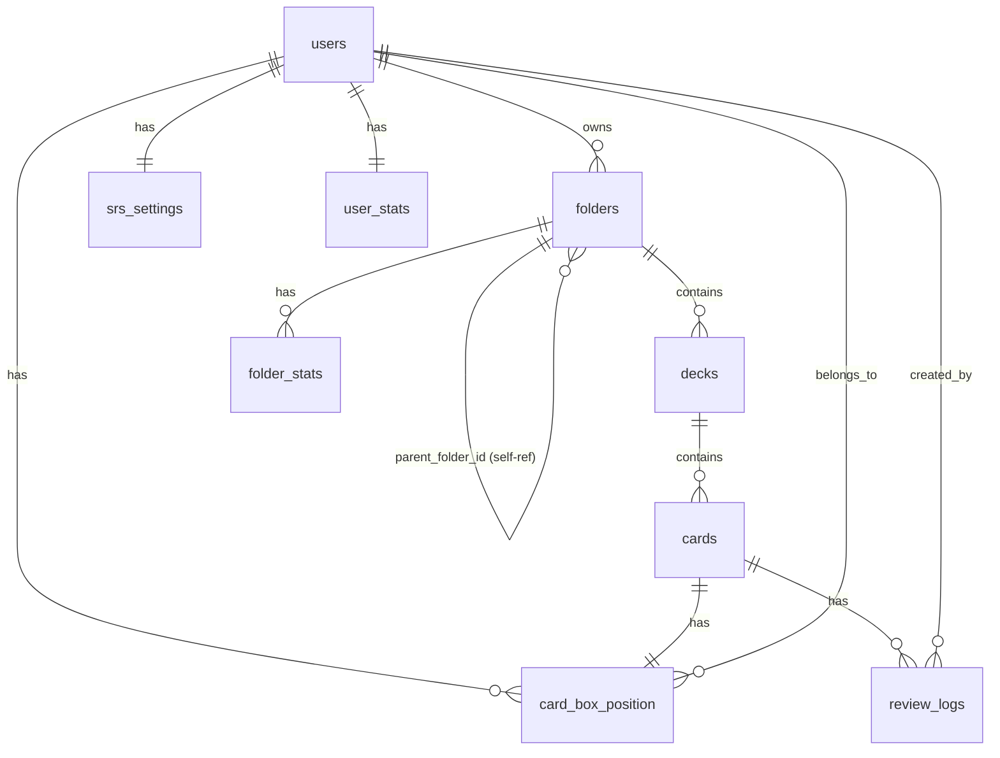

# Data Dictionary - RepeatWise MVP

## 1. Overview

Database schema cho RepeatWise MVP sử dụng PostgreSQL với cấu trúc quan hệ chuẩn, soft delete, và các indexes được tối ưu cho performance. Schema được thiết kế để hỗ trợ hierarchical folders, spaced repetition algorithm, và denormalized statistics.

**Database**: PostgreSQL 15+
**ORM**: Spring Data JPA (Hibernate)
**Migration**: Flyway

## 2. Core Tables

### 2.1 users

Quản lý thông tin người dùng, authentication, preferences.

| Column | Type | Constraints | Description |
|--------|------|-------------|-------------|
| id | UUID | PRIMARY KEY | Unique identifier |
| email | VARCHAR(255) | UNIQUE, NOT NULL | Login email, unique |
| password_hash | VARCHAR(255) | NOT NULL | bcrypt hash (cost 12) |
| name | VARCHAR(100) | | Full name |
| timezone | VARCHAR(50) | NOT NULL, DEFAULT 'Asia/Ho_Chi_Minh' | IANA timezone |
| language | VARCHAR(10) | NOT NULL, DEFAULT 'VI' | VI or EN |
| theme | VARCHAR(10) | NOT NULL, DEFAULT 'SYSTEM' | LIGHT, DARK, SYSTEM |
| created_at | TIMESTAMP | NOT NULL, DEFAULT NOW() | Registration timestamp |
| updated_at | TIMESTAMP | NOT NULL, DEFAULT NOW() | Last profile update |

**Indexes**:
```sql
CREATE UNIQUE INDEX idx_users_email ON users(email);
```

**Constraints**:
```sql
CHECK (language IN ('VI', 'EN'));
CHECK (theme IN ('LIGHT', 'DARK', 'SYSTEM'));
```

**Sample Data**:
```sql
INSERT INTO users (id, email, password_hash, name, timezone, language, theme)
VALUES ('a1b2c3...', 'minh@example.com', '$2a$12...', 'Nguyễn Văn Minh',
        'Asia/Ho_Chi_Minh', 'VI', 'DARK');
```

---

### 2.2 refresh_tokens ⭐ (MVP)

Quản lý refresh tokens cho JWT authentication với revocation support.

| Column | Type | Constraints | Description |
|--------|------|-------------|-------------|
| id | UUID | PRIMARY KEY | Unique identifier |
| user_id | UUID | NOT NULL, FK → users(id) ON DELETE CASCADE | Token owner |
| token_hash | VARCHAR(255) | NOT NULL, UNIQUE | bcrypt hash of refresh token |
| expires_at | TIMESTAMP | NOT NULL | Token expiration time (7 days) |
| revoked_at | TIMESTAMP | NULL | Revocation timestamp (logout) |
| created_at | TIMESTAMP | NOT NULL, DEFAULT NOW() | Token issue time |
| updated_at | TIMESTAMP | NOT NULL, DEFAULT NOW() | Last update |

**Indexes**:
```sql
CREATE INDEX idx_refresh_tokens_user ON refresh_tokens(user_id)
    WHERE revoked_at IS NULL;

CREATE UNIQUE INDEX idx_refresh_tokens_hash ON refresh_tokens(token_hash);

CREATE INDEX idx_refresh_tokens_expires ON refresh_tokens(expires_at)
    WHERE revoked_at IS NULL;
```

**Constraints**:
```sql
CHECK (expires_at > created_at);
CHECK (revoked_at IS NULL OR revoked_at >= created_at);
```

**Sample Data**:
```sql
INSERT INTO refresh_tokens (id, user_id, token_hash, expires_at)
VALUES ('token-uuid', 'user-uuid', '$2a$12...hashed_token...', NOW() + INTERVAL '7 days');
```

**Cleanup Job** (scheduled daily):
```sql
-- Delete expired/revoked tokens older than 30 days
DELETE FROM refresh_tokens
WHERE (expires_at < NOW() OR revoked_at IS NOT NULL)
  AND created_at < NOW() - INTERVAL '30 days';
```

**Business Rules**:
- One-time use: Old token revoked when refreshed
- Maximum tokens per user: No hard limit (cleanup handles old tokens)
- Token rotation: New token + revoke old on /api/auth/refresh
- Logout: Set revoked_at = NOW()
- Logout all devices: Revoke all user's tokens

---

### 2.3 folders ⭐

Quản lý folder hierarchy với materialized path cho performance.

| Column | Type | Constraints | Description |
|--------|------|-------------|-------------|
| id | UUID | PRIMARY KEY | Unique identifier |
| user_id | UUID | NOT NULL, FK → users(id) | Owner |
| parent_folder_id | UUID | FK → folders(id), NULL = root | Parent folder |
| name | VARCHAR(100) | NOT NULL | Folder name |
| description | VARCHAR(500) | | Optional description |
| path | VARCHAR(1000) | NOT NULL | Materialized path: /id1/id2/id3 |
| depth | INTEGER | NOT NULL, CHECK (depth <= 10) | Tree depth (0 = root) |
| created_at | TIMESTAMP | NOT NULL, DEFAULT NOW() | Creation time |
| updated_at | TIMESTAMP | NOT NULL, DEFAULT NOW() | Last modification |
| deleted_at | TIMESTAMP | NULL | Soft delete timestamp |

**Indexes** (Critical for Performance):
```sql
CREATE INDEX idx_folders_user_parent ON folders(user_id, parent_folder_id)
    WHERE deleted_at IS NULL;

CREATE INDEX idx_folders_path ON folders USING btree(path varchar_pattern_ops)
    WHERE deleted_at IS NULL;

CREATE INDEX idx_folders_user_deleted ON folders(user_id, deleted_at);

CREATE INDEX idx_folders_depth ON folders(depth);
```

**Constraints**:
```sql
CHECK (depth >= 0 AND depth <= 10);
CHECK (LENGTH(name) > 0 AND LENGTH(name) <= 100);
-- Prevent self-referencing
CHECK (id != parent_folder_id);
```

**Triggers**:
```sql
-- Auto-update path and depth on insert/update
CREATE OR REPLACE FUNCTION update_folder_path()
RETURNS TRIGGER AS $$
BEGIN
    IF NEW.parent_folder_id IS NULL THEN
        NEW.path := '/' || NEW.id::text;
        NEW.depth := 0;
    ELSE
        SELECT path || '/' || NEW.id::text, depth + 1
        INTO NEW.path, NEW.depth
        FROM folders
        WHERE id = NEW.parent_folder_id;
    END IF;
    RETURN NEW;
END;
$$ LANGUAGE plpgsql;

CREATE TRIGGER trg_folder_path
BEFORE INSERT OR UPDATE ON folders
FOR EACH ROW
EXECUTE FUNCTION update_folder_path();
```

**Sample Data**:
```sql
-- Root folder
INSERT INTO folders (id, user_id, parent_folder_id, name, path, depth)
VALUES ('f1...', 'a1b2c3...', NULL, 'English Learning', '/f1...', 0);

-- Sub-folder
INSERT INTO folders (id, user_id, parent_folder_id, name, path, depth)
VALUES ('f2...', 'a1b2c3...', 'f1...', 'IELTS', '/f1.../f2...', 1);
```

---

### 2.3 decks

Quản lý bộ flashcards (collections of cards).

| Column | Type | Constraints | Description |
|--------|------|-------------|-------------|
| id | UUID | PRIMARY KEY | Unique identifier |
| user_id | UUID | NOT NULL, FK → users(id) | Owner |
| folder_id | UUID | FK → folders(id), NULL = root | Parent folder (nullable) |
| name | VARCHAR(100) | NOT NULL | Deck name |
| description | VARCHAR(500) | | Optional description |
| created_at | TIMESTAMP | NOT NULL, DEFAULT NOW() | Creation time |
| updated_at | TIMESTAMP | NOT NULL, DEFAULT NOW() | Last modification |
| deleted_at | TIMESTAMP | NULL | Soft delete timestamp |

**Indexes**:
```sql
CREATE INDEX idx_decks_folder_user ON decks(folder_id, user_id)
    WHERE deleted_at IS NULL;

CREATE INDEX idx_decks_user_deleted ON decks(user_id, deleted_at);
```

**Constraints**:
```sql
CHECK (LENGTH(name) > 0 AND LENGTH(name) <= 100);
-- Unique name within folder
UNIQUE (user_id, folder_id, name) WHERE deleted_at IS NULL;
```

**Sample Data**:
```sql
INSERT INTO decks (id, user_id, folder_id, name, description)
VALUES ('d1...', 'a1b2c3...', 'f2...', 'Academic Words',
        'IELTS academic vocabulary');
```

---

### 2.4 cards

Quản lý flashcards (front/back text).

| Column | Type | Constraints | Description |
|--------|------|-------------|-------------|
| id | UUID | PRIMARY KEY | Unique identifier |
| deck_id | UUID | NOT NULL, FK → decks(id) | Parent deck |
| front | TEXT | NOT NULL, CHECK (LENGTH(front) <= 5000) | Question side |
| back | TEXT | NOT NULL, CHECK (LENGTH(back) <= 5000) | Answer side |
| created_at | TIMESTAMP | NOT NULL, DEFAULT NOW() | Creation time |
| updated_at | TIMESTAMP | NOT NULL, DEFAULT NOW() | Last modification |
| deleted_at | TIMESTAMP | NULL | Soft delete timestamp |

**Indexes**:
```sql
CREATE INDEX idx_cards_deck ON cards(deck_id)
    WHERE deleted_at IS NULL;

CREATE INDEX idx_cards_deleted ON cards(deck_id, deleted_at);
```

**Constraints**:
```sql
CHECK (LENGTH(front) > 0 AND LENGTH(front) <= 5000);
CHECK (LENGTH(back) > 0 AND LENGTH(back) <= 5000);
```

**Sample Data**:
```sql
INSERT INTO cards (id, deck_id, front, back)
VALUES ('c1...', 'd1...', 'ubiquitous', 'existing or being everywhere');
```

---

## 3. SRS-Specific Tables

### 3.1 srs_settings

Quản lý cấu hình SRS của từng user.

| Column | Type | Constraints | Description |
|--------|------|-------------|-------------|
| id | UUID | PRIMARY KEY | Unique identifier |
| user_id | UUID | UNIQUE, NOT NULL, FK → users(id) | Owner (one per user) |
| total_boxes | INTEGER | NOT NULL, DEFAULT 7 | Fixed 7 boxes for MVP |
| review_order | VARCHAR(20) | NOT NULL, DEFAULT 'RANDOM' | ASCENDING, DESCENDING, RANDOM |
| notification_enabled | BOOLEAN | NOT NULL, DEFAULT TRUE | Enable notifications |
| notification_time | TIME | NOT NULL, DEFAULT '09:00' | Daily reminder time |
| forgotten_card_action | VARCHAR(30) | NOT NULL, DEFAULT 'MOVE_TO_BOX_1' | MOVE_TO_BOX_1, MOVE_DOWN_N_BOXES, STAY_IN_BOX |
| move_down_boxes | INTEGER | NOT NULL, DEFAULT 1 | N boxes to move down (1-3) |
| new_cards_per_day | INTEGER | NOT NULL, DEFAULT 20 | Daily new cards limit |
| max_reviews_per_day | INTEGER | NOT NULL, DEFAULT 200 | Daily review limit |
| created_at | TIMESTAMP | NOT NULL, DEFAULT NOW() | Creation time |
| updated_at | TIMESTAMP | NOT NULL, DEFAULT NOW() | Last update |

**Indexes**:
```sql
CREATE UNIQUE INDEX idx_srs_settings_user ON srs_settings(user_id);
```

**Constraints**:
```sql
CHECK (total_boxes = 7); -- Fixed for MVP
CHECK (review_order IN ('ASCENDING', 'DESCENDING', 'RANDOM'));
CHECK (forgotten_card_action IN ('MOVE_TO_BOX_1', 'MOVE_DOWN_N_BOXES', 'STAY_IN_BOX'));
CHECK (move_down_boxes >= 1 AND move_down_boxes <= 3);
CHECK (new_cards_per_day > 0);
CHECK (max_reviews_per_day > 0);
```

**Sample Data**:
```sql
INSERT INTO srs_settings (id, user_id, review_order, forgotten_card_action)
VALUES ('s1...', 'a1b2c3...', 'RANDOM', 'MOVE_TO_BOX_1');
```

---

### 3.2 card_box_position ⭐ (Critical for SRS)

Quản lý vị trí của card trong SRS algorithm (box position, due date).

| Column | Type | Constraints | Description |
|--------|------|-------------|-------------|
| id | UUID | PRIMARY KEY | Unique identifier |
| card_id | UUID | NOT NULL, FK → cards(id) | Card reference |
| user_id | UUID | NOT NULL, FK → users(id) | User-specific position |
| current_box | INTEGER | NOT NULL, DEFAULT 1, CHECK (1 <= current_box <= 7) | Box position (1-7) |
| ease_factor | DECIMAL(3,2) | NOT NULL, DEFAULT 2.5 | Ease factor (unused in MVP) |
| interval_days | INTEGER | NOT NULL | Current interval in days |
| due_date | DATE | NOT NULL | Next review date |
| last_reviewed_at | TIMESTAMP | NULL | Last review timestamp |
| review_count | INTEGER | NOT NULL, DEFAULT 0 | Total reviews |
| lapse_count | INTEGER | NOT NULL, DEFAULT 0 | Count of "Again" ratings |
| created_at | TIMESTAMP | NOT NULL, DEFAULT NOW() | Creation time |
| updated_at | TIMESTAMP | NOT NULL, DEFAULT NOW() | Last update |

**Indexes** (CRITICAL FOR PERFORMANCE!):
```sql
-- MOST IMPORTANT INDEX: Used for daily due card queries
CREATE INDEX idx_card_box_user_due ON card_box_position(user_id, due_date, current_box);

-- Additional indexes
CREATE INDEX idx_card_box_card_user ON card_box_position(card_id, user_id);
CREATE INDEX idx_card_box_user_box ON card_box_position(user_id, current_box);
```

**Constraints**:
```sql
CHECK (current_box >= 1 AND current_box <= 7);
CHECK (interval_days >= 0);
CHECK (review_count >= 0);
CHECK (lapse_count >= 0);
-- Unique: one box position per card per user
UNIQUE (card_id, user_id);
```

**Query Examples**:
```sql
-- Get due cards for user (CRITICAL QUERY)
SELECT c.id, c.front, c.back, cbp.current_box, cbp.due_date
FROM card_box_position cbp
JOIN cards c ON c.id = cbp.card_id
WHERE cbp.user_id = 'a1b2c3...'
  AND cbp.due_date <= CURRENT_DATE
ORDER BY cbp.due_date ASC, cbp.current_box ASC
LIMIT 200;

-- Get box distribution for user
SELECT current_box, COUNT(*) as count
FROM card_box_position
WHERE user_id = 'a1b2c3...'
GROUP BY current_box;
```

**Sample Data**:
```sql
INSERT INTO card_box_position (id, card_id, user_id, current_box, interval_days, due_date)
VALUES ('cbp1...', 'c1...', 'a1b2c3...', 2, 3, '2025-01-15');
```

---

### 3.3 review_logs

Lưu lịch sử review để tracking và analytics.

| Column | Type | Constraints | Description |
|--------|------|-------------|-------------|
| id | UUID | PRIMARY KEY | Unique identifier |
| card_id | UUID | NOT NULL, FK → cards(id) | Card reviewed |
| user_id | UUID | NOT NULL, FK → users(id) | Reviewer |
| rating | VARCHAR(10) | NOT NULL | AGAIN, HARD, GOOD, EASY |
| previous_box | INTEGER | NOT NULL | Box before review |
| new_box | INTEGER | NOT NULL | Box after review |
| interval_days | INTEGER | NOT NULL | New interval |
| reviewed_at | TIMESTAMP | NOT NULL | Review timestamp |

**Indexes**:
```sql
CREATE INDEX idx_review_logs_user_date ON review_logs(user_id, reviewed_at DESC);
CREATE INDEX idx_review_logs_card ON review_logs(card_id);
```

**Constraints**:
```sql
CHECK (rating IN ('AGAIN', 'HARD', 'GOOD', 'EASY'));
CHECK (previous_box >= 1 AND previous_box <= 7);
CHECK (new_box >= 1 AND new_box <= 7);
```

**Sample Data**:
```sql
INSERT INTO review_logs (id, card_id, user_id, rating, previous_box, new_box, interval_days, reviewed_at)
VALUES ('rl1...', 'c1...', 'a1b2c3...', 'GOOD', 2, 3, 7, NOW());
```

---

## 4. Statistics Tables

### 4.1 user_stats

Tổng hợp thống kê học tập của user (updated real-time).

| Column | Type | Constraints | Description |
|--------|------|-------------|-------------|
| id | UUID | PRIMARY KEY | Unique identifier |
| user_id | UUID | UNIQUE, NOT NULL, FK → users(id) | Owner |
| total_cards_learned | INTEGER | NOT NULL, DEFAULT 0 | Total cards reviewed |
| streak_days | INTEGER | NOT NULL, DEFAULT 0 | Consecutive study days |
| last_study_date | DATE | NULL | Last review date |
| total_study_time_minutes | INTEGER | NOT NULL, DEFAULT 0 | Total study time |
| updated_at | TIMESTAMP | NOT NULL, DEFAULT NOW() | Last update |

**Indexes**:
```sql
CREATE UNIQUE INDEX idx_user_stats_user ON user_stats(user_id);
```

**Update Mechanism**:
- Triggered by: review_logs insert (after each review)
- Strategy: Increment counters, recalculate streak
- Frequency: Real-time (synchronous update in review transaction)

**Sample Data**:
```sql
INSERT INTO user_stats (id, user_id, total_cards_learned, streak_days, last_study_date)
VALUES ('us1...', 'a1b2c3...', 150, 7, '2025-01-10');
```

---

### 4.2 folder_stats ⭐ (Denormalized Cache)

Cache thống kê folder (recursive) để tránh expensive queries.

| Column | Type | Constraints | Description |
|--------|------|-------------|-------------|
| folder_id | UUID | PRIMARY KEY (composite) | Folder reference |
| user_id | UUID | PRIMARY KEY (composite) | User reference |
| total_cards_count | INTEGER | NOT NULL, DEFAULT 0 | Total cards (recursive) |
| due_cards_count | INTEGER | NOT NULL, DEFAULT 0 | Due cards (recursive) |
| new_cards_count | INTEGER | NOT NULL, DEFAULT 0 | New cards (review_count = 0) |
| mature_cards_count | INTEGER | NOT NULL, DEFAULT 0 | Mature cards (box >= 5) |
| last_computed_at | TIMESTAMP | NULL | Last calculation time |

**Indexes**:
```sql
CREATE INDEX idx_folder_stats_user ON folder_stats(user_id);
CREATE INDEX idx_folder_stats_computed ON folder_stats(last_computed_at);
```

**Constraints**:
```sql
PRIMARY KEY (folder_id, user_id);
```

**Update Mechanism**:
- Triggered by: card CRUD, deck CRUD, review submit
- Strategy: Async batch recalculation (not real-time)
- Frequency:
  - Auto refresh: Every 5 minutes (scheduled job)
  - On-demand: When user requests folder stats
  - Invalidation: Set last_computed_at = NULL when cards/decks change
- Trade-off: Slightly stale data (max 5min old) for better performance

**Calculation Query** (Recursive):
```sql
WITH RECURSIVE folder_tree AS (
    -- Base case: target folder
    SELECT id, parent_folder_id, path FROM folders WHERE id = :folderId
    UNION ALL
    -- Recursive case: all descendants
    SELECT f.id, f.parent_folder_id, f.path
    FROM folders f
    INNER JOIN folder_tree ft ON f.parent_folder_id = ft.id
    WHERE f.deleted_at IS NULL
)
SELECT
    COUNT(DISTINCT c.id) as total_cards,
    COUNT(DISTINCT CASE WHEN cbp.due_date <= CURRENT_DATE THEN c.id END) as due_cards,
    COUNT(DISTINCT CASE WHEN cbp.review_count = 0 THEN c.id END) as new_cards,
    COUNT(DISTINCT CASE WHEN cbp.current_box >= 5 THEN c.id END) as mature_cards
FROM folder_tree ft
JOIN decks d ON d.folder_id = ft.id AND d.deleted_at IS NULL
JOIN cards c ON c.deck_id = d.id AND c.deleted_at IS NULL
LEFT JOIN card_box_position cbp ON cbp.card_id = c.id AND cbp.user_id = :userId;
```

---

## 5. Database Schema Diagram



## 6. Migration Scripts (Flyway)

### V1__create_users_table.sql
```sql
CREATE TABLE users (
    id UUID PRIMARY KEY,
    email VARCHAR(255) UNIQUE NOT NULL,
    password_hash VARCHAR(255) NOT NULL,
    name VARCHAR(100),
    timezone VARCHAR(50) NOT NULL DEFAULT 'Asia/Ho_Chi_Minh',
    language VARCHAR(10) NOT NULL DEFAULT 'VI',
    theme VARCHAR(10) NOT NULL DEFAULT 'SYSTEM',
    created_at TIMESTAMP NOT NULL DEFAULT NOW(),
    updated_at TIMESTAMP NOT NULL DEFAULT NOW(),
    CONSTRAINT chk_language CHECK (language IN ('VI', 'EN')),
    CONSTRAINT chk_theme CHECK (theme IN ('LIGHT', 'DARK', 'SYSTEM'))
);

CREATE UNIQUE INDEX idx_users_email ON users(email);
```

### V2__create_refresh_tokens_table.sql
```sql
CREATE TABLE refresh_tokens (
    id UUID PRIMARY KEY,
    user_id UUID NOT NULL REFERENCES users(id) ON DELETE CASCADE,
    token_hash VARCHAR(255) UNIQUE NOT NULL,
    expires_at TIMESTAMP NOT NULL,
    revoked_at TIMESTAMP,
    created_at TIMESTAMP NOT NULL DEFAULT NOW(),
    updated_at TIMESTAMP NOT NULL DEFAULT NOW(),
    CONSTRAINT chk_expires_after_created CHECK (expires_at > created_at),
    CONSTRAINT chk_revoked_after_created CHECK (revoked_at IS NULL OR revoked_at >= created_at)
);

CREATE INDEX idx_refresh_tokens_user ON refresh_tokens(user_id)
    WHERE revoked_at IS NULL;
CREATE UNIQUE INDEX idx_refresh_tokens_hash ON refresh_tokens(token_hash);
CREATE INDEX idx_refresh_tokens_expires ON refresh_tokens(expires_at)
    WHERE revoked_at IS NULL;
```

### V3__create_folders_table.sql ⭐
```sql
CREATE TABLE folders (
    id UUID PRIMARY KEY,
    user_id UUID NOT NULL REFERENCES users(id) ON DELETE CASCADE,
    parent_folder_id UUID REFERENCES folders(id) ON DELETE CASCADE,
    name VARCHAR(100) NOT NULL,
    description VARCHAR(500),
    path VARCHAR(1000) NOT NULL,
    depth INTEGER NOT NULL DEFAULT 0,
    created_at TIMESTAMP NOT NULL DEFAULT NOW(),
    updated_at TIMESTAMP NOT NULL DEFAULT NOW(),
    deleted_at TIMESTAMP,
    CONSTRAINT chk_depth CHECK (depth >= 0 AND depth <= 10),
    CONSTRAINT chk_name_length CHECK (LENGTH(name) > 0 AND LENGTH(name) <= 100),
    CONSTRAINT chk_no_self_ref CHECK (id != parent_folder_id)
);

CREATE INDEX idx_folders_user_parent ON folders(user_id, parent_folder_id)
    WHERE deleted_at IS NULL;
CREATE INDEX idx_folders_path ON folders USING btree(path varchar_pattern_ops)
    WHERE deleted_at IS NULL;
CREATE INDEX idx_folders_user_deleted ON folders(user_id, deleted_at);
CREATE INDEX idx_folders_depth ON folders(depth);
```

### V4__create_decks_table.sql
```sql
CREATE TABLE decks (
    id UUID PRIMARY KEY,
    user_id UUID NOT NULL REFERENCES users(id) ON DELETE CASCADE,
    folder_id UUID REFERENCES folders(id) ON DELETE CASCADE,
    name VARCHAR(100) NOT NULL,
    description VARCHAR(500),
    created_at TIMESTAMP NOT NULL DEFAULT NOW(),
    updated_at TIMESTAMP NOT NULL DEFAULT NOW(),
    deleted_at TIMESTAMP,
    CONSTRAINT chk_deck_name_length CHECK (LENGTH(name) > 0 AND LENGTH(name) <= 100),
    CONSTRAINT uq_deck_name_per_folder UNIQUE (user_id, folder_id, name)
        WHERE deleted_at IS NULL
);

CREATE INDEX idx_decks_folder_user ON decks(folder_id, user_id)
    WHERE deleted_at IS NULL;
CREATE INDEX idx_decks_user_deleted ON decks(user_id, deleted_at);
```

### V5__create_cards_table.sql
```sql
CREATE TABLE cards (
    id UUID PRIMARY KEY,
    deck_id UUID NOT NULL REFERENCES decks(id) ON DELETE CASCADE,
    front TEXT NOT NULL,
    back TEXT NOT NULL,
    created_at TIMESTAMP NOT NULL DEFAULT NOW(),
    updated_at TIMESTAMP NOT NULL DEFAULT NOW(),
    deleted_at TIMESTAMP,
    CONSTRAINT chk_front_length CHECK (LENGTH(front) > 0 AND LENGTH(front) <= 5000),
    CONSTRAINT chk_back_length CHECK (LENGTH(back) > 0 AND LENGTH(back) <= 5000)
);

CREATE INDEX idx_cards_deck ON cards(deck_id) WHERE deleted_at IS NULL;
CREATE INDEX idx_cards_deleted ON cards(deck_id, deleted_at);
```

### V6__create_srs_tables.sql
```sql
CREATE TABLE srs_settings (
    id UUID PRIMARY KEY,
    user_id UUID UNIQUE NOT NULL REFERENCES users(id) ON DELETE CASCADE,
    total_boxes INTEGER NOT NULL DEFAULT 7,
    review_order VARCHAR(20) NOT NULL DEFAULT 'RANDOM',
    notification_enabled BOOLEAN NOT NULL DEFAULT TRUE,
    notification_time TIME NOT NULL DEFAULT '09:00',
    forgotten_card_action VARCHAR(30) NOT NULL DEFAULT 'MOVE_TO_BOX_1',
    move_down_boxes INTEGER NOT NULL DEFAULT 1,
    new_cards_per_day INTEGER NOT NULL DEFAULT 20,
    max_reviews_per_day INTEGER NOT NULL DEFAULT 200,
    created_at TIMESTAMP NOT NULL DEFAULT NOW(),
    updated_at TIMESTAMP NOT NULL DEFAULT NOW(),
    CONSTRAINT chk_total_boxes CHECK (total_boxes = 7),
    CONSTRAINT chk_review_order CHECK (review_order IN ('ASCENDING', 'DESCENDING', 'RANDOM')),
    CONSTRAINT chk_forgotten_action CHECK (forgotten_card_action IN ('MOVE_TO_BOX_1', 'MOVE_DOWN_N_BOXES', 'STAY_IN_BOX')),
    CONSTRAINT chk_move_down_boxes CHECK (move_down_boxes >= 1 AND move_down_boxes <= 3),
    CONSTRAINT chk_new_cards CHECK (new_cards_per_day > 0),
    CONSTRAINT chk_max_reviews CHECK (max_reviews_per_day > 0)
);

CREATE TABLE card_box_position (
    id UUID PRIMARY KEY,
    card_id UUID NOT NULL REFERENCES cards(id) ON DELETE CASCADE,
    user_id UUID NOT NULL REFERENCES users(id) ON DELETE CASCADE,
    current_box INTEGER NOT NULL DEFAULT 1,
    ease_factor DECIMAL(3,2) NOT NULL DEFAULT 2.5,
    interval_days INTEGER NOT NULL,
    due_date DATE NOT NULL,
    last_reviewed_at TIMESTAMP,
    review_count INTEGER NOT NULL DEFAULT 0,
    lapse_count INTEGER NOT NULL DEFAULT 0,
    created_at TIMESTAMP NOT NULL DEFAULT NOW(),
    updated_at TIMESTAMP NOT NULL DEFAULT NOW(),
    CONSTRAINT chk_current_box CHECK (current_box >= 1 AND current_box <= 7),
    CONSTRAINT chk_interval CHECK (interval_days >= 0),
    CONSTRAINT chk_review_count CHECK (review_count >= 0),
    CONSTRAINT chk_lapse_count CHECK (lapse_count >= 0),
    CONSTRAINT uq_card_user UNIQUE (card_id, user_id)
);

-- CRITICAL INDEX FOR PERFORMANCE
CREATE INDEX idx_card_box_user_due ON card_box_position(user_id, due_date, current_box);
CREATE INDEX idx_card_box_card_user ON card_box_position(card_id, user_id);
CREATE INDEX idx_card_box_user_box ON card_box_position(user_id, current_box);

CREATE TABLE review_logs (
    id UUID PRIMARY KEY,
    card_id UUID NOT NULL REFERENCES cards(id) ON DELETE CASCADE,
    user_id UUID NOT NULL REFERENCES users(id) ON DELETE CASCADE,
    rating VARCHAR(10) NOT NULL,
    previous_box INTEGER NOT NULL,
    new_box INTEGER NOT NULL,
    interval_days INTEGER NOT NULL,
    reviewed_at TIMESTAMP NOT NULL,
    CONSTRAINT chk_rating CHECK (rating IN ('AGAIN', 'HARD', 'GOOD', 'EASY')),
    CONSTRAINT chk_previous_box CHECK (previous_box >= 1 AND previous_box <= 7),
    CONSTRAINT chk_new_box CHECK (new_box >= 1 AND new_box <= 7)
);

CREATE INDEX idx_review_logs_user_date ON review_logs(user_id, reviewed_at DESC);
CREATE INDEX idx_review_logs_card ON review_logs(card_id);

CREATE TABLE user_stats (
    id UUID PRIMARY KEY,
    user_id UUID UNIQUE NOT NULL REFERENCES users(id) ON DELETE CASCADE,
    total_cards_learned INTEGER NOT NULL DEFAULT 0,
    streak_days INTEGER NOT NULL DEFAULT 0,
    last_study_date DATE,
    total_study_time_minutes INTEGER NOT NULL DEFAULT 0,
    updated_at TIMESTAMP NOT NULL DEFAULT NOW()
);

CREATE TABLE folder_stats (
    folder_id UUID NOT NULL REFERENCES folders(id) ON DELETE CASCADE,
    user_id UUID NOT NULL REFERENCES users(id) ON DELETE CASCADE,
    total_cards_count INTEGER NOT NULL DEFAULT 0,
    due_cards_count INTEGER NOT NULL DEFAULT 0,
    new_cards_count INTEGER NOT NULL DEFAULT 0,
    mature_cards_count INTEGER NOT NULL DEFAULT 0,
    last_computed_at TIMESTAMP,
    PRIMARY KEY (folder_id, user_id)
);

CREATE INDEX idx_folder_stats_user ON folder_stats(user_id);
CREATE INDEX idx_folder_stats_computed ON folder_stats(last_computed_at);
```

## 7. Database Maintenance

### Regular Maintenance Tasks

1. **Vacuum** (Weekly):
```sql
VACUUM ANALYZE card_box_position;
VACUUM ANALYZE folders;
VACUUM ANALYZE review_logs;
```

2. **Reindex** (Monthly):
```sql
REINDEX INDEX idx_card_box_user_due;
REINDEX INDEX idx_folders_path;
```

3. **Backup** (Daily):
```bash
pg_dump -U postgres -d repeatwise -F c -b -v -f backup_$(date +%Y%m%d).dump
```

4. **Cleanup Deleted Records** (Monthly):
```sql
-- Permanent delete records older than 30 days
DELETE FROM folders WHERE deleted_at < NOW() - INTERVAL '30 days';
DELETE FROM decks WHERE deleted_at < NOW() - INTERVAL '30 days';
DELETE FROM cards WHERE deleted_at < NOW() - INTERVAL '30 days';
```

## 8. Performance Optimization

### Query Optimization Tips

1. **Always use indexes for WHERE clauses**
2. **Avoid N+1 queries**: Use JOIN or batch fetch
3. **Limit result sets**: Always use LIMIT for large tables
4. **Use EXPLAIN ANALYZE** to check query plans
5. **Denormalize when necessary**: folder_stats table

### Critical Queries Performance Targets

| Query | Target Time | Notes |
|-------|------------|-------|
| Get due cards | < 100ms | Uses idx_card_box_user_due |
| Get folder tree | < 200ms | Uses idx_folders_user_parent |
| Get folder descendants | < 150ms | Uses idx_folders_path |
| Calculate folder stats | < 500ms | Cached in folder_stats |
| Insert review log | < 50ms | Simple insert with index updates |

## 9. Conclusion

Database schema được thiết kế với focus vào:
1. **Performance**: Critical indexes cho due cards query, materialized path cho folder tree
2. **Scalability**: Denormalized folder_stats, indexed queries
3. **Data Integrity**: Foreign keys, constraints, soft delete
4. **Maintainability**: Flyway migrations, clear naming conventions

**Next**: See [nfr.md](./nfr.md) for non-functional requirements and [use-cases/](./use-cases/) for detailed use cases.
