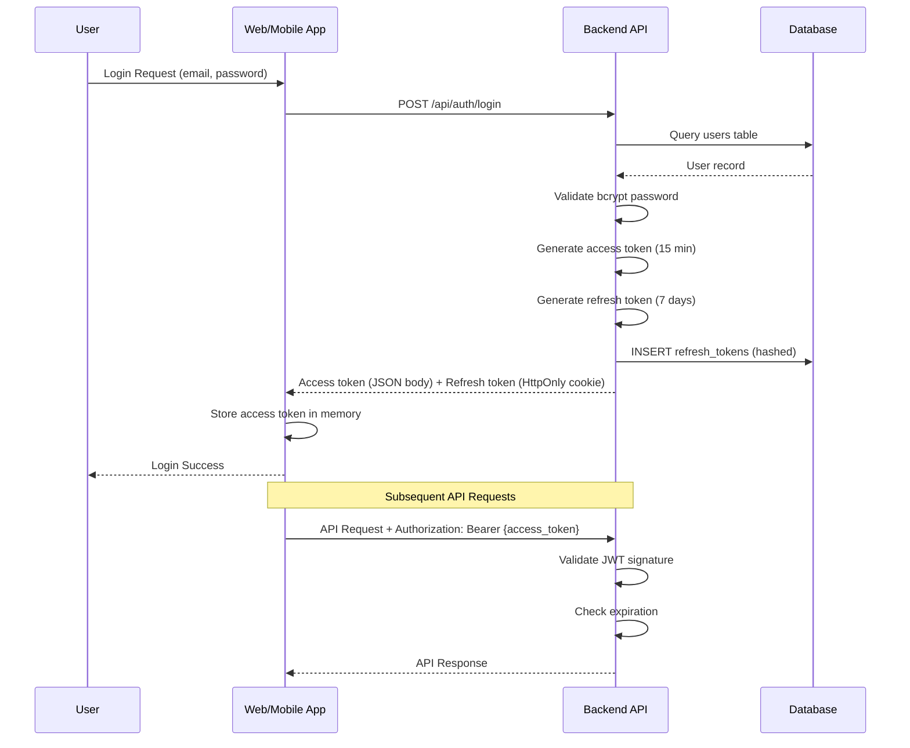
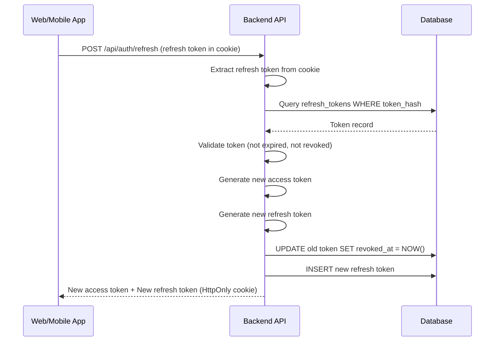
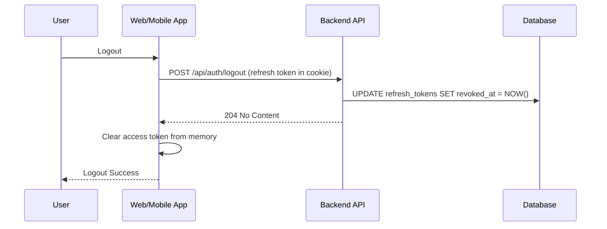

# Authentication and Authorization Model - RepeatWise MVP

## 1. Overview

Authentication và Authorization Model của RepeatWise được thiết kế để đảm bảo bảo mật truy cập vào hệ thống Spaced Repetition System. Model này tuân theo các best practices về bảo mật và tuân thủ các quy định về bảo vệ dữ liệu cá nhân.

**MVP Focus**:
- ✅ Email + password authentication
- ✅ JWT with refresh token (7-day expiry)
- ✅ Simple role-based authorization (user owns their data)
- ✅ Rate limiting (in-memory for MVP)
- ❌ MFA (Future)
- ❌ OAuth providers (Future)
- ❌ Complex RBAC with multiple roles (Future)

**Requirements Mapping**:
- [UC-001: User Registration](../../02-system-analysis/use-cases/UC-001-user-registration.md)
- [UC-002: User Login](../../02-system-analysis/use-cases/UC-002-user-login.md)
- [UC-003: User Logout](../../02-system-analysis/use-cases/UC-003-user-logout.md)
- [NFR Security](../../02-system-analysis/nfr.md) Section 4: Security Requirements
- [MVP Spec](../../../repeatwise-mvp-spec.md) Section 3.3: JWT Authentication
- [Database Schema](../database/schema.md) Section 2.2: refresh_tokens table

## 2. Authentication Architecture

### 2.1 Authentication Flow (MVP)

**Login Flow**:


**Refresh Token Flow**:


**Logout Flow**:


**Requirements Mapping**:
- [UC-002: User Login](../../02-system-analysis/use-cases/UC-002-user-login.md) - Main flow
- [UC-003: User Logout](../../02-system-analysis/use-cases/UC-003-user-logout.md) - Logout + revocation
- [MVP Spec](../../../repeatwise-mvp-spec.md) Section 3.3: Token rotation, expiry times

### 2.2 Multi-Factor Authentication (MFA) ⚠️ NOT IN MVP

**Status**: ❌ Excluded from MVP

**Reason**:
- MVP focuses on single-user personal learning app
- Email + password sufficient for initial validation
- Adds complexity (SMS provider, TOTP library, recovery codes)

**Future Implementation** (Phase 6+):
```json
{
  "mfa_config": {
    "enabled": false,
    "methods": ["email", "totp"],
    "enforcement": {
      "optional": true,
      "required_for_admin": false
    }
  }
}
```

**See**: [MVP Scope](../../01-business/mvp-scope.md) Section 2.1 - User Management exclusions

### 2.3 Password Policy (MVP - Simplified)

#### 2.3.1 Password Requirements (MVP)
```json
{
  "password_policy": {
    "min_length": 8,
    "max_length": 128,
    "require_uppercase": false,
    "require_lowercase": false,
    "require_numbers": false,
    "require_special_chars": false,
    "forbidden_patterns": [
      "password",
      "123456",
      "qwerty"
    ],
    "history_count": 0,
    "max_age_days": null,
    "lockout_policy": {
      "max_attempts": 5,
      "lockout_duration_minutes": 30,
      "reset_after_hours": 24
    }
  }
}
```

**MVP Simplifications**:
- ✅ Minimum 8 characters
- ✅ Basic forbidden patterns check
- ✅ Brute-force protection (5 attempts, 30-min lockout)
- ❌ Complex password requirements (uppercase, numbers, special chars)
- ❌ Password history tracking
- ❌ Password expiration

**Rationale**: Personal learning app, not enterprise system. Balance security vs UX for MVP.

**Requirements Mapping**:
- [UC-001: User Registration](../../02-system-analysis/use-cases/UC-001-user-registration.md) - Password validation
- [NFR Security](../../02-system-analysis/nfr.md) Section 4.1: Password encryption (bcrypt cost 12)

#### 2.3.2 Password Strength Validation (MVP)
```java
/**
 * Simple password validator for MVP
 * Requirements: UC-001 User Registration
 */
public class PasswordValidator {
    private static final int MIN_LENGTH = 8;
    private static final int MAX_LENGTH = 128;
    private static final List<String> FORBIDDEN_PATTERNS = List.of(
        "password", "123456", "qwerty", "admin"
    );

    public ValidationResult validatePassword(String password) {
        // Check null/empty
        if (password == null || password.isBlank()) {
            return ValidationResult.error("Password cannot be empty");
        }

        // Check length
        if (password.length() < MIN_LENGTH) {
            return ValidationResult.error("Password must be at least 8 characters");
        }

        if (password.length() > MAX_LENGTH) {
            return ValidationResult.error("Password must not exceed 128 characters");
        }

        // Check forbidden patterns
        String lowerPassword = password.toLowerCase();
        for (String forbidden : FORBIDDEN_PATTERNS) {
            if (lowerPassword.contains(forbidden)) {
                return ValidationResult.error("Password contains forbidden pattern: " + forbidden);
            }
        }

        return ValidationResult.success();
    }

    public String hashPassword(String plainPassword) {
        // bcrypt with cost factor 12 (as per NFR Section 4.1)
        return BCrypt.hashpw(plainPassword, BCrypt.gensalt(12));
    }

    public boolean verifyPassword(String plainPassword, String hashedPassword) {
        return BCrypt.checkpw(plainPassword, hashedPassword);
    }
}
```

**Database Storage**:
```sql
-- users table stores bcrypt hash (60 chars fixed length)
password_hash VARCHAR(60) NOT NULL CHECK (LENGTH(password_hash) = 60)
```

**See**: [Database Schema](../database/schema.md) Section 2.1: users.password_hash

## 3. Token Management

### 3.1 JWT Token Structure (MVP)

#### 3.1.1 Access Token (15 minutes expiry)
```json
{
  "header": {
    "alg": "HS256",
    "typ": "JWT"
  },
  "payload": {
    "sub": "user-uuid",
    "iss": "repeatwise-api",
    "aud": "repeatwise-app",
    "iat": 1640995200,
    "exp": 1640996100,
    "email": "user@example.com",
    "name": "Nguyễn Văn A"
  }
}
```

**MVP Simplifications**:
- ✅ HS256 (symmetric key) instead of RS256 (faster, simpler for single backend)
- ✅ Short expiry: 15 minutes (security best practice)
- ✅ Minimal claims: sub, iss, aud, iat, exp, email, name
- ❌ No roles/permissions (MVP: user only accesses own data)
- ❌ No MFA claims
- ❌ No device tracking

**Token Generation**:
```java
public String generateAccessToken(User user) {
    Instant now = Instant.now();
    Instant expiry = now.plus(15, ChronoUnit.MINUTES);

    return Jwts.builder()
        .setSubject(user.getId().toString())
        .setIssuer("repeatwise-api")
        .setAudience("repeatwise-app")
        .setIssuedAt(Date.from(now))
        .setExpiration(Date.from(expiry))
        .claim("email", user.getEmail())
        .claim("name", user.getName())
        .signWith(secretKey, SignatureAlgorithm.HS256)
        .compact();
}
```

#### 3.1.2 Refresh Token (7 days expiry)

**NOT stored as JWT in MVP** - stored as random token in database:

```java
public RefreshToken generateRefreshToken(User user) {
    // Generate random token (not JWT)
    String rawToken = UUID.randomUUID().toString();

    // Hash token with bcrypt before storing
    String tokenHash = BCrypt.hashpw(rawToken, BCrypt.gensalt(12));

    RefreshToken refreshToken = RefreshToken.builder()
        .user(user)
        .tokenHash(tokenHash)
        .expiresAt(LocalDateTime.now().plusDays(7))
        .build();

    refreshTokenRepository.save(refreshToken);

    return rawToken; // Return plain token to client (in HttpOnly cookie)
}
```

**Why NOT JWT for refresh token**:
- ✅ Revocation support (update DB row)
- ✅ Simpler logout implementation
- ✅ Better security (can invalidate immediately)

**Database Schema**:
```sql
CREATE TABLE refresh_tokens (
    id UUID PRIMARY KEY,
    user_id UUID NOT NULL,
    token_hash VARCHAR(255) UNIQUE NOT NULL, -- bcrypt hashed
    expires_at TIMESTAMP NOT NULL,
    revoked_at TIMESTAMP NULL,
    created_at TIMESTAMP NOT NULL DEFAULT NOW()
);
```

**Requirements Mapping**:
- [MVP Spec](../../../repeatwise-mvp-spec.md) Section 3.3: JWT with refresh token
- [NFR Security](../../02-system-analysis/nfr.md) Section 4.1: Token expiry times
- [Database Schema](../database/schema.md) Section 2.2: refresh_tokens table

### 3.2 Token Security

#### 3.2.1 Token Storage (MVP)

**Web App**:
```typescript
// Access token: In-memory (not localStorage - XSS protection)
let accessToken: string | null = null;

function storeAccessToken(token: string) {
    accessToken = token; // Memory only, cleared on page refresh
}

// Refresh token: HttpOnly cookie (set by backend, not accessible by JS)
// - Secure: true (HTTPS only)
// - SameSite: Strict (CSRF protection)
// - HttpOnly: true (XSS protection)
```

**Mobile App** (React Native):
```typescript
// Access token: In-memory
let accessToken: string | null = null;

// Refresh token: Secure storage
import * as SecureStore from 'expo-secure-store';

async function storeRefreshToken(token: string) {
    await SecureStore.setItemAsync('refresh_token', token);
}

async function getRefreshToken(): Promise<string | null> {
    return await SecureStore.getItemAsync('refresh_token');
}

async function clearTokens() {
    accessToken = null;
    await SecureStore.deleteItemAsync('refresh_token');
}
```

**Backend - Set HttpOnly Cookie**:
```java
@PostMapping("/api/auth/login")
public ResponseEntity<LoginResponse> login(@RequestBody LoginRequest request,
                                           HttpServletResponse response) {
    // Validate credentials
    User user = authService.authenticate(request.getEmail(), request.getPassword());

    // Generate tokens
    String accessToken = jwtService.generateAccessToken(user);
    String refreshToken = refreshTokenService.generateRefreshToken(user);

    // Set HttpOnly cookie for refresh token
    Cookie cookie = new Cookie("refresh_token", refreshToken);
    cookie.setHttpOnly(true);
    cookie.setSecure(true); // HTTPS only
    cookie.setPath("/api/auth/refresh");
    cookie.setMaxAge(7 * 24 * 60 * 60); // 7 days
    cookie.setSameSite("Strict"); // CSRF protection
    response.addCookie(cookie);

    // Return access token in JSON body
    return ResponseEntity.ok(new LoginResponse(accessToken, 900)); // 900s = 15min
}
```

**Security Rationale**:
- Access token in memory → cleared on page refresh, not vulnerable to XSS
- Refresh token in HttpOnly cookie → not accessible to JavaScript, XSS protection
- HTTPS + Secure flag → prevent MITM attacks
- SameSite=Strict → prevent CSRF attacks

**See**: [MVP Spec](../../../repeatwise-mvp-spec.md) Section 6.2: Security best practices

#### 3.2.2 Token Rotation (MVP)

**Refresh Endpoint**:
```java
@PostMapping("/api/auth/refresh")
public ResponseEntity<RefreshResponse> refresh(
        @CookieValue(name = "refresh_token", required = false) String rawRefreshToken,
        HttpServletResponse response) {

    // Validate refresh token
    if (rawRefreshToken == null) {
        throw new UnauthorizedException("Refresh token missing");
    }

    // Find token in database by hash
    RefreshToken refreshToken = refreshTokenService.findByToken(rawRefreshToken)
        .orElseThrow(() -> new UnauthorizedException("Invalid refresh token"));

    // Check if expired
    if (refreshToken.isExpired()) {
        throw new UnauthorizedException("Refresh token expired");
    }

    // Check if revoked
    if (refreshToken.isRevoked()) {
        throw new UnauthorizedException("Refresh token revoked");
    }

    // Get user
    User user = refreshToken.getUser();

    // Generate new access token
    String newAccessToken = jwtService.generateAccessToken(user);

    // Generate new refresh token (rotation)
    String newRefreshToken = refreshTokenService.generateRefreshToken(user);

    // Revoke old refresh token (one-time use)
    refreshToken.revoke();
    refreshTokenRepository.save(refreshToken);

    // Set new refresh token cookie
    Cookie cookie = new Cookie("refresh_token", newRefreshToken);
    cookie.setHttpOnly(true);
    cookie.setSecure(true);
    cookie.setPath("/api/auth/refresh");
    cookie.setMaxAge(7 * 24 * 60 * 60);
    cookie.setSameSite("Strict");
    response.addCookie(cookie);

    // Return new access token
    return ResponseEntity.ok(new RefreshResponse(newAccessToken, 900));
}
```

**Token Rotation Flow**:
1. Client sends refresh token (in cookie)
2. Backend validates refresh token (hash lookup in DB)
3. Generate new access token + new refresh token
4. **Revoke old refresh token** (set revoked_at = NOW())
5. Store new refresh token in DB
6. Return new access + new refresh to client

**Why Token Rotation**:
- ✅ **Security**: One-time use tokens, limits damage if token stolen
- ✅ **Detection**: If old token used again → potential theft detected
- ✅ **Compliance**: Best practice recommended by OAuth 2.0

**Requirements Mapping**:
- [UC-002: User Login](../../02-system-analysis/use-cases/UC-002-user-login.md) - Token issuance
- [NFR Security](../../02-system-analysis/nfr.md) Section 4.1: Token rotation
- [MVP Spec](../../../repeatwise-mvp-spec.md) Section 3.3: Refresh token implementation

## 4. Authorization Model (MVP - Simplified)

### 4.1 Resource Ownership Authorization (MVP)

**MVP Approach**: Simple ownership-based authorization

❌ **No complex RBAC in MVP**:
- No multiple roles (STUDENT, TEACHER, ADMIN)
- No permission system
- No role-permission mapping

✅ **Simple Authorization Rule**:
- User can only access their own resources
- Check: `resource.user_id == authenticated_user.id`

**Rationale**:
- MVP is single-user personal learning app
- No sharing/collaboration features
- No admin dashboard
- RBAC adds complexity without MVP value

#### 4.1.1 Authorization Service (MVP)
```java
/**
 * Simple ownership-based authorization
 * Requirements: All use cases (UC-001 to UC-024)
 */
@Service
public class AuthorizationService {

    public void checkOwnership(UUID authenticatedUserId, UUID resourceOwnerId) {
        if (!authenticatedUserId.equals(resourceOwnerId)) {
            throw new ForbiddenException("You don't have permission to access this resource");
        }
    }

    public void checkFolderOwnership(UUID userId, UUID folderId) {
        Folder folder = folderRepository.findById(folderId)
            .orElseThrow(() -> new NotFoundException("Folder not found"));

        checkOwnership(userId, folder.getUser().getId());
    }

    public void checkDeckOwnership(UUID userId, UUID deckId) {
        Deck deck = deckRepository.findById(deckId)
            .orElseThrow(() -> new NotFoundException("Deck not found"));

        checkOwnership(userId, deck.getUser().getId());
    }

    public void checkCardOwnership(UUID userId, UUID cardId) {
        Card card = cardRepository.findById(cardId)
            .orElseThrow(() -> new NotFoundException("Card not found"));

        checkOwnership(userId, card.getDeck().getUser().getId());
    }
}
```

#### 4.1.2 Database-Level Authorization
```sql
-- All queries automatically filter by user_id
SELECT * FROM folders WHERE user_id = :authenticatedUserId AND id = :folderId;
SELECT * FROM decks WHERE user_id = :authenticatedUserId AND id = :deckId;
SELECT * FROM cards c
JOIN decks d ON c.deck_id = d.id
WHERE d.user_id = :authenticatedUserId AND c.id = :cardId;
```

**Foreign Key Constraints** ensure data isolation:
```sql
-- folders.user_id → users.id (CASCADE DELETE)
-- decks.user_id → users.id (CASCADE DELETE)
-- card_box_position.user_id → users.id (CASCADE DELETE)
```

**See**: [Database Schema](../database/schema.md) - All core tables have `user_id` FK

### 4.2 API-Level Authorization (MVP)

#### 4.2.1 Controller Authorization Pattern
```java
@RestController
@RequestMapping("/api/folders")
public class FolderController {

    @Autowired
    private AuthorizationService authService;

    @Autowired
    private FolderService folderService;

    /**
     * Get folder details
     * UC-010: View Folder Statistics
     */
    @GetMapping("/{folderId}")
    public ResponseEntity<FolderResponse> getFolder(
            @PathVariable UUID folderId,
            @AuthenticationPrincipal UUID authenticatedUserId) {

        // Authorization check
        authService.checkFolderOwnership(authenticatedUserId, folderId);

        // Business logic
        Folder folder = folderService.getFolder(folderId);
        return ResponseEntity.ok(FolderMapper.toResponse(folder));
    }

    /**
     * Create new folder
     * UC-005: Create Folder Hierarchy
     */
    @PostMapping
    public ResponseEntity<FolderResponse> createFolder(
            @RequestBody CreateFolderRequest request,
            @AuthenticationPrincipal UUID authenticatedUserId) {

        // If parent folder specified, check ownership
        if (request.getParentFolderId() != null) {
            authService.checkFolderOwnership(authenticatedUserId, request.getParentFolderId());
        }

        // Business logic - automatically assigns user_id
        Folder folder = folderService.createFolder(request, authenticatedUserId);
        return ResponseEntity.created(URI.create("/api/folders/" + folder.getId()))
            .body(FolderMapper.toResponse(folder));
    }

    /**
     * Delete folder
     * UC-009: Delete Folder
     */
    @DeleteMapping("/{folderId}")
    public ResponseEntity<Void> deleteFolder(
            @PathVariable UUID folderId,
            @AuthenticationPrincipal UUID authenticatedUserId) {

        // Authorization check
        authService.checkFolderOwnership(authenticatedUserId, folderId);

        // Business logic (soft delete)
        folderService.deleteFolder(folderId);
        return ResponseEntity.noContent().build();
    }
}
```

#### 4.2.2 Service-Level Authorization
```java
@Service
public class FolderServiceImpl implements FolderService {

    @Override
    @Transactional
    public Folder createFolder(CreateFolderRequest request, UUID authenticatedUserId) {
        Folder folder = new Folder();
        folder.setName(request.getName());
        folder.setDescription(request.getDescription());

        // IMPORTANT: Always set user_id from authenticated user, not request
        User user = userRepository.findById(authenticatedUserId)
            .orElseThrow(() -> new NotFoundException("User not found"));
        folder.setUser(user);

        // Set parent folder
        if (request.getParentFolderId() != null) {
            Folder parent = folderRepository.findById(request.getParentFolderId())
                .orElseThrow(() -> new NotFoundException("Parent folder not found"));

            // Parent ownership already checked in controller
            folder.setParentFolder(parent);
        }

        return folderRepository.save(folder);
    }
}
```

**Security Best Practices**:
1. ✅ **Never trust user_id from request body** - always use `@AuthenticationPrincipal`
2. ✅ **Check ownership before any operation** - read, update, delete
3. ✅ **Fail fast** - throw ForbiddenException immediately if ownership check fails
4. ✅ **Database constraints** - FK relationships enforce data isolation

**Requirements Mapping**:
- All use cases (UC-005 to UC-024) follow this authorization pattern
- [NFR Security](../../02-system-analysis/nfr.md) Section 4.2: Authorization requirements

## 5. Session Management

### 5.1 Session Configuration
```yaml
session:
  timeout:
    access_token_minutes: 60
    refresh_token_days: 7
    session_timeout_minutes: 480
  security:
    concurrent_sessions_max: 3
    force_logout_on_password_change: true
    require_mfa_for_sensitive_operations: true
  storage:
    type: "redis"
    encryption: true
    ttl_seconds: 28800
```

### 5.2 Session Tracking
```java
public class SessionManager {
    public void createSession(String userId, String deviceId, String userAgent) {
        Session session = Session.builder()
            .userId(userId)
            .deviceId(deviceId)
            .userAgent(userAgent)
            .ipAddress(getClientIp())
            .createdAt(Instant.now())
            .lastActivity(Instant.now())
            .build();
        
        sessionRepository.save(session);
    }
    
    public void updateLastActivity(String sessionId) {
        sessionRepository.updateLastActivity(sessionId, Instant.now());
    }
    
    public void invalidateSession(String sessionId) {
        sessionRepository.deleteById(sessionId);
    }
    
    public void invalidateAllUserSessions(String userId) {
        sessionRepository.deleteByUserId(userId);
    }
}
```

## 6. Security Headers and Configuration

### 6.1 Security Headers
```java
@Configuration
public class SecurityHeadersConfig {
    
    @Bean
    public SecurityFilterChain filterChain(HttpSecurity http) throws Exception {
        http.headers()
            .frameOptions().deny()
            .contentTypeOptions()
            .and()
            .httpStrictTransportSecurity()
            .and()
            .contentSecurityPolicy("default-src 'self'; script-src 'self' 'unsafe-inline'")
            .and()
            .referrerPolicy(ReferrerPolicyHeaderWriter.ReferrerPolicy.STRICT_ORIGIN_WHEN_CROSS_ORIGIN)
            .and()
            .permissionsPolicy(permissionsPolicyConfig -> permissionsPolicyConfig
                .policy("camera=(), microphone=(), geolocation=()"));
        
        return http.build();
    }
}
```

### 6.2 CORS Configuration
```java
@Configuration
public class CorsConfig {
    
    @Bean
    public CorsConfigurationSource corsConfigurationSource() {
        CorsConfiguration configuration = new CorsConfiguration();
        configuration.setAllowedOrigins(Arrays.asList(
            "https://app.repeatwise.com",
            "https://web.repeatwise.com"
        ));
        configuration.setAllowedMethods(Arrays.asList("GET", "POST", "PUT", "DELETE", "OPTIONS"));
        configuration.setAllowedHeaders(Arrays.asList("*"));
        configuration.setAllowCredentials(true);
        configuration.setMaxAge(3600L);
        
        UrlBasedCorsConfigurationSource source = new UrlBasedCorsConfigurationSource();
        source.registerCorsConfiguration("/**", configuration);
        return source;
    }
}
```

## 7. Rate Limiting

### 7.1 Rate Limiting Configuration
```yaml
rate_limiting:
  authentication:
    login_attempts_per_minute: 5
    mfa_attempts_per_minute: 3
    password_reset_per_hour: 3
  api:
    requests_per_minute: 100
    burst_limit: 200
    user_specific_limit: 1000
  endpoints:
    /api/auth/login:
      requests_per_minute: 5
    /api/auth/register:
      requests_per_hour: 10
    /api/sets:
      requests_per_minute: 60
```

### 7.2 Rate Limiting Implementation
```java
@Component
public class RateLimitingService {
    
    private final RedisTemplate<String, String> redisTemplate;
    
    public boolean isAllowed(String key, int maxRequests, Duration window) {
        String script = """
            local current = redis.call('incr', KEYS[1])
            if current == 1 then
                redis.call('expire', KEYS[1], ARGV[1])
            end
            return current <= tonumber(ARGV[2])
            """;
        
        List<String> keys = List.of(key);
        List<String> args = List.of(
            String.valueOf(window.getSeconds()),
            String.valueOf(maxRequests)
        );
        
        Long result = redisTemplate.execute(
            new DefaultRedisScript<>(script, Long.class),
            keys,
            args.toArray()
        );
        
        return result != null && result == 1;
    }
}
```

## 8. Audit and Monitoring

### 8.1 Authentication Events
```java
public enum AuthEventType {
    LOGIN_SUCCESS,
    LOGIN_FAILURE,
    LOGOUT,
    PASSWORD_CHANGE,
    PASSWORD_RESET,
    MFA_ENABLED,
    MFA_DISABLED,
    MFA_VERIFICATION_SUCCESS,
    MFA_VERIFICATION_FAILURE,
    SESSION_CREATED,
    SESSION_EXPIRED,
    SESSION_INVALIDATED,
    ACCOUNT_LOCKED,
    ACCOUNT_UNLOCKED
}
```

### 8.2 Audit Logging
```java
@Component
public class AuthAuditService {
    
    public void logAuthEvent(AuthEventType eventType, String userId, 
                           String ipAddress, String userAgent, 
                           Map<String, Object> details) {
        AuthAuditLog log = AuthAuditLog.builder()
            .eventType(eventType)
            .userId(userId)
            .ipAddress(ipAddress)
            .userAgent(userAgent)
            .timestamp(Instant.now())
            .details(details)
            .build();
        
        auditLogRepository.save(log);
    }
}
```

## 9. Compliance and Privacy

### 9.1 GDPR Compliance
```java
public class PrivacyService {
    
    public void handleDataSubjectRequest(String userId, DataSubjectRequestType type) {
        switch (type) {
            case ACCESS:
                generateDataExport(userId);
                break;
            case RECTIFICATION:
                // Allow user to update their data
                break;
            case ERASURE:
                anonymizeUserData(userId);
                break;
            case PORTABILITY:
                exportUserData(userId);
                break;
        }
    }
    
    private void anonymizeUserData(String userId) {
        // Anonymize personal data but keep learning progress
        userService.anonymizeUser(userId);
        setService.anonymizeUserSets(userId);
        reviewHistoryService.anonymizeUserReviews(userId);
    }
}
```

### 9.2 Data Retention
```java
@Component
public class DataRetentionService {
    
    @Scheduled(cron = "0 0 2 * * *") // Daily at 2 AM
    public void cleanupExpiredData() {
        // Remove expired sessions
        sessionRepository.deleteExpiredSessions();
        
        // Archive old audit logs
        auditLogRepository.archiveOldLogs();
        
        // Clean up expired tokens
        tokenRepository.deleteExpiredTokens();
    }
}
```

## 10. Security Testing (MVP)

### 10.1 Authentication Testing
```java
@SpringBootTest
@AutoConfigureMockMvc
class AuthenticationSecurityTest {

    @Autowired
    private MockMvc mockMvc;

    /**
     * Test: UC-002 User Login - Invalid credentials
     */
    @Test
    void shouldRejectInvalidCredentials() throws Exception {
        mockMvc.perform(post("/api/auth/login")
                .contentType(MediaType.APPLICATION_JSON)
                .content("{\"email\":\"user@example.com\",\"password\":\"wrongpassword\"}"))
            .andExpect(status().isUnauthorized())
            .andExpect(jsonPath("$.error").value("Invalid credentials"));
    }

    /**
     * Test: UC-002 User Login - Success
     */
    @Test
    void shouldReturnAccessAndRefreshTokensOnSuccessfulLogin() throws Exception {
        mockMvc.perform(post("/api/auth/login")
                .contentType(MediaType.APPLICATION_JSON)
                .content("{\"email\":\"user@example.com\",\"password\":\"correctpassword\"}"))
            .andExpect(status().isOk())
            .andExpect(jsonPath("$.access_token").exists())
            .andExpect(jsonPath("$.expires_in").value(900)) // 15 minutes
            .andExpect(cookie().exists("refresh_token"))
            .andExpect(cookie().httpOnly("refresh_token", true))
            .andExpect(cookie().secure("refresh_token", true));
    }

    /**
     * Test: Token refresh with valid refresh token
     */
    @Test
    void shouldRotateTokensOnRefresh() throws Exception {
        String refreshToken = "valid-refresh-token";

        mockMvc.perform(post("/api/auth/refresh")
                .cookie(new Cookie("refresh_token", refreshToken)))
            .andExpect(status().isOk())
            .andExpect(jsonPath("$.access_token").exists())
            .andExpect(cookie().exists("refresh_token")) // New refresh token
            .andExpect(cookie().value("refresh_token", not(refreshToken))); // Different token
    }

    /**
     * Test: UC-003 User Logout - Token revocation
     */
    @Test
    void shouldRevokeRefreshTokenOnLogout() throws Exception {
        String refreshToken = "valid-refresh-token";

        mockMvc.perform(post("/api/auth/logout")
                .cookie(new Cookie("refresh_token", refreshToken)))
            .andExpect(status().isNoContent());

        // Verify token is revoked in database
        RefreshToken token = refreshTokenRepository.findByTokenHash(hashToken(refreshToken)).get();
        assertThat(token.getRevokedAt()).isNotNull();
    }
}
```

### 10.2 Authorization Testing (MVP)
```java
@SpringBootTest
@AutoConfigureMockMvc
class AuthorizationSecurityTest {

    @Autowired
    private MockMvc mockMvc;

    /**
     * Test: User can only access their own folders
     * UC-010: View Folder Statistics
     */
    @Test
    void shouldPreventAccessToOtherUsersFolders() throws Exception {
        // User 1 creates folder
        UUID user1Id = createUser("user1@example.com");
        String user1Token = loginUser("user1@example.com");
        UUID folderId = createFolder(user1Token, "My Folder");

        // User 2 tries to access user1's folder
        String user2Token = loginUser("user2@example.com");

        mockMvc.perform(get("/api/folders/" + folderId)
                .header("Authorization", "Bearer " + user2Token))
            .andExpect(status().isForbidden())
            .andExpect(jsonPath("$.error").value("You don't have permission to access this resource"));
    }

    /**
     * Test: User can access their own folders
     */
    @Test
    void shouldAllowAccessToOwnFolders() throws Exception {
        String userToken = loginUser("user@example.com");
        UUID folderId = createFolder(userToken, "My Folder");

        mockMvc.perform(get("/api/folders/" + folderId)
                .header("Authorization", "Bearer " + userToken))
            .andExpect(status().isOk())
            .andExpect(jsonPath("$.id").value(folderId.toString()))
            .andExpect(jsonPath("$.name").value("My Folder"));
    }

    /**
     * Test: Authenticated request required
     */
    @Test
    void shouldRejectUnauthenticatedRequests() throws Exception {
        mockMvc.perform(get("/api/folders"))
            .andExpect(status().isUnauthorized());
    }
}
```

**Test Coverage Requirements**:
- ✅ Authentication: Login, logout, token refresh
- ✅ Authorization: Ownership checks, forbidden access
- ✅ Password validation: Min length, forbidden patterns
- ✅ Token security: HttpOnly cookies, expiration
- ❌ MFA (not in MVP)
- ❌ Rate limiting (manual testing for MVP)

**See**: [MVP Spec](../../../repeatwise-mvp-spec.md) Section 6.6: Testing requirements

---

## 11. MVP Summary & Future Enhancements

### 11.1 MVP Security Features (Implemented)

✅ **Authentication**:
- Email + password authentication
- bcrypt password hashing (cost 12)
- JWT access tokens (15 min expiry)
- Refresh token rotation (7-day expiry)
- HttpOnly cookies for refresh tokens
- In-memory access token storage (web)

✅ **Authorization**:
- Simple ownership-based authorization
- User can only access own resources
- Database-level isolation (user_id FK)

✅ **Security Best Practices**:
- HTTPS enforcement
- CORS configuration
- XSS protection (HttpOnly cookies)
- CSRF protection (SameSite=Strict)
- SQL injection prevention (parameterized queries)

### 11.2 MVP Exclusions (Future)

❌ **Advanced Authentication** (Phase 6+):
- MFA (SMS, TOTP, Email)
- OAuth providers (Google, Facebook)
- Biometric authentication
- Device fingerprinting

❌ **Advanced Authorization** (Phase 7+):
- Complex RBAC (STUDENT, TEACHER, ADMIN roles)
- Permission system
- Shared/public resources
- Folder-level permissions

❌ **Enterprise Security** (Phase 8+):
- Session management (concurrent sessions, device tracking)
- Advanced rate limiting (Redis-based)
- Audit logging (comprehensive)
- GDPR compliance tooling
- Advanced password policies (rotation, history)

### 11.3 Requirements Traceability

| Security Feature | Use Cases | NFR Section | Database Table |
|-----------------|-----------|-------------|----------------|
| Email/Password Auth | UC-001, UC-002 | 4.1 | users |
| Refresh Token | UC-002, UC-003 | 4.1 | refresh_tokens |
| Password Hashing | UC-001 | 4.1 | users.password_hash |
| Ownership Authorization | UC-005 to UC-024 | 4.2 | All tables with user_id |
| JWT Access Token | All API calls | 4.1 | N/A (stateless) |

### 11.4 Implementation Checklist

✅ **Completed in MVP**:
- [x] User registration with password validation
- [x] Login with JWT generation
- [x] Refresh token rotation
- [x] Logout with token revocation
- [x] Ownership-based authorization
- [x] HttpOnly cookie configuration
- [x] CORS configuration
- [x] Security testing (auth + authz)

❌ **Future Work**:
- [ ] MFA implementation
- [ ] OAuth integration
- [ ] Role-based permissions
- [ ] Session management UI
- [ ] Advanced rate limiting
- [ ] Audit logging dashboard

---

**Document Version**: 2.0 (MVP)
**Last Updated**: 2025-01-10
**Status**: ✅ Ready for Implementation

**Related Documents**:
- [UC-001: User Registration](../../02-system-analysis/use-cases/UC-001-user-registration.md)
- [UC-002: User Login](../../02-system-analysis/use-cases/UC-002-user-login.md)
- [UC-003: User Logout](../../02-system-analysis/use-cases/UC-003-user-logout.md)
- [NFR Security](../../02-system-analysis/nfr.md) Section 4: Security Requirements
- [Database Schema](../database/schema.md) Section 2: Core Tables
- [MVP Spec](../../../repeatwise-mvp-spec.md) Section 3.3 & 6.2: JWT Auth & Security
