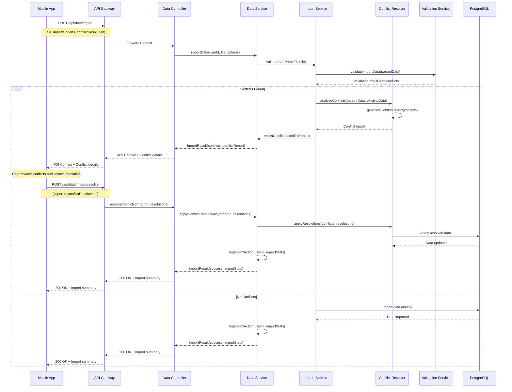
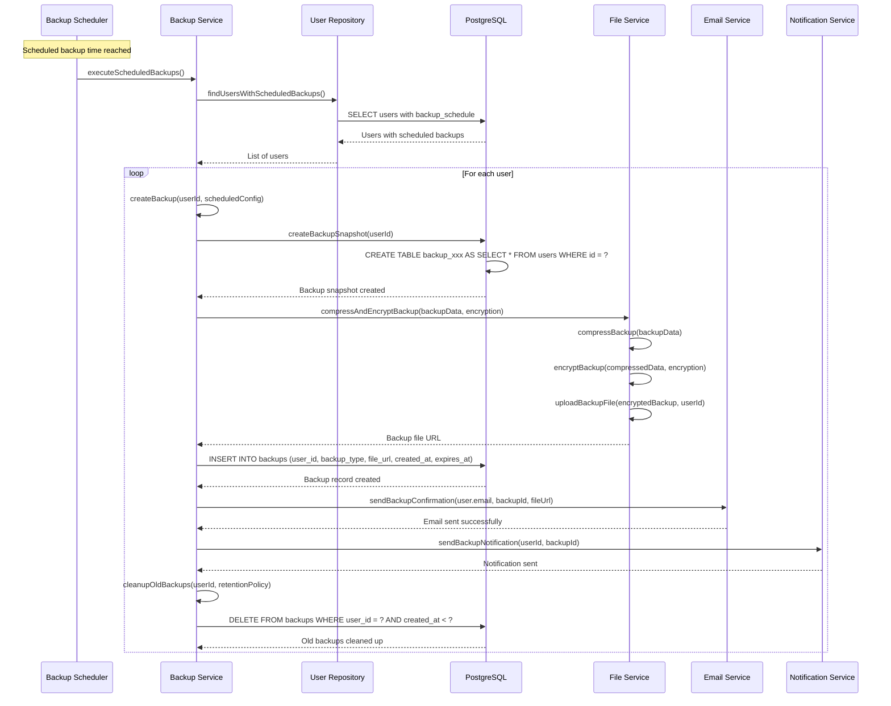
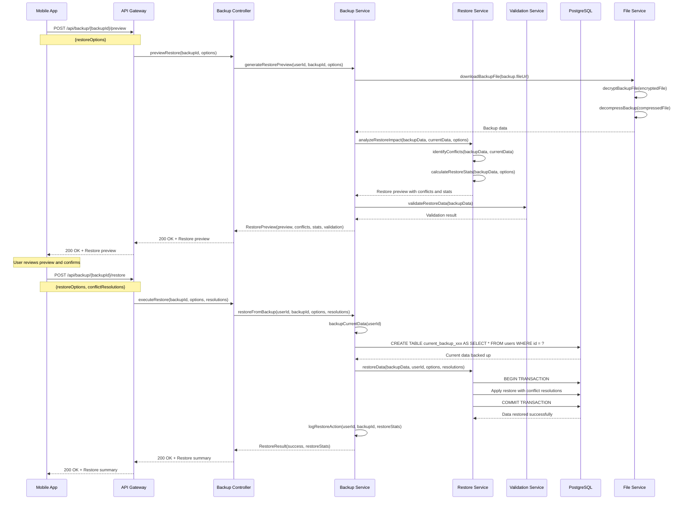

# Phân tích Import/Export và Backup/Restore: Gap Analysis

## Tổng quan

Tài liệu này phân tích sự khác biệt giữa các Use Cases chi tiết trong phân tích hệ thống (02-system-analysis) và thiết kế hiện tại (03-design) cho các chức năng Import/Export và Backup/Restore.

## 1. So sánh Use Cases vs Thiết kế hiện tại

### 1.1 Import Learning Data (UC-022)

#### Use Case Chi tiết:
- **9 bước chính** với xử lý chi tiết
- **5 alternative flows** bao gồm xử lý lỗi phức tạp
- **Conflict resolution strategies**: skip/overwrite/rename
- **Import modes**: merge/replace
- **Data validation levels** khác nhau
- **Progress tracking** và **estimated time**
- **Rollback mechanism** khi có lỗi

#### Thiết kế hiện tại:
- **Chỉ có 1 sequence diagram** cơ bản
- **Thiếu các alternative flows** chi tiết
- **Conflict resolution** chỉ được đề cập sơ lược
- **Không có progress tracking** chi tiết
- **Thiếu rollback mechanism** rõ ràng

#### Gaps chính:
1. **Thiếu xử lý conflicts chi tiết**
2. **Không có import modes** (merge/replace)
3. **Thiếu progress tracking** và estimated time
4. **Không có rollback mechanism** đầy đủ
5. **Thiếu data validation levels**

### 1.2 Backup Learning Data (UC-023)

#### Use Case Chi tiết:
- **9 bước chính** với nhiều tùy chọn
- **5 alternative flows** bao gồm authentication, storage issues
- **Backup types**: manual/scheduled/incremental/full
- **Backup locations**: cloud/local/email/external
- **Encryption và compression options**
- **Scheduling với frequency, timezone**
- **Retention period và auto-cleanup**

#### Thiết kế hiện tại:
- **Chỉ có 1 sequence diagram** đơn giản
- **Thiếu scheduling mechanism**
- **Không có incremental backup**
- **Thiếu cloud storage integration** chi tiết
- **Không có retention policy** rõ ràng

#### Gaps chính:
1. **Thiếu scheduled backup** mechanism
2. **Không có incremental backup**
3. **Thiếu cloud storage authentication**
4. **Không có retention policy** implementation
5. **Thiếu auto-cleanup** mechanism

### 1.3 Restore Learning Data (UC-024)

#### Use Case Chi tiết:
- **9 bước chính** với validation phức tạp
- **5 alternative flows** bao gồm file corruption, conflicts
- **Restore modes**: full/selective
- **Conflict resolution**: overwrite/skip/merge
- **Backup current data** trước khi restore
- **Restore preview** và validation
- **Rollback mechanism** khi thất bại

#### Thiết kế hiện tại:
- **Chỉ có 1 sequence diagram** cơ bản
- **Thiếu selective restore**
- **Conflict resolution** không chi tiết
- **Không có backup current data** mechanism
- **Thiếu restore preview**

#### Gaps chính:
1. **Thiếu selective restore** options
2. **Conflict resolution** không đầy đủ
3. **Không có backup current data** trước restore
4. **Thiếu restore preview** mechanism
5. **Rollback mechanism** không chi tiết

## 2. API Design Gaps

### 2.1 OpenAPI Specification

#### Hiện tại:
- **Không có endpoints** cho Import/Export/Backup/Restore
- **Thiếu data models** cho các chức năng này
- **Không có error responses** chi tiết

#### Cần bổ sung:
```yaml
# Import endpoints
/api/data/import:
  post:
    summary: Import learning data
    requestBody:
      content:
        multipart/form-data:
          schema:
            type: object
            properties:
              file:
                type: string
                format: binary
              importOptions:
                $ref: '#/components/schemas/ImportOptions'
              conflictResolution:
                $ref: '#/components/schemas/ConflictResolution'

# Export endpoints  
/api/data/export:
  post:
    summary: Export learning data
    requestBody:
      content:
        application/json:
          schema:
            $ref: '#/components/schemas/ExportRequest'

# Backup endpoints
/api/backup:
  post:
    summary: Create backup
  get:
    summary: List backups
/api/backup/{backupId}:
  get:
    summary: Get backup details
  delete:
    summary: Delete backup
/api/backup/{backupId}/restore:
  post:
    summary: Restore from backup
```

### 2.2 Data Models cần thiết

```yaml
components:
  schemas:
    ImportOptions:
      type: object
      properties:
        importMode:
          type: string
          enum: [merge, replace]
        conflictResolution:
          type: string
          enum: [skip, overwrite, rename]
        dataValidationLevel:
          type: string
          enum: [basic, strict, custom]
        backupExisting:
          type: boolean
    
    ExportRequest:
      type: object
      properties:
        exportType:
          type: string
          enum: [all, sets, cycles, reviews]
        format:
          type: string
          enum: [json, csv, excel, pdf]
        dateRange:
          $ref: '#/components/schemas/DateRange'
        options:
          $ref: '#/components/schemas/ExportOptions'
    
    BackupConfig:
      type: object
      properties:
        backupType:
          type: string
          enum: [manual, scheduled, incremental, full]
        backupScope:
          type: object
          properties:
            includeSets:
              type: boolean
            includeCycles:
              type: boolean
            includeReviews:
              type: boolean
            includePreferences:
              type: boolean
        backupLocation:
          type: string
          enum: [cloud, local, email, external]
        encryption:
          type: boolean
        compression:
          type: boolean
        retentionPeriod:
          type: integer
        schedule:
          $ref: '#/components/schemas/BackupSchedule'
    
    RestoreOptions:
      type: object
      properties:
        restoreMode:
          type: string
          enum: [full, selective]
        conflictResolution:
          type: string
          enum: [overwrite, skip, merge]
        backupCurrent:
          type: boolean
        selectedComponents:
          type: array
          items:
            type: string
```

## 3. Sequence Diagrams cần bổ sung

### 3.1 Import với Conflict Resolution



### 3.2 Scheduled Backup



### 3.3 Restore với Preview



## 4. Các cải thiện cần thiết

### 4.1 API Endpoints cần bổ sung

1. **Import Management**:
   - `POST /api/data/import` - Upload và validate import file
   - `GET /api/data/import/{importId}/preview` - Preview import data
   - `POST /api/data/import/{importId}/resolve` - Resolve conflicts
   - `GET /api/data/import/{importId}/status` - Check import status
   - `DELETE /api/data/import/{importId}` - Cancel import

2. **Export Management**:
   - `POST /api/data/export` - Create export request
   - `GET /api/data/export/{exportId}/status` - Check export status
   - `GET /api/data/export/{exportId}/download` - Download export file
   - `DELETE /api/data/export/{exportId}` - Cancel export

3. **Backup Management**:
   - `POST /api/backup` - Create backup
   - `GET /api/backup` - List backups
   - `GET /api/backup/{backupId}` - Get backup details
   - `PUT /api/backup/{backupId}/schedule` - Update backup schedule
   - `DELETE /api/backup/{backupId}` - Delete backup
   - `POST /api/backup/{backupId}/restore` - Restore from backup
   - `POST /api/backup/{backupId}/preview` - Preview restore

### 4.2 Business Logic cần implement

1. **Conflict Resolution Engine**:
   - Analyze conflicts between imported and existing data
   - Generate conflict reports with detailed information
   - Apply user-selected resolution strategies
   - Handle UUID conflicts and data relationships

2. **Progress Tracking System**:
   - Track import/export/backup/restore progress
   - Provide estimated completion time
   - Handle large dataset processing
   - Support cancellation of long-running operations

3. **Scheduling System**:
   - Manage scheduled backups
   - Handle timezone differences
   - Retry failed scheduled operations
   - Cleanup old backups automatically

4. **Validation Engine**:
   - Multi-level data validation
   - File format detection and validation
   - Data integrity checks
   - Relationship validation

### 4.3 Error Handling cần cải thiện

1. **Detailed Error Responses**:
   - Specific error codes for different scenarios
   - Detailed error messages with suggestions
   - Error categorization (validation, system, user)

2. **Rollback Mechanisms**:
   - Automatic rollback on failure
   - Partial rollback for selective operations
   - Backup current data before destructive operations

3. **Retry Logic**:
   - Automatic retry for transient failures
   - Exponential backoff for retries
   - User notification of retry attempts

## 5. Kết luận

Có sự khác biệt đáng kể giữa độ chi tiết của Use Cases và thiết kế hiện tại. Use Cases cung cấp mô tả rất chi tiết với nhiều kịch bản phức tạp, trong khi thiết kế hiện tại chỉ ở mức tổng quan.

### Ưu tiên cải thiện:

1. **Cao**: Bổ sung API endpoints cho Import/Export/Backup/Restore
2. **Cao**: Implement conflict resolution engine
3. **Trung bình**: Thêm progress tracking và scheduling
4. **Trung bình**: Cải thiện error handling và rollback
5. **Thấp**: Bổ sung advanced features như incremental backup

### Timeline đề xuất:

- **Phase 1** (2-3 tuần): Basic API endpoints và conflict resolution
- **Phase 2** (2-3 tuần): Progress tracking và scheduling
- **Phase 3** (1-2 tuần): Advanced features và optimization
