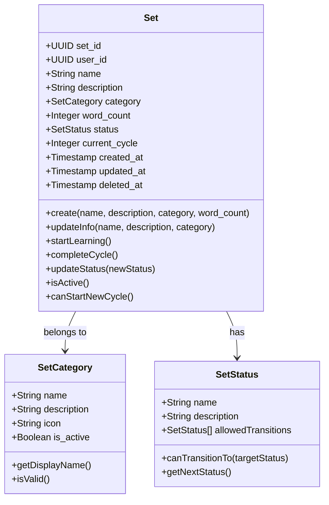
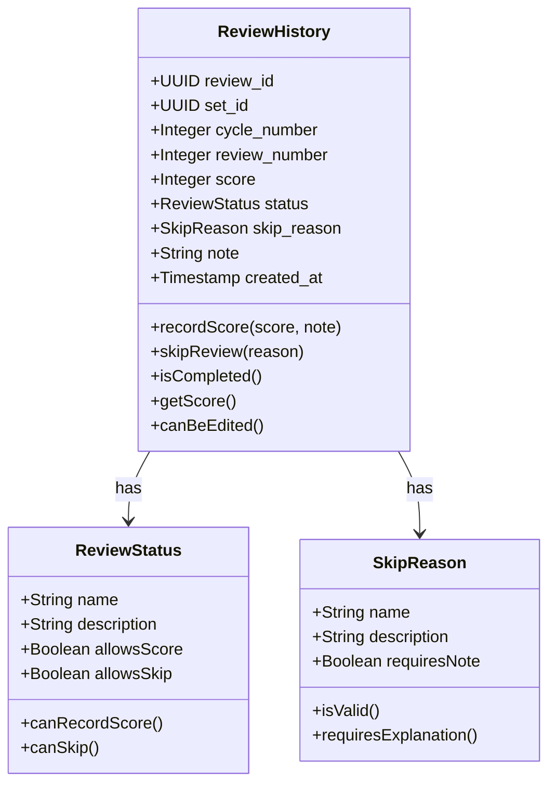
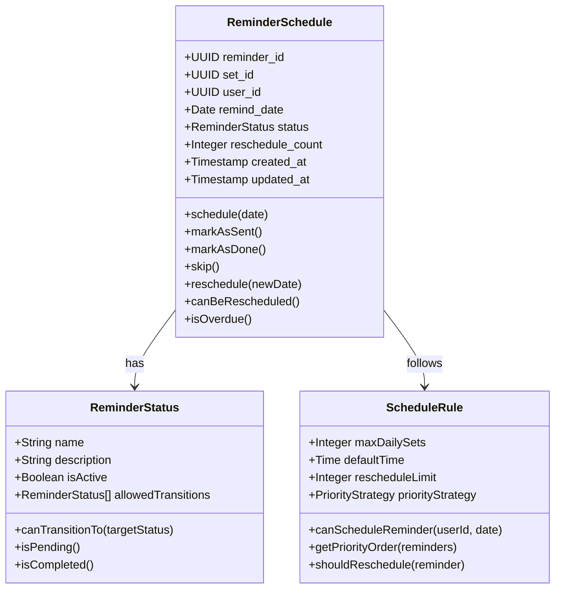

# Domain Model

## 1. Overview

Domain Model của RepeatWise được thiết kế theo Domain-Driven Design (DDD) với các bounded contexts rõ ràng và entities có trách nhiệm cụ thể. Hệ thống tập trung vào việc quản lý học tập thông qua Spaced Repetition System (SRS).

## 2. Bounded Contexts

### 2.1 User Management Context
**Responsibility**: Quản lý thông tin người dùng, authentication, authorization
**Key Entities**: User, UserProfile, UserSettings
**Business Rules**: 
- User phải có email duy nhất
- Password phải được mã hóa
- User chỉ có thể access dữ liệu của mình

### 2.2 Learning Management Context
**Responsibility**: Quản lý set học tập, chu kỳ học, điểm số
**Key Entities**: Set, ReviewHistory, LearningCycle
**Business Rules**:
- Mỗi set thuộc về một user
- Mỗi chu kỳ có 5 lần ôn tập
- Điểm số phải từ 0-100%

### 2.3 Scheduling Context
**Responsibility**: Quản lý lịch nhắc nhở, reschedule, overload prevention
**Key Entities**: ReminderSchedule, ScheduleRule, OverloadManager
**Business Rules**:
- Tối đa 3 set/ngày/user
- Tự động reschedule khi quá tải
- Ưu tiên theo thứ tự: quá hạn > điểm thấp > từ ít

### 2.4 Analytics Context
**Responsibility**: Thống kê, báo cáo, phân tích hiệu quả học tập
**Key Entities**: LearningStatistics, PerformanceMetrics, ProgressReport
**Business Rules**:
- Tính toán điểm trung bình chu kỳ
- Theo dõi tiến trình học tập
- Phân tích xu hướng cải thiện

## 3. Core Entities

### 3.1 User Entity

```mermaid
classDiagram
    class User {
        +UUID user_id
        +String email
        +String password_hash
        +String full_name
        +Language preferred_language
        +String timezone
        +Time default_reminder_time
        +UserStatus status
        +Timestamp created_at
        +Timestamp updated_at
        +Timestamp deleted_at
        
        +register(email, password, full_name)
        +updateProfile(profileData)
        +changePassword(newPassword)
        +deactivate()
        +isActive()
    }
    
    class UserProfile {
        +UUID profile_id
        +UUID user_id
        +String avatar_url
        +String bio
        +LearningGoal[] goals
        +Timestamp created_at
        +Timestamp updated_at
        
        +updateAvatar(url)
        +setGoals(goals)
        +getLearningProgress()
    }
    
    class UserSettings {
        +UUID settings_id
        +UUID user_id
        +NotificationSettings notifications
        +PrivacySettings privacy
        +LearningPreferences preferences
        +Timestamp updated_at
        
        +updateNotificationSettings(settings)
        +updatePrivacySettings(settings)
        +updateLearningPreferences(preferences)
    }
    
    User ||--|| UserProfile : has
    User ||--|| UserSettings : has
```

**Aggregate Root**: User
**Invariants**:
- Email phải duy nhất và hợp lệ
- Password phải được mã hóa
- User chỉ có thể access dữ liệu của mình

### 3.2 Set Entity



**Aggregate Root**: Set
**Invariants**:
- Set phải thuộc về một user
- Tên set không được trống và ≤ 100 ký tự
- Số từ vựng phải > 0
- Status transitions phải hợp lệ

### 3.3 Review History Entity



**Aggregate Root**: ReviewHistory
**Invariants**:
- Review phải thuộc về một set
- Cycle number phải match với set.current_cycle
- Review number phải từ 1-5
- Score phải từ 0-100 hoặc NULL nếu skipped

### 3.4 Reminder Schedule Entity



**Aggregate Root**: ReminderSchedule
**Invariants**:
- Reminder phải thuộc về một set và user
- Remind date phải trong tương lai khi tạo
- Reschedule count không được vượt quá limit
- Status transitions phải hợp lệ

## 4. Value Objects

### 4.1 Email Value Object
```java
class Email {
    private String value;
    
    public Email(String email) {
        validate(email);
        this.value = email.toLowerCase().trim();
    }
    
    private void validate(String email) {
        if (email == null || !email.matches(EMAIL_PATTERN)) {
            throw new InvalidEmailException();
        }
    }
    
    public String getValue() { return value; }
    public String getDomain() { return value.substring(value.indexOf('@') + 1); }
}
```

### 4.2 Score Value Object
```java
class Score {
    private Integer value;
    
    public Score(Integer score) {
        validate(score);
        this.value = score;
    }
    
    private void validate(Integer score) {
        if (score == null || score < 0 || score > 100) {
            throw new InvalidScoreException();
        }
    }
    
    public Integer getValue() { return value; }
    public boolean isExcellent() { return value >= 90; }
    public boolean isGood() { return value >= 70; }
    public boolean isPoor() { return value < 40; }
}
```

### 4.3 DateRange Value Object
```java
class DateRange {
    private LocalDate startDate;
    private LocalDate endDate;
    
    public DateRange(LocalDate start, LocalDate end) {
        validate(start, end);
        this.startDate = start;
        this.endDate = end;
    }
    
    private void validate(LocalDate start, LocalDate end) {
        if (start == null || end == null || start.isAfter(end)) {
            throw new InvalidDateRangeException();
        }
    }
    
    public boolean contains(LocalDate date) {
        return !date.isBefore(startDate) && !date.isAfter(endDate);
    }
    
    public long getDays() {
        return ChronoUnit.DAYS.between(startDate, endDate) + 1;
    }
}
```

## 5. Domain Services

### 5.1 SRS Algorithm Service
```java
@Service
class SRSAlgorithmService {
    
    public int calculateNextCycleDelay(Set set, double avgScore) {
        int baseDelay = getBaseDelay();
        double penalty = getPenalty();
        double scaling = getScaling();
        
        int delay = (int) (baseDelay - penalty * (100 - avgScore) + scaling * set.getWordCount());
        
        return Math.max(getMinDelay(), Math.min(getMaxDelay(), delay));
    }
    
    public boolean shouldStartNewCycle(Set set) {
        return set.getCompletedReviewsInCurrentCycle().size() >= 5;
    }
    
    public double calculateAverageScore(List<ReviewHistory> reviews) {
        return reviews.stream()
            .filter(r -> r.getScore() != null)
            .mapToInt(ReviewHistory::getScore)
            .average()
            .orElse(0.0);
    }
}
```

### 5.2 Overload Prevention Service
```java
@Service
class OverloadPreventionService {
    
    public List<ReminderSchedule> prioritizeReminders(List<ReminderSchedule> reminders) {
        return reminders.stream()
            .sorted(Comparator
                .comparing(ReminderSchedule::getOverdueDays).reversed()
                .thenComparing(r -> r.getSet().getAverageScore())
                .thenComparing(r -> r.getSet().getWordCount()))
            .limit(getMaxDailySets())
            .collect(Collectors.toList());
    }
    
    public List<ReminderSchedule> rescheduleOverflow(List<ReminderSchedule> reminders) {
        List<ReminderSchedule> prioritized = prioritizeReminders(reminders);
        List<ReminderSchedule> overflow = reminders.stream()
            .filter(r -> !prioritized.contains(r))
            .collect(Collectors.toList());
            
        return rescheduleToNextAvailableDate(overflow);
    }
    
    private List<ReminderSchedule> rescheduleToNextAvailableDate(List<ReminderSchedule> reminders) {
        // Implementation for rescheduling logic
    }
}
```

### 5.3 Learning Analytics Service
```java
@Service
class LearningAnalyticsService {
    
    public LearningStatistics calculateStatistics(UUID userId, DateRange period) {
        List<Set> sets = setRepository.findByUserIdAndPeriod(userId, period);
        List<ReviewHistory> reviews = reviewRepository.findByUserIdAndPeriod(userId, period);
        
        return LearningStatistics.builder()
            .totalSets(sets.size())
            .activeSets(countActiveSets(sets))
            .completedCycles(countCompletedCycles(reviews))
            .averageScore(calculateAverageScore(reviews))
            .learningStreak(calculateLearningStreak(reviews))
            .build();
    }
    
    public PerformanceTrend analyzeTrend(UUID userId, int months) {
        // Implementation for trend analysis
    }
    
    public SetRecommendation generateRecommendations(UUID userId) {
        // Implementation for recommendations
    }
}
```

### 5.4 Mastered Status Service
```java
@Service
class MasteredStatusService {
    
    public boolean checkMasteredCondition(Set set) {
        // Kiểm tra điều kiện mastered theo BR-033
        List<ReviewHistory> recentCycles = getLastThreeCycles(set.getId());
        
        if (recentCycles.size() < 3) {
            return false; // Chưa đủ 3 chu kỳ
        }
        
        // Kiểm tra avg_score ≥ 85% trong 3 chu kỳ liên tiếp
        boolean hasHighScores = recentCycles.stream()
            .allMatch(cycle -> calculateCycleAverageScore(cycle) >= 85.0);
            
        // Kiểm tra không có skip trong 3 chu kỳ cuối
        boolean noSkips = recentCycles.stream()
            .noneMatch(cycle -> hasSkippedReviews(cycle));
            
        // Kiểm tra tổng thời gian học ≥ 30 ngày
        boolean sufficientTime = calculateTotalLearningTime(set) >= 30;
        
        return hasHighScores && noSkips && sufficientTime;
    }
    
    public void handleMasteredStatus(Set set) {
        if (checkMasteredCondition(set)) {
            set.updateStatus(SetStatus.MASTERED);
            createPeriodicReviewSchedule(set);
            publishMasteredEvent(set);
        }
    }
    
    public void handleMasteredMaintenance(Set set, ReviewHistory review) {
        // Xử lý duy trì trạng thái mastered theo BR-034
        if (set.getStatus() == SetStatus.MASTERED) {
            if (review.getScore() < 50) {
                set.updateStatus(SetStatus.LEARNING); // Reset về learning
            } else if (review.getScore() < 70) {
                set.updateStatus(SetStatus.REVIEWING); // Chuyển về reviewing
            }
            // Nếu score >= 70, giữ nguyên mastered status
        }
    }
    
    private List<ReviewHistory> getLastThreeCycles(UUID setId) {
        // Lấy 3 chu kỳ gần nhất (bỏ qua chu kỳ đầu tiên)
        return reviewRepository.findLastThreeCycles(setId);
    }
    
    private double calculateCycleAverageScore(ReviewHistory cycle) {
        // Tính điểm trung bình của một chu kỳ
        return cycle.getReviews().stream()
            .filter(r -> r.getScore() != null)
            .mapToInt(Review::getScore)
            .average()
            .orElse(0.0);
    }
    
    private boolean hasSkippedReviews(ReviewHistory cycle) {
        // Kiểm tra có lần ôn nào bị skip không
        return cycle.getReviews().stream()
            .anyMatch(r -> r.getStatus() == ReviewStatus.SKIPPED);
    }
    
    private long calculateTotalLearningTime(Set set) {
        // Tính tổng thời gian học từ lần ôn đầu tiên
        ReviewHistory firstReview = reviewRepository.findFirstReview(set.getId());
        if (firstReview == null) {
            return 0;
        }
        return ChronoUnit.DAYS.between(
            firstReview.getCreatedAt().toLocalDate(), 
            LocalDate.now()
        );
    }
    
    private void createPeriodicReviewSchedule(Set set) {
        // Tạo lịch ôn định kỳ mỗi 90 ngày
        LocalDate nextReviewDate = LocalDate.now().plusDays(90);
        reminderService.schedulePeriodicReview(set.getId(), nextReviewDate);
    }
    
    private void publishMasteredEvent(Set set) {
        // Publish event cho analytics và notifications
        eventPublisher.publish(new SetMasteredEvent(set.getId(), set.getUserId()));
    }
}
```

## 6. Domain Events

### 6.1 User Events
```java
@Event
class UserRegisteredEvent {
    private UUID userId;
    private String email;
    private LocalDateTime registeredAt;
}

@Event
class UserProfileUpdatedEvent {
    private UUID userId;
    private Map<String, Object> changes;
    private LocalDateTime updatedAt;
}
```

### 6.2 Learning Events
```java
@Event
class SetCreatedEvent {
    private UUID setId;
    private UUID userId;
    private String setName;
    private LocalDateTime createdAt;
}

@Event
class ReviewCompletedEvent {
    private UUID reviewId;
    private UUID setId;
    private Integer score;
    private LocalDateTime completedAt;
}

@Event
class CycleCompletedEvent {
    private UUID setId;
    private Integer cycleNumber;
    private Double averageScore;
    private Integer nextCycleDelay;
    private LocalDateTime completedAt;
}

@Event
class SetMasteredEvent {
    private UUID setId;
    private UUID userId;
    private Integer totalCycles;
    private Double finalAverageScore;
    private LocalDateTime masteredAt;
}

@Event
class MasteredStatusChangedEvent {
    private UUID setId;
    private UUID userId;
    private SetStatus oldStatus;
    private SetStatus newStatus;
    private String reason;
    private LocalDateTime changedAt;
}
```

### 6.3 Scheduling Events
```java
@Event
class ReminderScheduledEvent {
    private UUID reminderId;
    private UUID setId;
    private LocalDate remindDate;
    private LocalDateTime scheduledAt;
}

@Event
class ReminderSentEvent {
    private UUID reminderId;
    private UUID userId;
    private LocalDateTime sentAt;
}

@Event
class ReminderRescheduledEvent {
    private UUID reminderId;
    private LocalDate oldDate;
    private LocalDate newDate;
    private String reason;
    private LocalDateTime rescheduledAt;
}
```

## 7. Repository Interfaces

### 7.1 User Repository
```java
@Repository
interface UserRepository extends JpaRepository<User, UUID> {
    Optional<User> findByEmail(String email);
    Optional<User> findByEmailAndStatus(String email, UserStatus status);
    boolean existsByEmail(String email);
    List<User> findByStatus(UserStatus status);
    List<User> findByCreatedAtBetween(LocalDateTime start, LocalDateTime end);
}
```

### 7.2 Set Repository
```java
@Repository
interface SetRepository extends JpaRepository<Set, UUID> {
    List<Set> findByUserId(UUID userId);
    List<Set> findByUserIdAndStatus(UUID userId, SetStatus status);
    List<Set> findByUserIdAndCategory(UUID userId, SetCategory category);
    List<Set> findByUserIdAndCreatedAtBetween(UUID userId, LocalDateTime start, LocalDateTime end);
    long countByUserIdAndStatus(UUID userId, SetStatus status);
}
```

### 7.3 Review Repository
```java
@Repository
interface ReviewRepository extends JpaRepository<ReviewHistory, UUID> {
    List<ReviewHistory> findBySetId(UUID setId);
    List<ReviewHistory> findBySetIdAndCycleNumber(UUID setId, Integer cycleNumber);
    List<ReviewHistory> findBySetIdAndStatus(UUID setId, ReviewStatus status);
    List<ReviewHistory> findByUserIdAndCreatedAtBetween(UUID userId, LocalDateTime start, LocalDateTime end);
    Optional<ReviewHistory> findBySetIdAndCycleNumberAndReviewNumber(UUID setId, Integer cycleNumber, Integer reviewNumber);
}
```

### 7.4 Reminder Repository
```java
@Repository
interface ReminderRepository extends JpaRepository<ReminderSchedule, UUID> {
    List<ReminderSchedule> findByUserIdAndRemindDate(UUID userId, LocalDate date);
    List<ReminderSchedule> findByUserIdAndStatus(UUID userId, ReminderStatus status);
    List<ReminderSchedule> findByRemindDateAndStatus(LocalDate date, ReminderStatus status);
    List<ReminderSchedule> findBySetIdAndStatus(UUID setId, ReminderStatus status);
    List<ReminderSchedule> findByUserIdAndRemindDateBetween(UUID userId, LocalDate start, LocalDate end);
}
```

## 8. Aggregate Relationships

```mermaid
erDiagram
    User ||--o{ Set : creates
    User ||--o{ ReviewHistory : performs
    User ||--o{ ReminderSchedule : receives
    User ||--o{ ActivityLog : generates
    
    Set ||--o{ ReviewHistory : contains
    Set ||--o{ ReminderSchedule : schedules
    Set }o--|| SetCategory : belongs to
    Set }o--|| SetStatus : has
    
    ReviewHistory }o--|| ReviewStatus : has
    ReviewHistory }o--|| SkipReason : has
    
    ReminderSchedule }o--|| ReminderStatus : has
    ReminderSchedule }o--|| ScheduleRule : follows
    
    User ||--|| UserProfile : has
    User ||--|| UserSettings : has
```

## 9. Domain Rules Summary

### 9.1 User Management Rules
- Email phải duy nhất và hợp lệ
- Password phải được mã hóa với BCrypt
- User chỉ có thể access dữ liệu của mình
- Soft delete cho user và related data

### 9.2 Learning Management Rules
- Set phải thuộc về một user
- Mỗi chu kỳ có đúng 5 lần ôn tập với khoảng cách: 1, 3, 7, 14, 30 ngày
- Điểm số phải từ 0-100%
- Status transitions phải tuân theo business rules
- Mastered status: avg_score ≥ 85% trong 3 chu kỳ liên tiếp, không skip, ≥ 30 ngày học
- Mastered maintenance: ôn định kỳ 90 ngày, chuyển về reviewing nếu score < 70%

### 9.3 Scheduling Rules
- Tối đa 3 set/ngày/user
- Ưu tiên: quá hạn > điểm thấp > từ ít
- Reschedule limit: 2 lần/reminder
- Remind date phải trong tương lai

### 9.4 Data Integrity Rules
- Foreign key constraints
- Unique constraints cho email, set names
- Check constraints cho score range, word count
- Audit fields auto-population 
