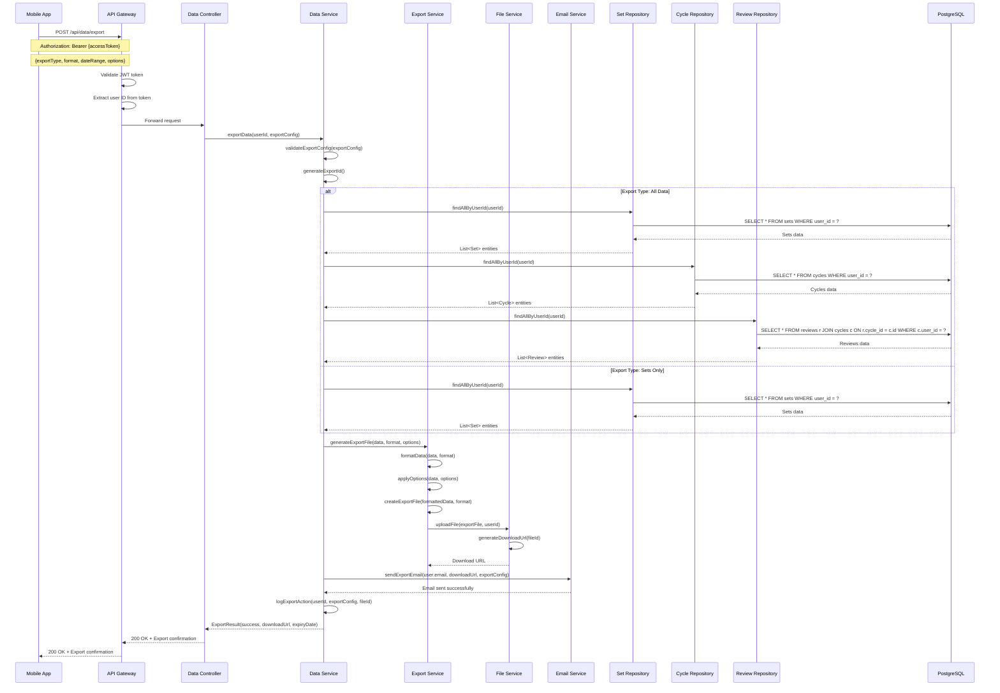
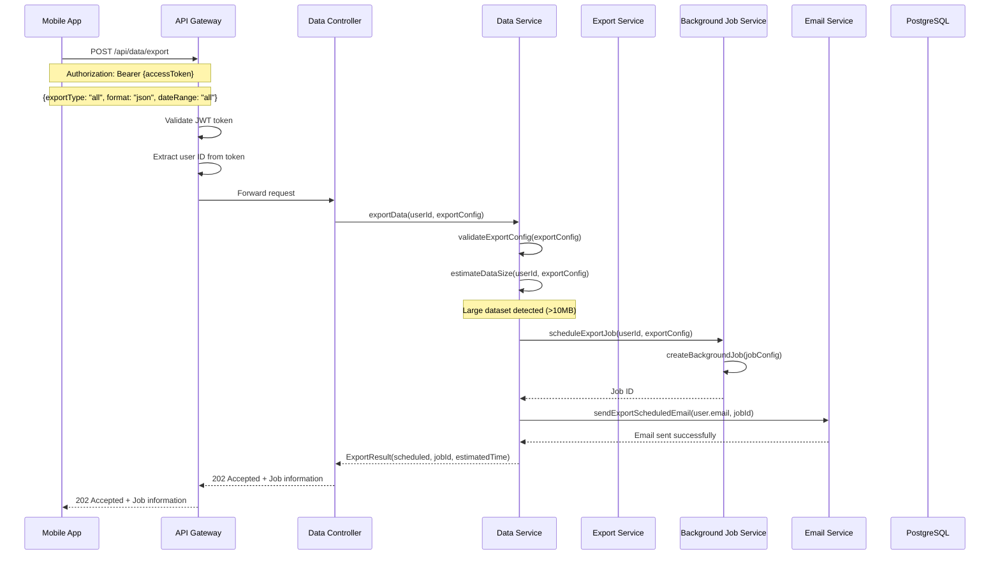
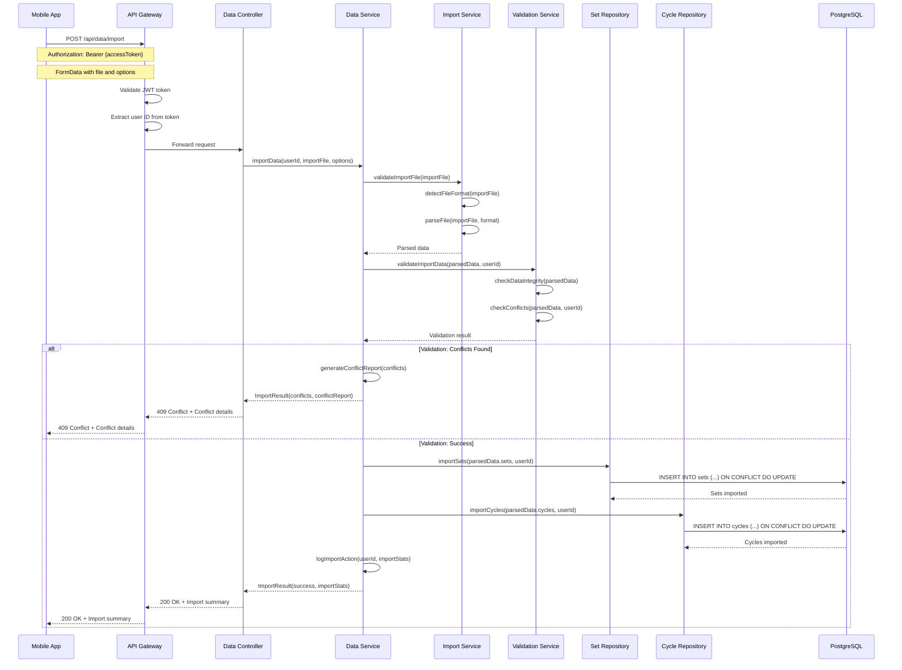
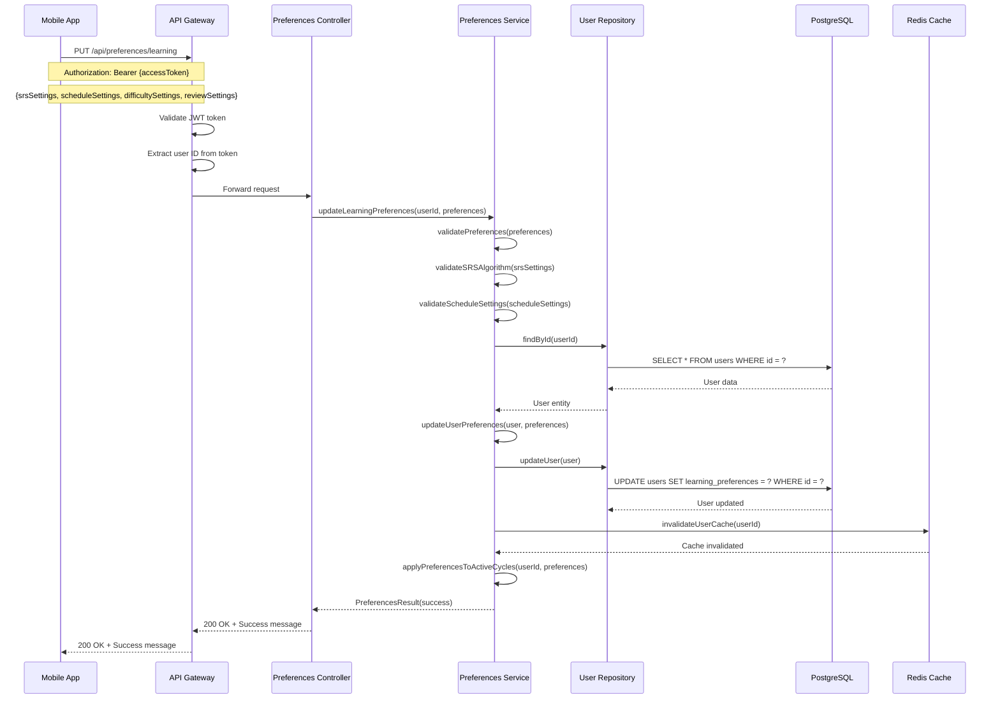
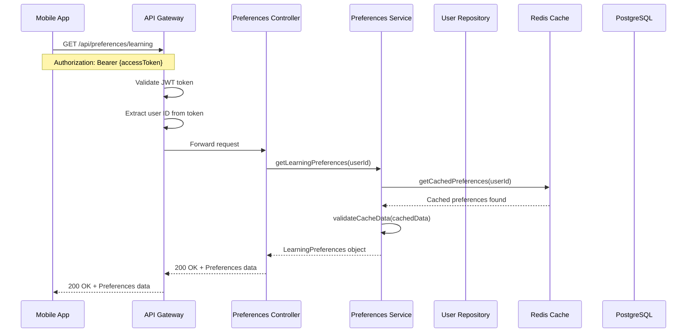
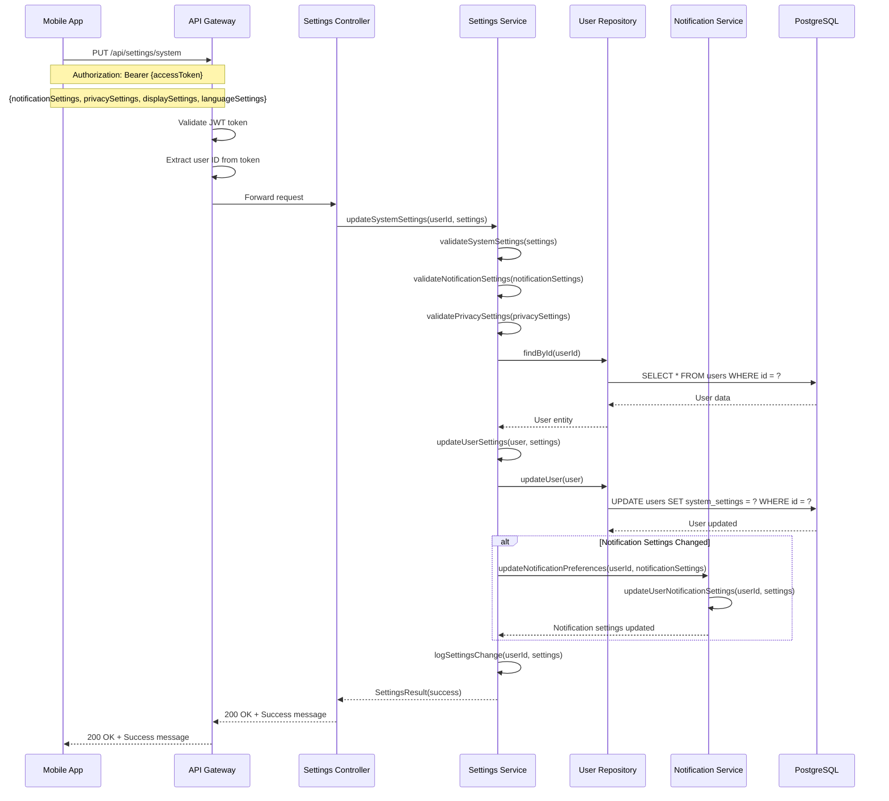
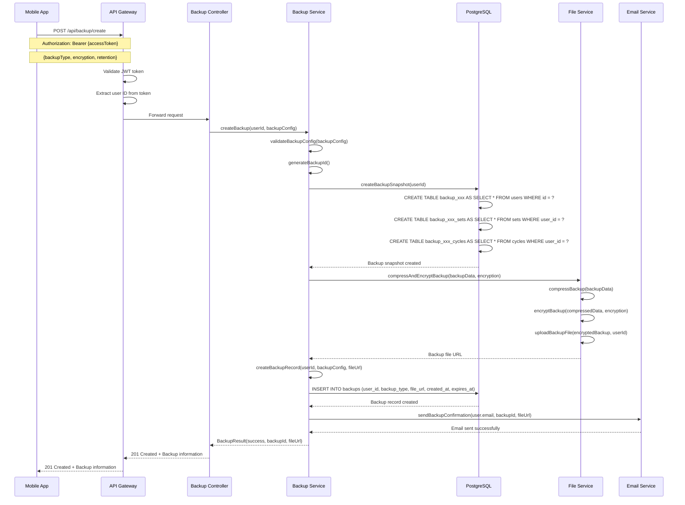
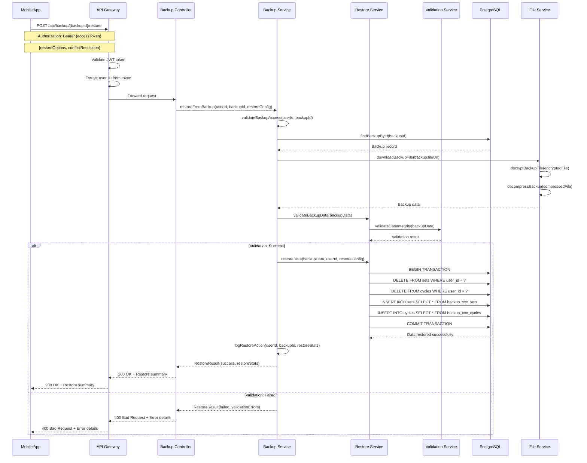

# Data Management Sequence Diagrams

## Tổng quan

Tài liệu này mô tả các luồng sequence cho quá trình quản lý dữ liệu trong hệ thống RepeatWise, bao gồm export/import dữ liệu, backup/restore, quản lý preferences và system settings.

## 1. Export Learning Data Sequence

### 1.1 Successful Data Export

### 1.2 Export with Large Dataset

## 2. Import Learning Data Sequence

### 2.1 Successful Data Import

## 3. Learning Preferences Management Sequence

### 3.1 Update Learning Preferences

### 3.2 Get Learning Preferences

## 4. System Settings Management Sequence

### 4.1 Update System Settings

## 5. Backup and Restore Sequence

### 5.1 Create Backup

### 5.2 Restore from Backup

## Ghi chú kỹ thuật

### 1. Data Export/Import
- Export hỗ trợ nhiều format: JSON, CSV, Excel, PDF
- Import có validation và conflict resolution
- Large datasets được xử lý async với background jobs
- File encryption cho bảo mật dữ liệu

### 2. Preferences Management
- Learning preferences ảnh hưởng đến SRS algorithm
- System settings bao gồm notification và privacy
- Cache được invalidate khi preferences thay đổi
- Settings được apply cho active cycles

### 3. Backup/Restore
- Backup được encrypt và compress
- Retention policy tự động xóa backup cũ
- Restore có validation và rollback capability
- Backup history được track và log

### 4. Security Considerations
- Tất cả data operations yêu cầu authentication
- File upload/download có virus scanning
- Sensitive data được encrypt
- Access logs được maintain

### 5. Performance Optimization
- Large exports được chunked và streamed
- Background jobs cho heavy operations
- Database transactions cho data consistency
- Caching cho frequently accessed data
