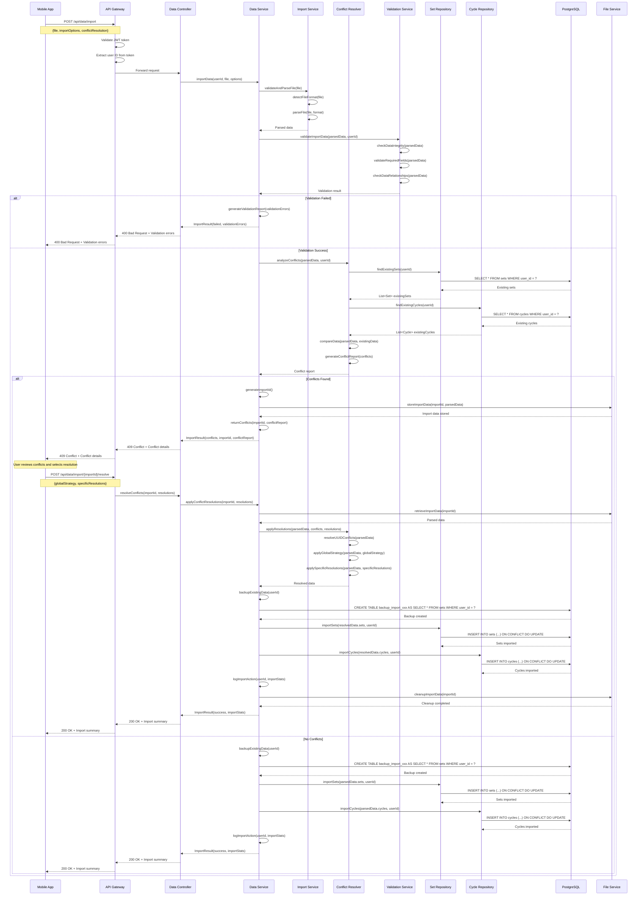
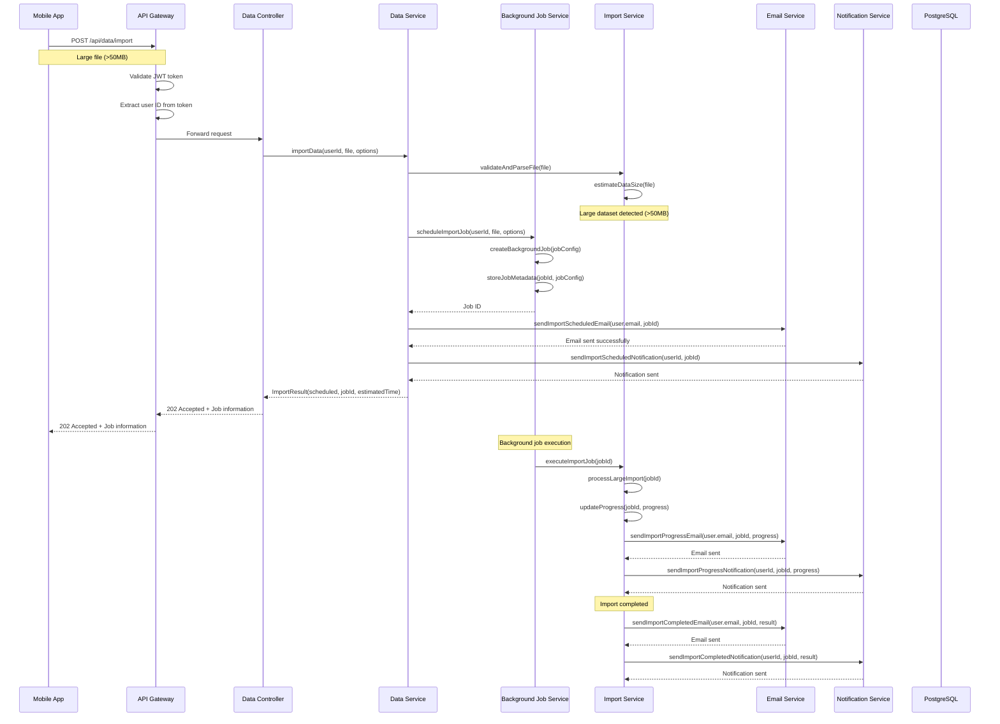
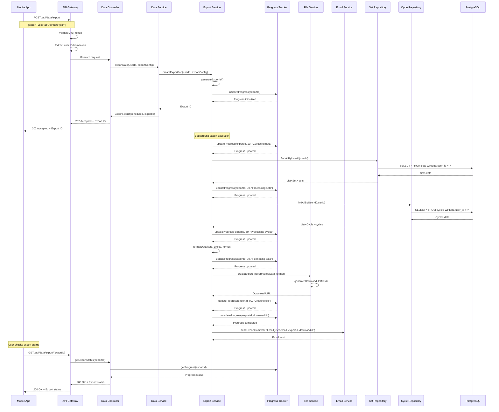
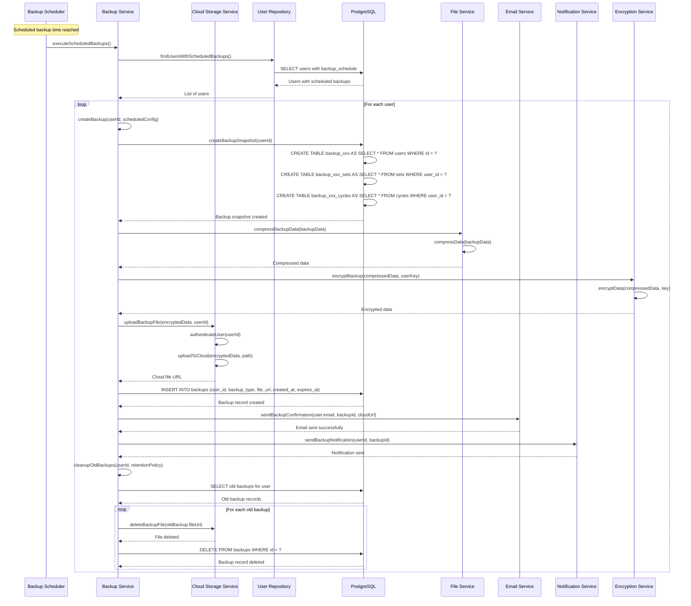
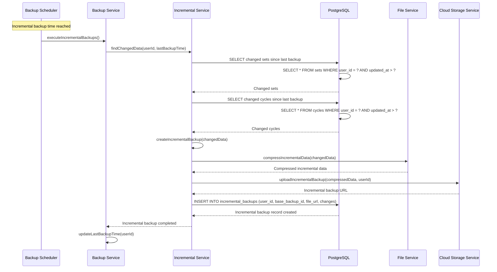
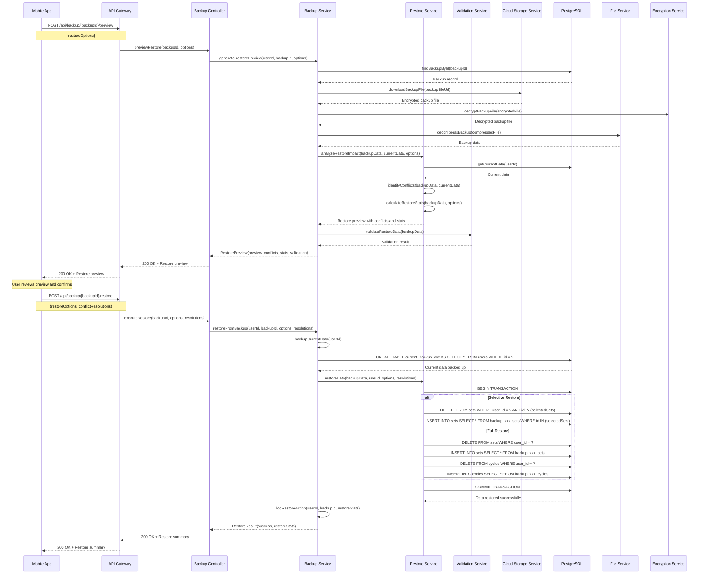
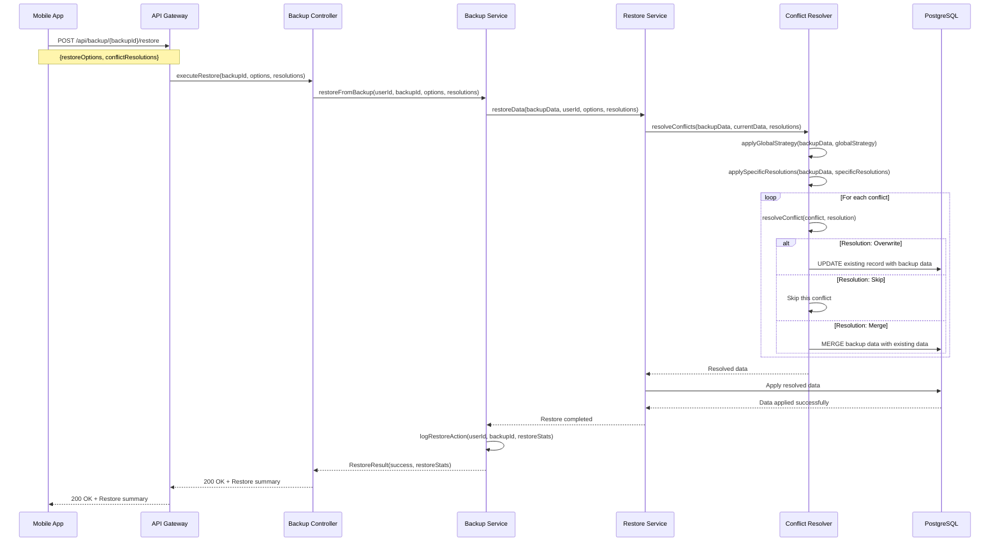
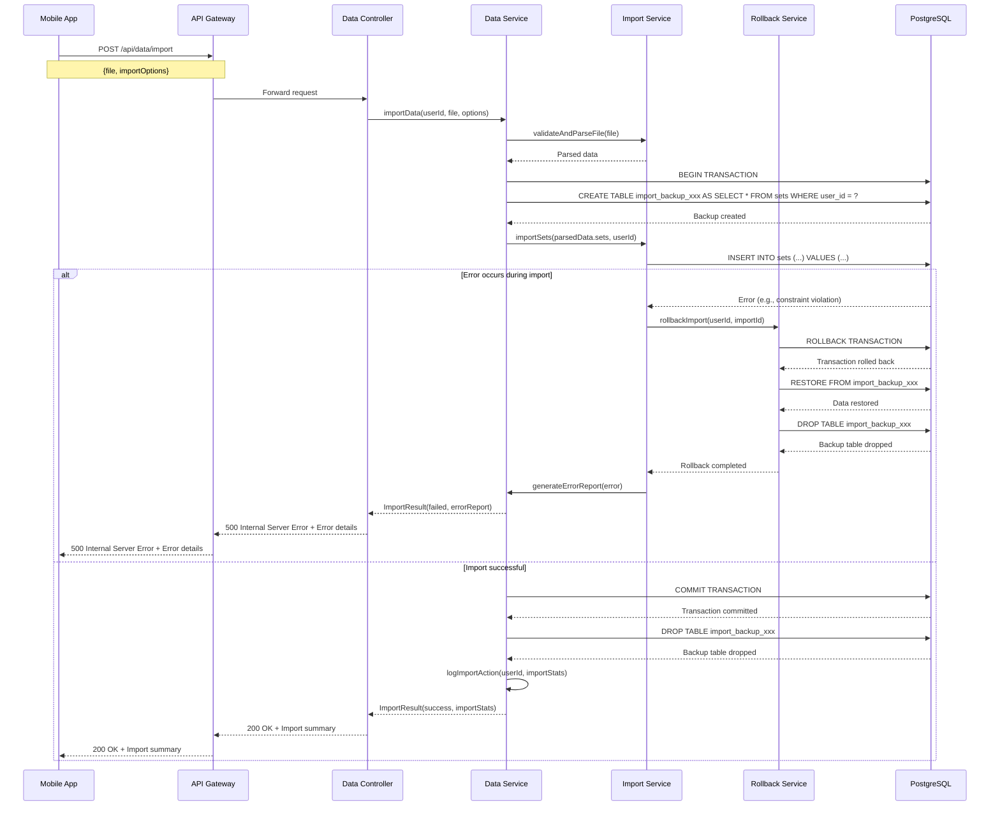

# Import/Export/Backup/Restore Sequence Diagrams - Chi tiết

## Tổng quan

Tài liệu này bổ sung cho `data-management-sequences.md` với các sequence diagrams chi tiết hơn cho các chức năng Import/Export/Backup/Restore, bao gồm các alternative flows và error handling phức tạp như được mô tả trong Use Cases.

## 1. Import với Conflict Resolution Chi tiết

### 1.1 Import với Conflicts và Resolution

### 1.2 Import với Large Dataset và Background Processing

## 2. Export với Progress Tracking

### 2.1 Export với Progress Updates

## 3. Backup với Scheduling và Cloud Integration

### 3.1 Scheduled Backup với Cloud Storage

### 3.2 Incremental Backup

## 4. Restore với Preview và Conflict Resolution

### 4.1 Restore Preview và Execution

### 4.2 Restore với Conflict Resolution

## 5. Error Handling và Rollback

### 5.1 Import Error Handling với Rollback

## Ghi chú kỹ thuật

### 1. Performance Considerations
- **Large dataset processing**: Sử dụng background jobs và streaming
- **Progress tracking**: Real-time updates qua WebSocket hoặc polling
- **Memory management**: Chunked processing cho large files
- **Database optimization**: Batch operations và proper indexing

### 2. Security Considerations
- **File validation**: Virus scanning và format validation
- **Data encryption**: End-to-end encryption cho sensitive data
- **Access control**: User-specific data isolation
- **Audit logging**: Comprehensive logging cho all operations

### 3. Error Handling
- **Graceful degradation**: Partial success handling
- **Automatic retry**: Exponential backoff cho transient failures
- **Rollback mechanisms**: Automatic rollback on failure
- **User notification**: Clear error messages và recovery options

### 4. Scalability
- **Background processing**: Async operations cho heavy tasks
- **Resource management**: Proper cleanup và resource limits
- **Caching**: Cache frequently accessed data
- **Load balancing**: Distribute load across multiple instances
