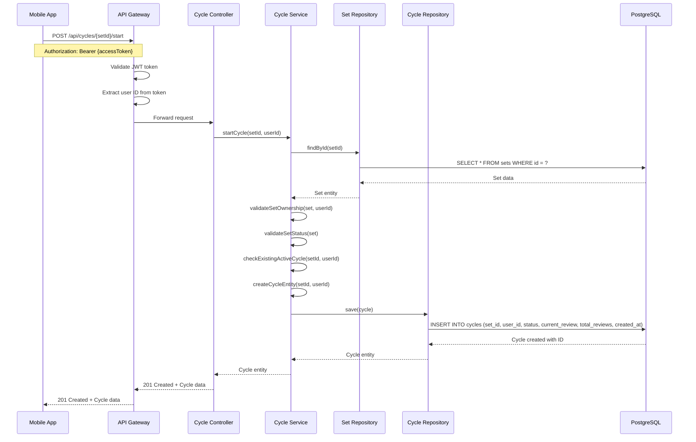
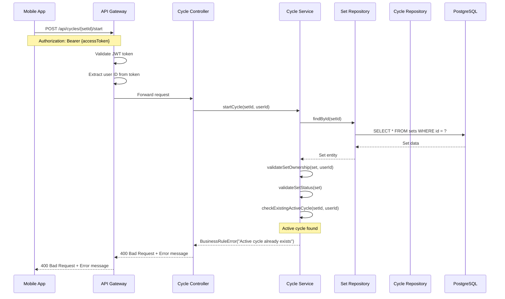
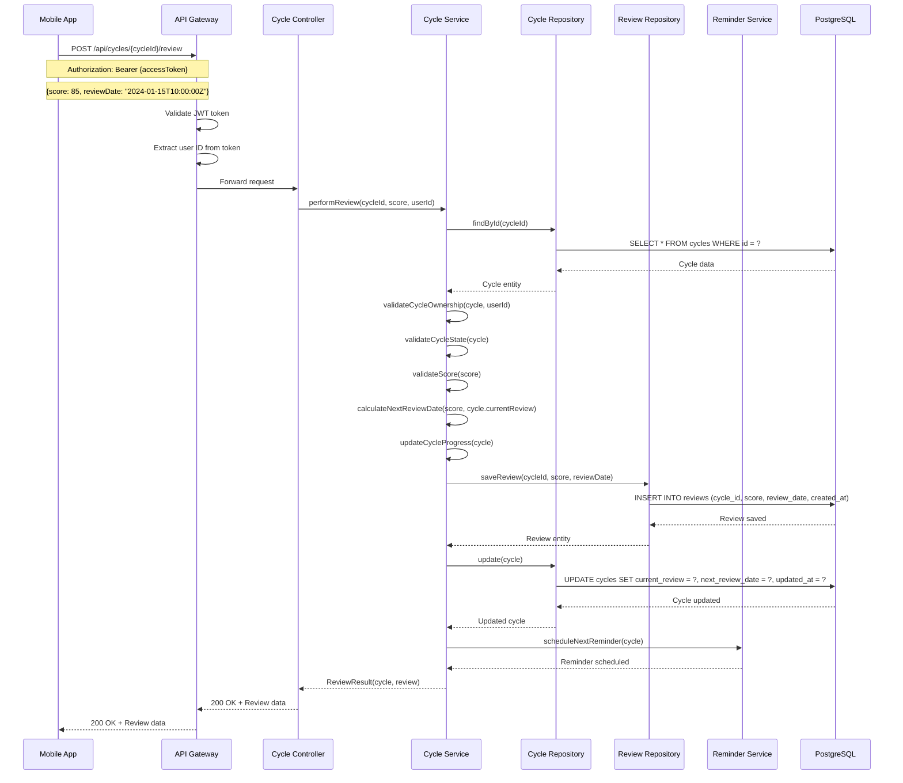
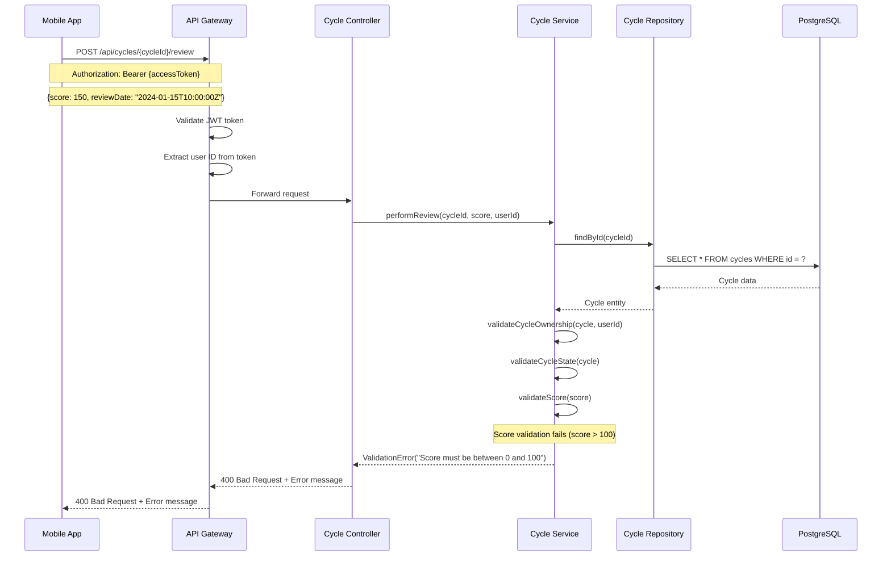
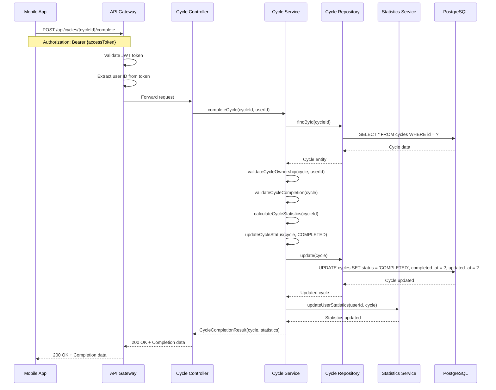
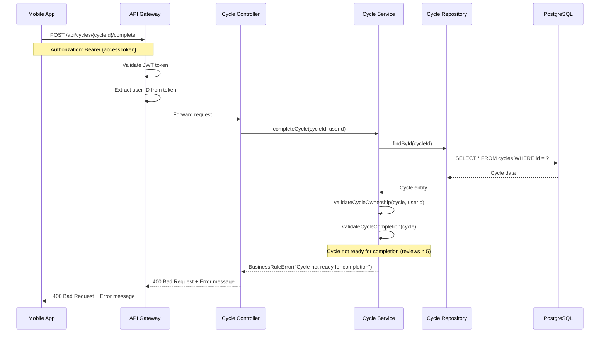
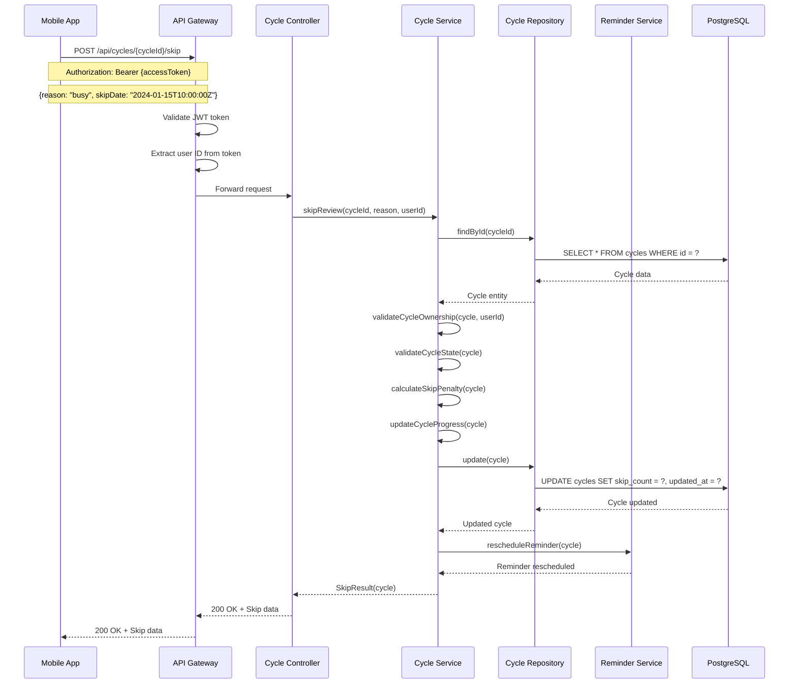
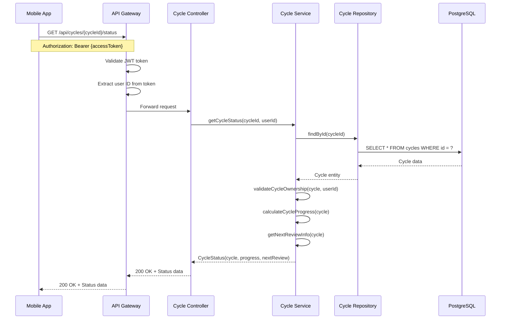
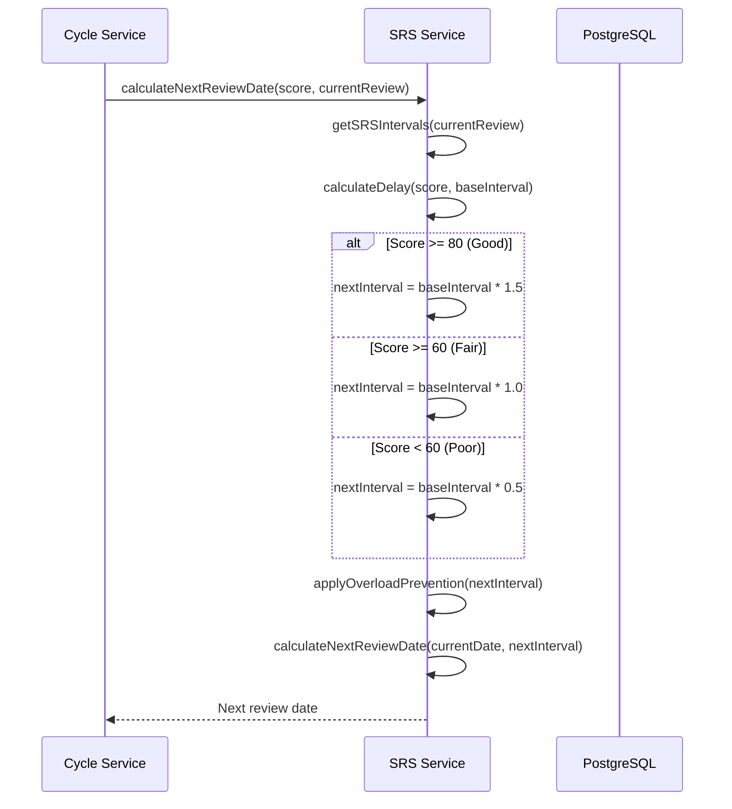

# Learning Cycle Sequence Diagrams

## Tổng quan

Tài liệu này mô tả các luồng sequence cho quá trình học tập theo chu kỳ SRS (Spaced Repetition System) trong hệ thống RepeatWise, bao gồm bắt đầu chu kỳ, thực hiện review và hoàn thành chu kỳ.

## 1. Start Learning Cycle Sequence

### 1.1 Successful Cycle Start

### 1.2 Start Cycle with Existing Active Cycle

## 2. Perform Review Sequence

### 2.1 Successful Review with Score

### 2.2 Review with Invalid Score

## 3. Complete Cycle Sequence

### 3.1 Successful Cycle Completion

### 3.2 Complete Incomplete Cycle

## 4. Skip Review Sequence

### 4.1 Skip Review

## 5. Get Cycle Status Sequence

### 5.1 Get Active Cycle Status

## 6. SRS Algorithm Calculation

### 6.1 Calculate Next Review Date

## Ghi chú kỹ thuật

### 1. SRS Algorithm
- **Base intervals**: 1, 3, 7, 14, 30 days
- **Score-based multipliers**: 
  - 80-100%: 1.5x (tăng interval)
  - 60-79%: 1.0x (giữ nguyên)
  - 0-59%: 0.5x (giảm interval)
- **Overload prevention**: Giới hạn 3 set/ngày

### 2. Business Rules
- Mỗi set chỉ có 1 active cycle tại một thời điểm
- Cycle cần 5 reviews để hoàn thành
- Score phải từ 0-100%
- Không thể complete cycle chưa đủ reviews

### 3. Validation
- Cycle ownership validation
- Cycle state validation
- Score range validation
- Review timing validation

### 4. Performance
- SRS calculation được cache
- Review history được index
- Cycle status được pre-calculate
- Reminder scheduling được optimize
