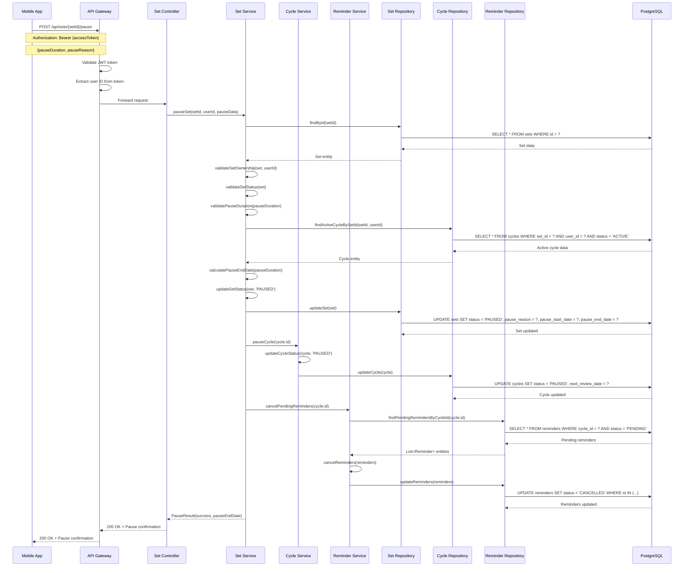
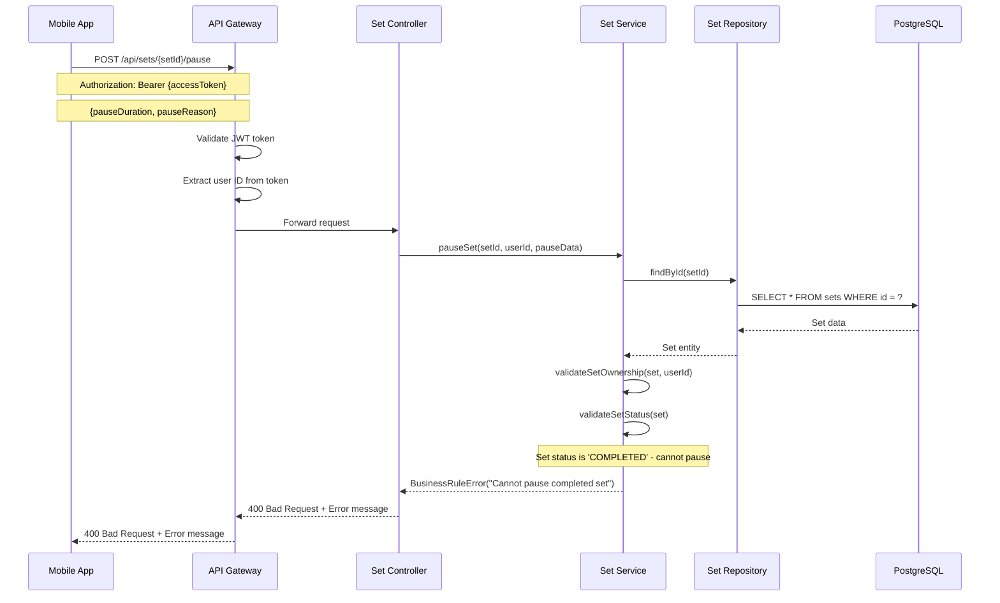
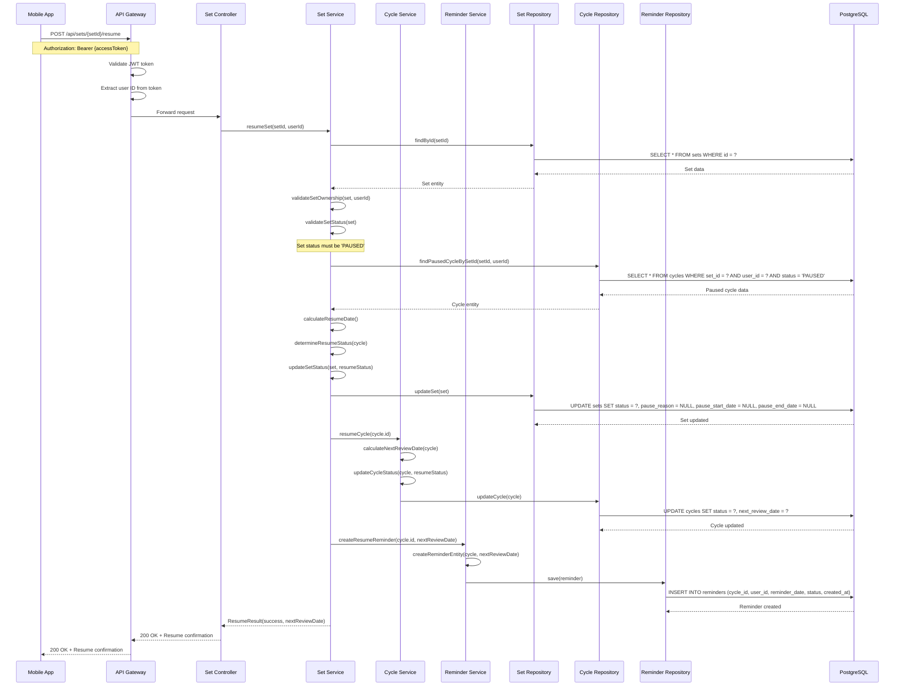
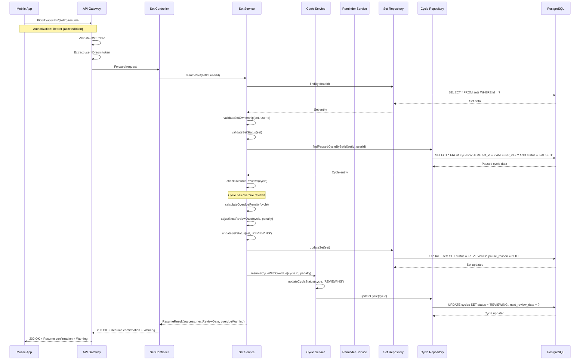
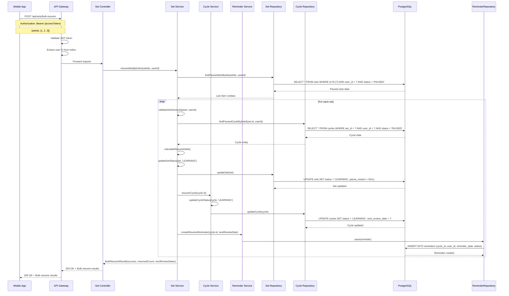

# Learning Set Management Sequence Diagrams

## Tổng quan

Tài liệu này mô tả các luồng sequence cho quá trình quản lý trạng thái học tập của set trong hệ thống RepeatWise, bao gồm tạm dừng và tiếp tục học tập set.

## 1. Pause Learning Set Sequence

### 1.1 Successful Set Pause

### 1.2 Pause Set with Invalid Status

## 2. Resume Learning Set Sequence

### 2.1 Successful Set Resume

### 2.2 Resume Set with Overdue Reviews

## 3. Bulk Resume Sets Sequence

### 3.1 Resume Multiple Sets

## Ghi chú kỹ thuật

### 1. Pause Management
- Set có thể pause với duration cụ thể hoặc vô thời hạn
- Khi pause, tất cả reminder pending sẽ bị cancel
- Pause reason được lưu để phân tích sau này
- Pause start/end date được track để tính toán

### 2. Resume Logic
- Resume sẽ khôi phục trạng thái trước khi pause
- Nếu có overdue reviews, sẽ áp dụng penalty
- Next review date được tính toán lại dựa trên SRS algorithm
- Resume có thể bulk cho nhiều set cùng lúc

### 3. Status Transitions
- LEARNING → PAUSED → LEARNING/REVIEWING
- REVIEWING → PAUSED → REVIEWING
- COMPLETED → Không thể pause
- DELETED → Không thể pause/resume

### 4. Error Handling
- Invalid set status trả về 400 Bad Request
- Set not found trả về 404 Not Found
- Unauthorized access trả về 403 Forbidden
- Server errors trả về 500 Internal Server Error

### 5. Performance Considerations
- Bulk operations được xử lý trong transaction
- Reminder creation được batch để tối ưu performance
- Database queries được optimize với indexes
