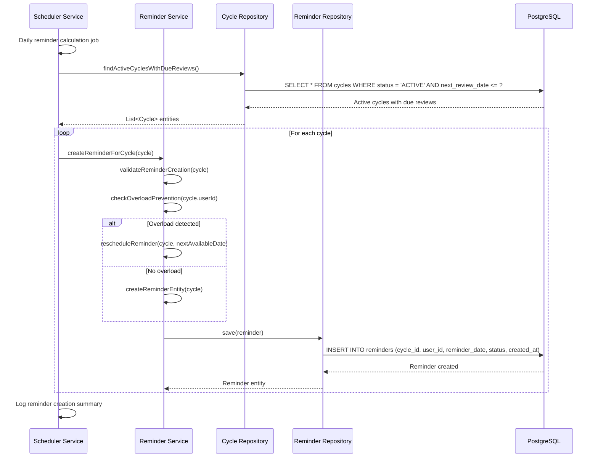
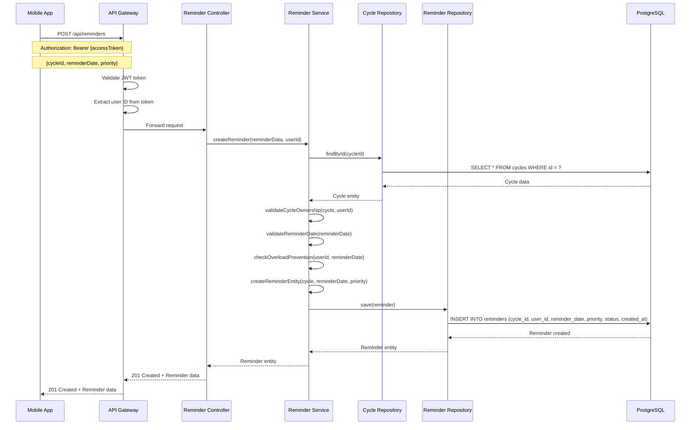
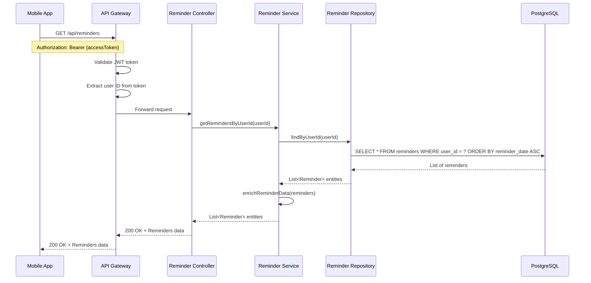
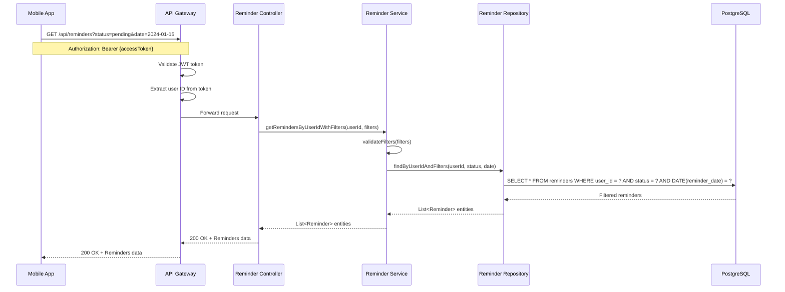
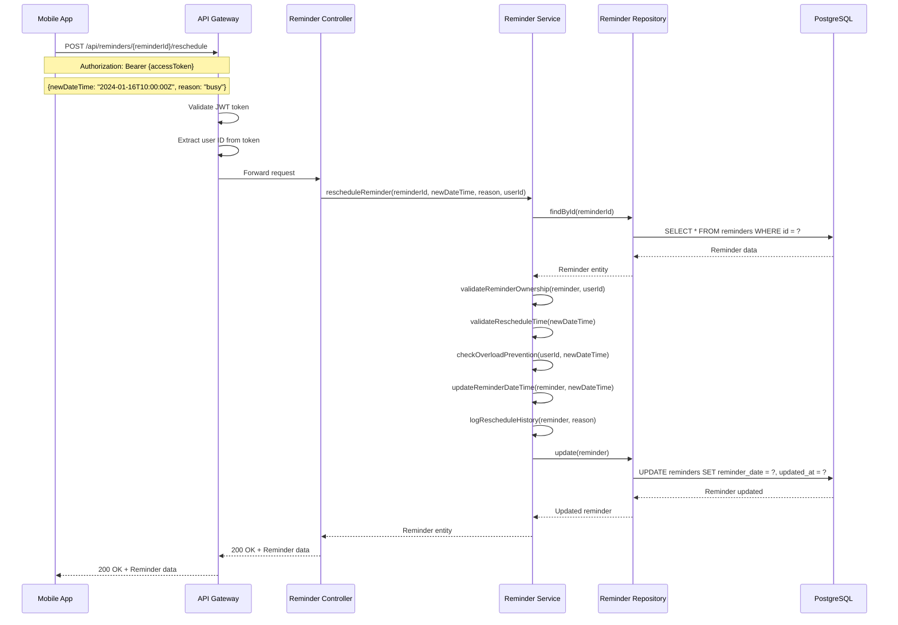
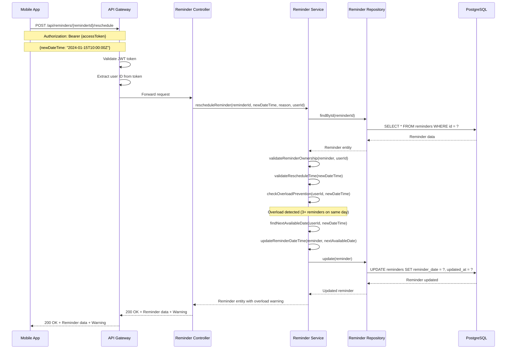
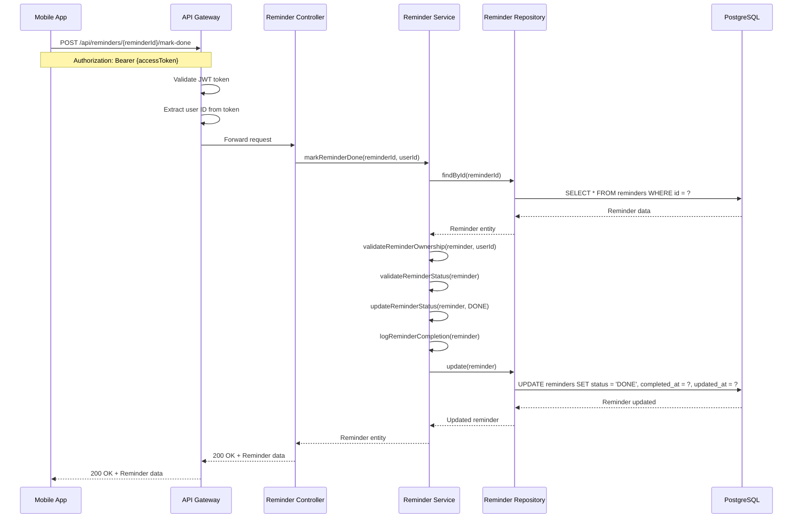
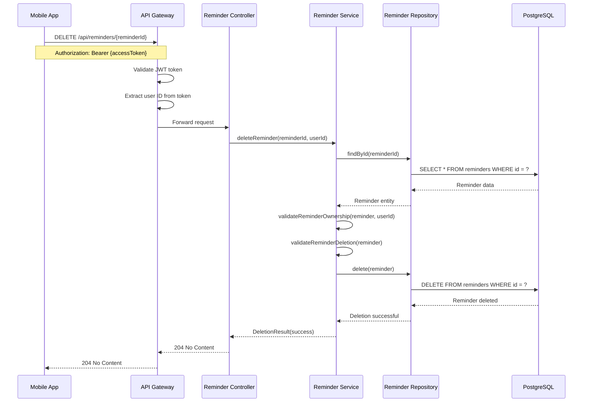
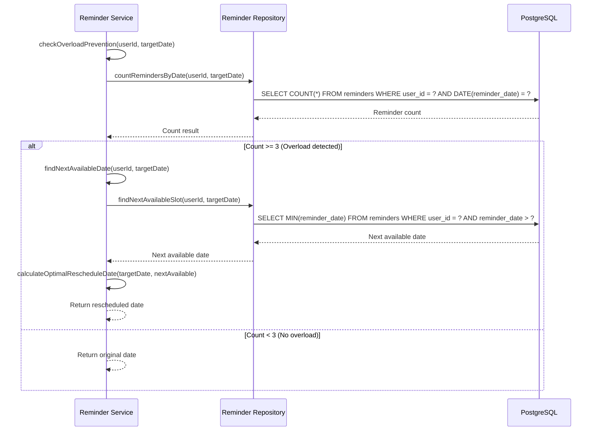
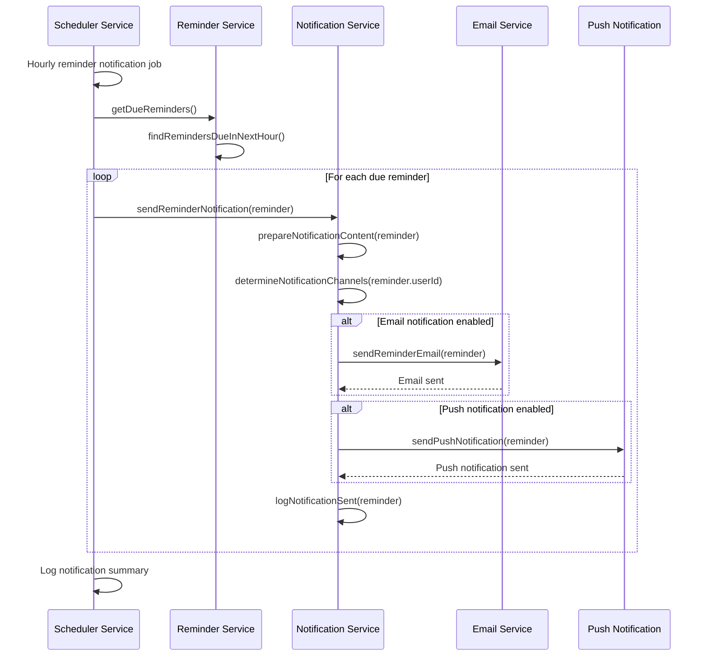

# Reminder Management Sequence Diagrams

## Tổng quan

Tài liệu này mô tả các luồng sequence cho quá trình quản lý reminder trong hệ thống RepeatWise, bao gồm tạo reminder, reschedule, mark done và overload prevention.

## 1. Create Reminder Sequence

### 1.1 Automatic Reminder Creation

### 1.2 Manual Reminder Creation

## 2. Get Reminder List Sequence

### 2.1 Get User Reminders

### 2.2 Get Reminders with Filters

## 3. Reschedule Reminder Sequence

### 3.1 Successful Reminder Reschedule

### 3.2 Reschedule with Overload Prevention

## 4. Mark Reminder Done Sequence

### 4.1 Mark Reminder as Done

## 5. Delete Reminder Sequence

### 5.1 Delete Reminder

## 6. Overload Prevention Sequence

### 6.1 Overload Detection and Prevention

## 7. Reminder Notification Sequence

### 7.1 Send Reminder Notification

## Ghi chú kỹ thuật

### 1. Overload Prevention Rules
- Giới hạn tối đa 3 reminders/ngày cho mỗi user
- Tự động reschedule khi phát hiện overload
- Ưu tiên reminders theo priority và due date
- Tìm slot trống gần nhất để reschedule

### 2. Reminder Status
- **PENDING**: Chưa được xử lý
- **DONE**: Đã hoàn thành
- **CANCELLED**: Đã hủy
- **OVERDUE**: Quá hạn

### 3. Notification Channels
- **Email**: Gửi email reminder
- **Push Notification**: Gửi push notification
- **In-app**: Hiển thị trong app
- **SMS**: Gửi SMS (tương lai)

### 4. Performance
- Batch processing cho reminder creation
- Caching cho user preferences
- Indexing cho reminder queries
- Async processing cho notifications
