# Set Management Sequence Diagrams

## Tổng quan

Tài liệu này mô tả các luồng sequence cho quá trình quản lý set học tập trong hệ thống RepeatWise, bao gồm tạo, chỉnh sửa, xóa và xem danh sách set.

## 1. Create Set Sequence

### 1.1 Successful Set Creation

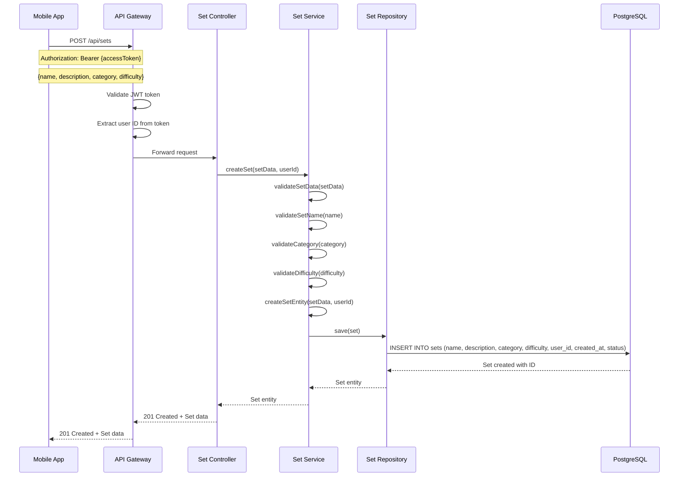

### 1.2 Set Creation with Validation Error

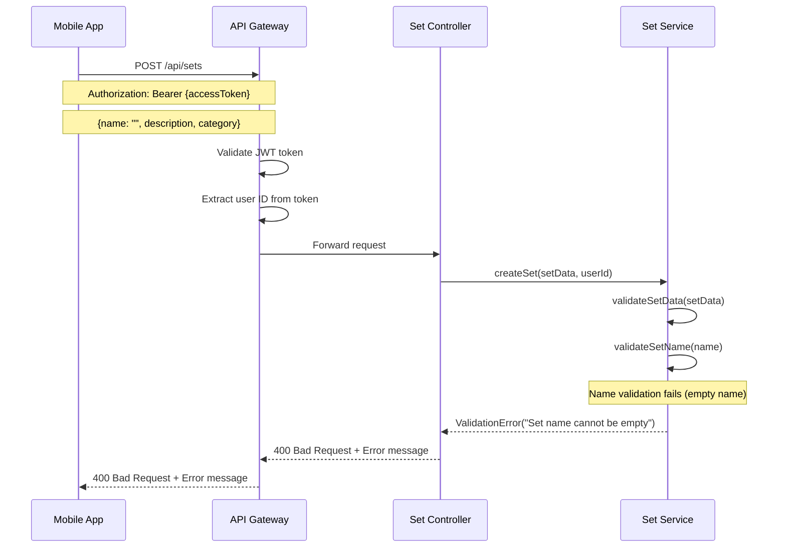

## 2. Get Set List Sequence

### 2.1 Get All Sets for User

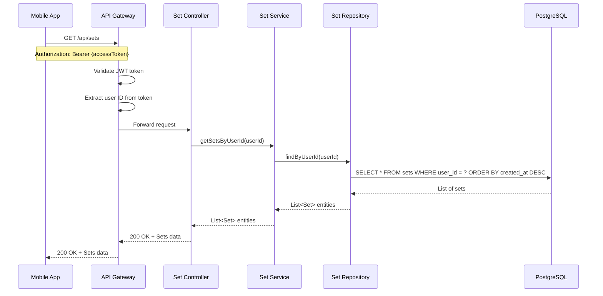

### 2.2 Get Sets with Filtering

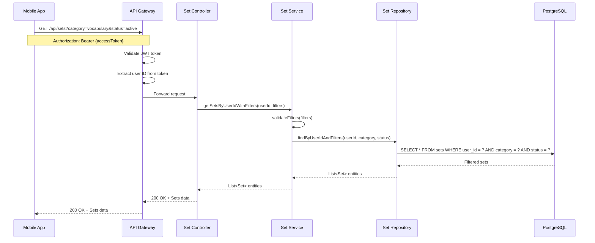

## 3. Get Set Details Sequence

### 3.1 Get Set by ID

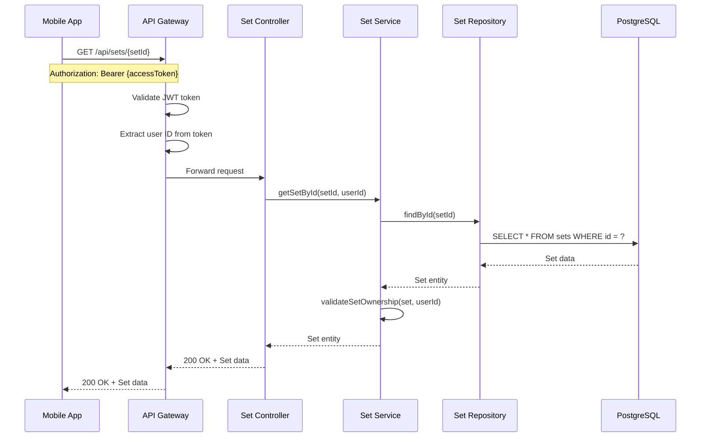

### 3.2 Get Set with Unauthorized Access

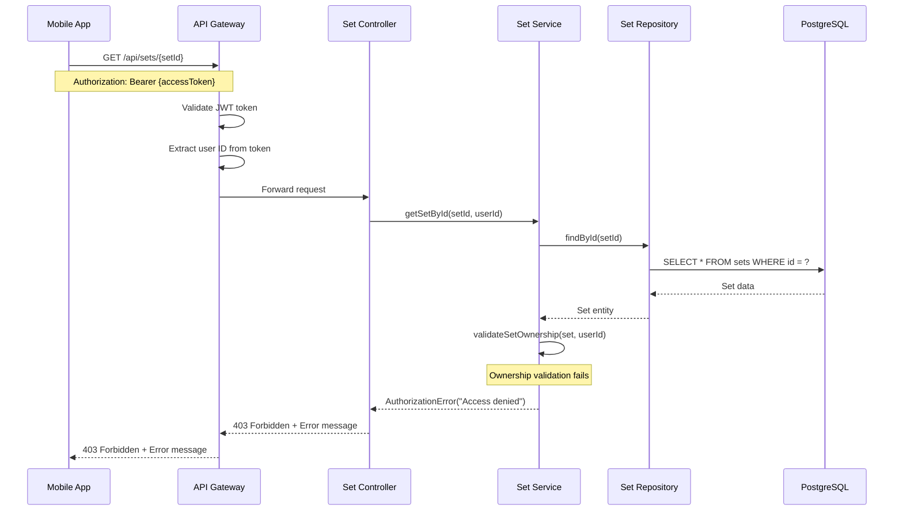

## 4. Update Set Sequence

### 4.1 Successful Set Update

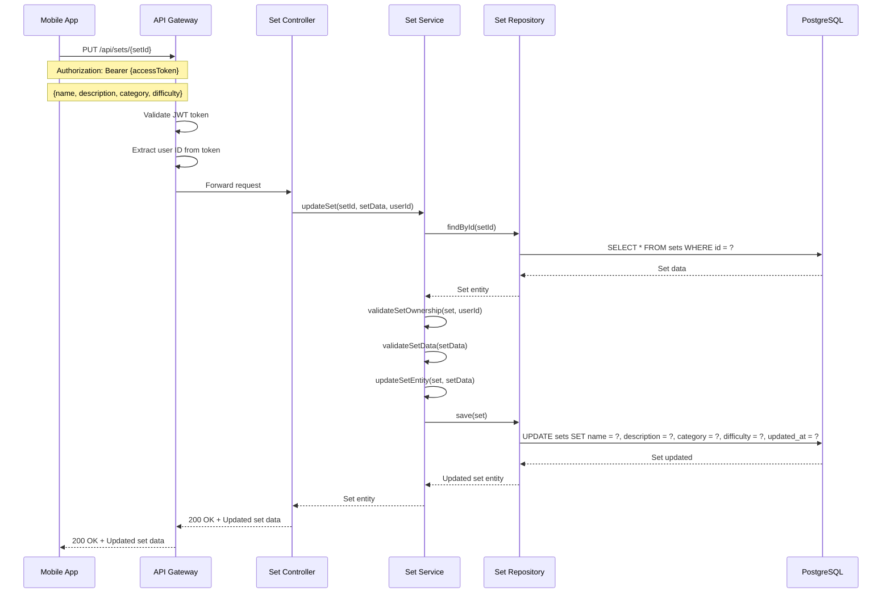

### 4.2 Update Non-existent Set

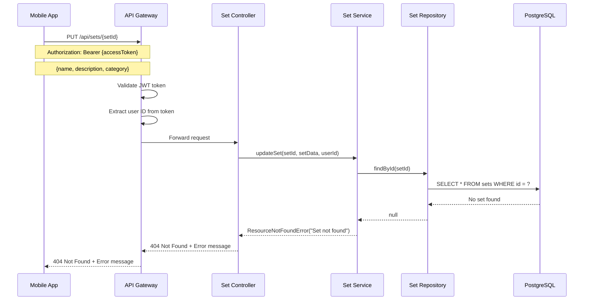

## 5. Delete Set Sequence

### 5.1 Successful Set Deletion

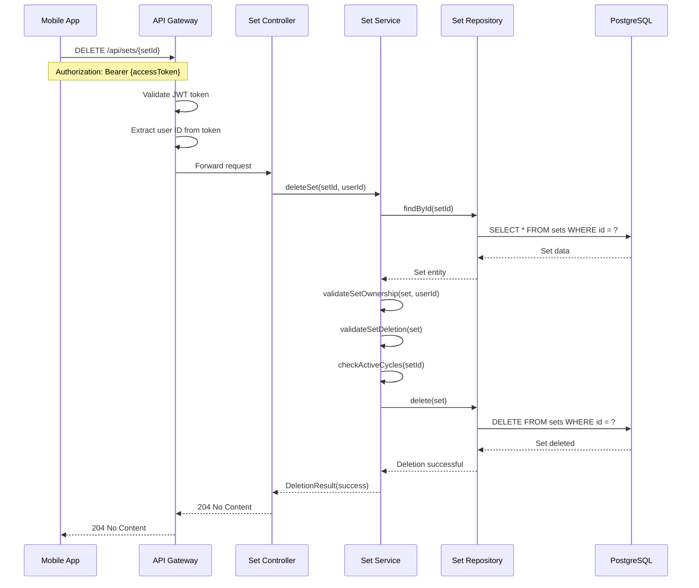

### 5.2 Delete Set with Active Cycles

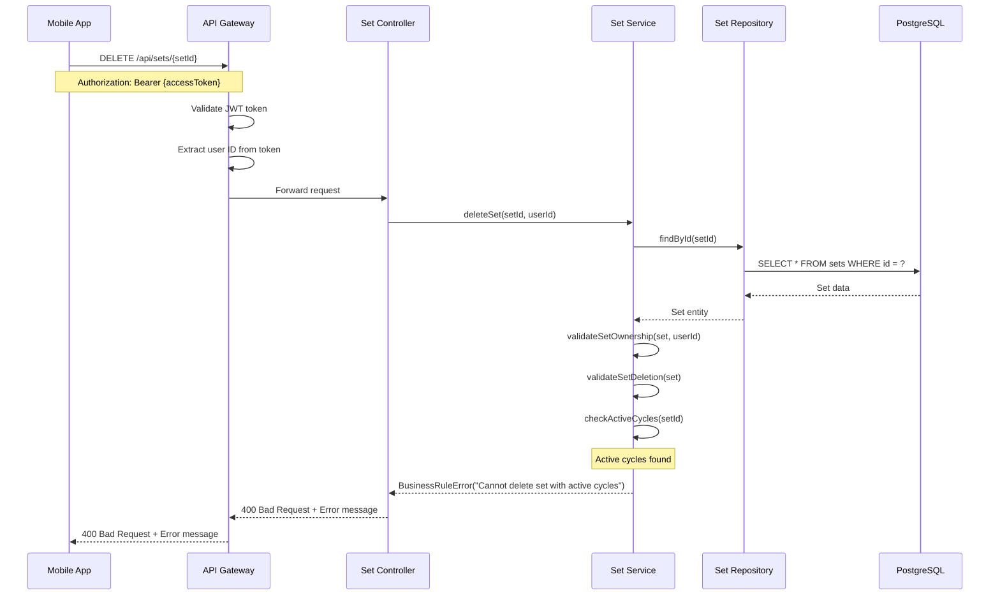

## 6. Set Statistics Sequence

### 6.1 Get Set Statistics

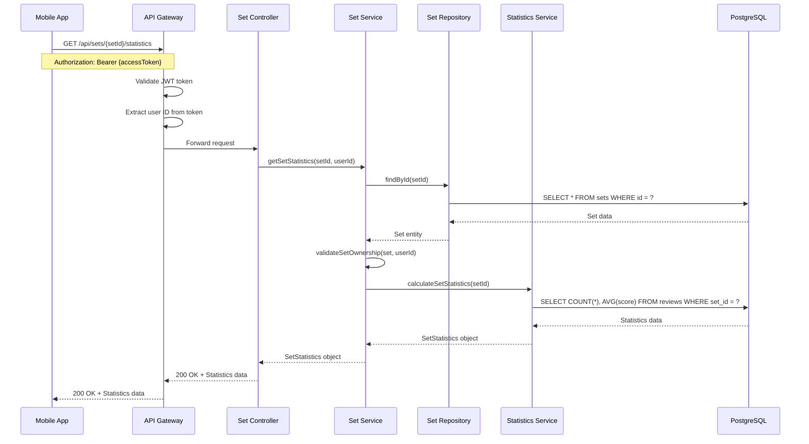

## Ghi chú kỹ thuật

### 1. Business Rules
- Set name không được trống và độ dài tối đa 100 ký tự
- Category phải thuộc danh sách cho phép
- Difficulty level từ 1-5
- Không thể xóa set có active cycles
- User chỉ có thể truy cập set của mình

### 2. Validation
- Input validation ở Controller layer
- Business rule validation ở Service layer
- Ownership validation cho mọi operation
- Data integrity validation

### 3. Error Handling
- Validation errors: 400 Bad Request
- Authorization errors: 403 Forbidden
- Resource not found: 404 Not Found
- Business rule violations: 400 Bad Request

### 4. Performance
- Database queries được optimize với indexes
- Pagination cho set list
- Caching cho frequently accessed sets
- Lazy loading cho set details
