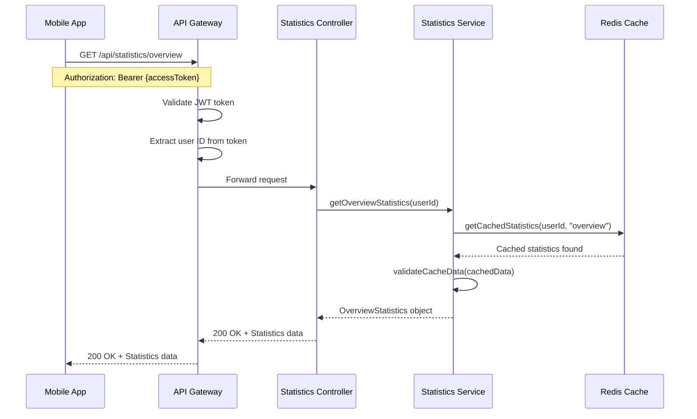
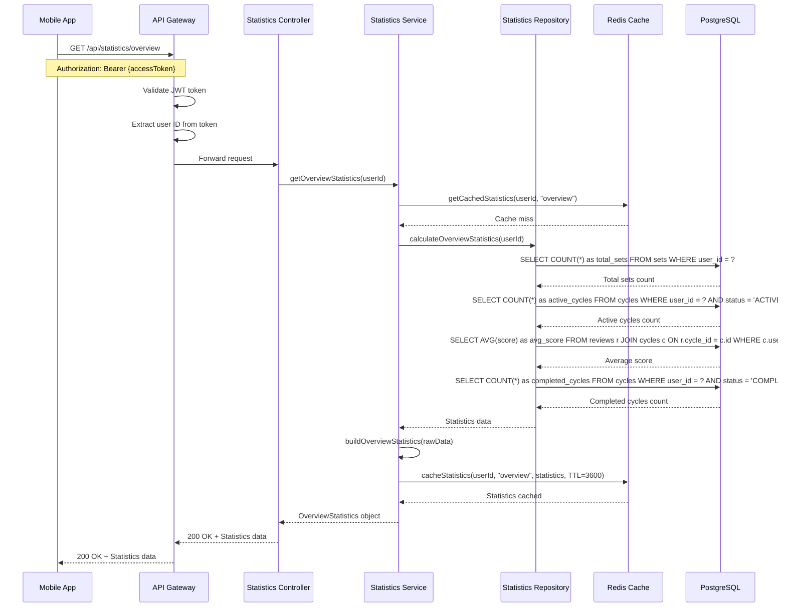
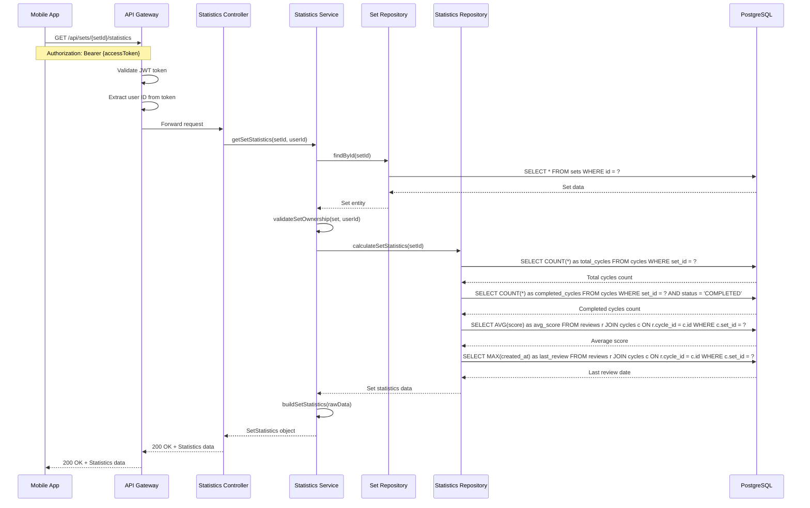
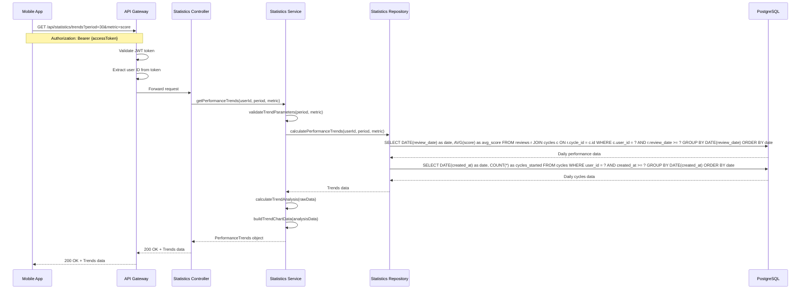
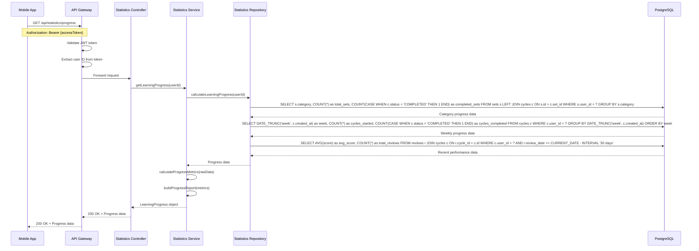
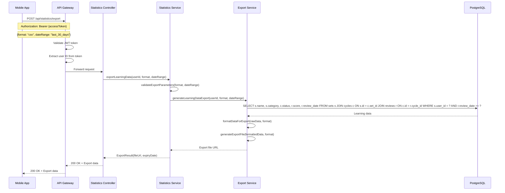
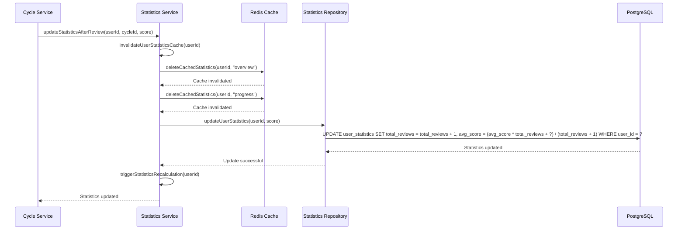
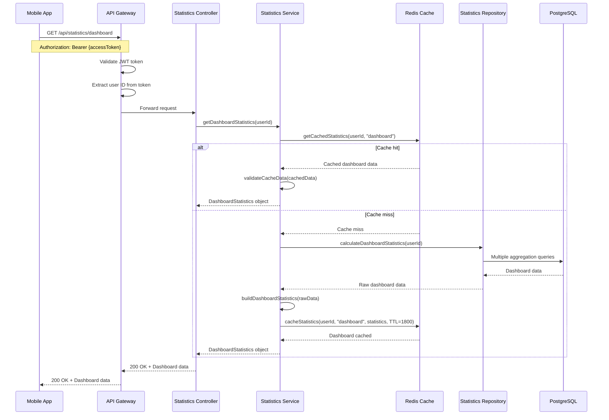

# Statistics and Analytics Sequence Diagrams

## Tổng quan

Tài liệu này mô tả các luồng sequence cho quá trình tính toán và hiển thị thống kê học tập trong hệ thống RepeatWise, bao gồm overview statistics, set statistics, performance trends và analytics.

## 1. Overview Statistics Sequence

### 1.1 Get Overview Statistics (Cached)

### 1.2 Get Overview Statistics (Cache Miss)

## 2. Set Statistics Sequence

### 2.1 Get Set Statistics

## 3. Performance Trends Sequence

### 3.1 Get Performance Trends

## 4. Learning Progress Sequence

### 4.1 Get Learning Progress

## 5. Analytics Data Export Sequence

### 5.1 Export Learning Data

## 6. Real-time Statistics Update Sequence

### 6.1 Update Statistics After Review

## 7. Dashboard Statistics Sequence

### 7.1 Get Dashboard Statistics

## Ghi chú kỹ thuật

### 1. Caching Strategy
- **Overview statistics**: Cache 1 giờ
- **Dashboard statistics**: Cache 30 phút
- **Set statistics**: Cache 15 phút
- **Trends data**: Cache 6 giờ
- **Progress data**: Cache 1 giờ

### 2. Performance Optimization
- Aggregation queries được optimize với indexes
- Batch processing cho large datasets
- Lazy loading cho detailed statistics
- Background calculation cho heavy analytics

### 3. Data Accuracy
- Real-time updates sau mỗi review
- Cache invalidation khi data thay đổi
- Data consistency checks
- Historical data preservation

### 4. Export Features
- **Formats**: CSV, JSON, Excel
- **Date ranges**: Last 7/30/90 days, custom range
- **File storage**: Temporary URLs với expiry
- **Data privacy**: User-specific exports only
