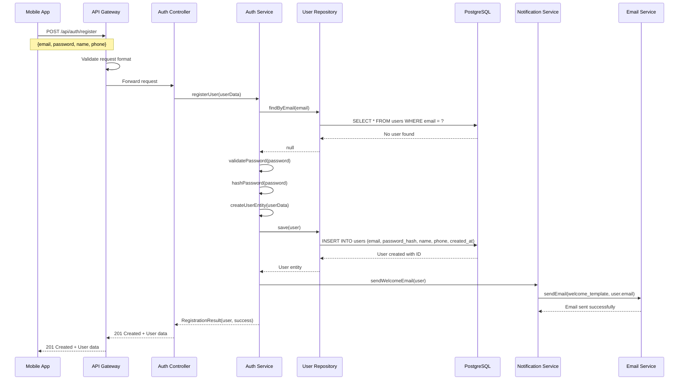
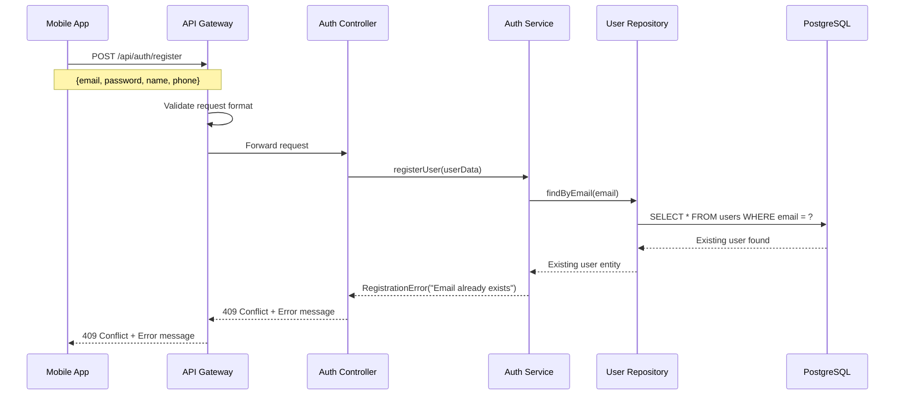
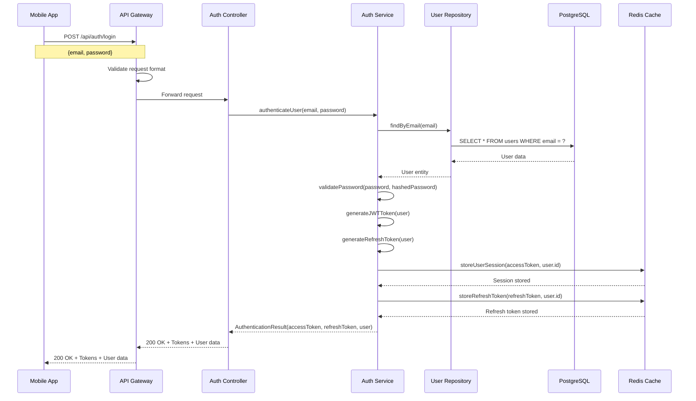
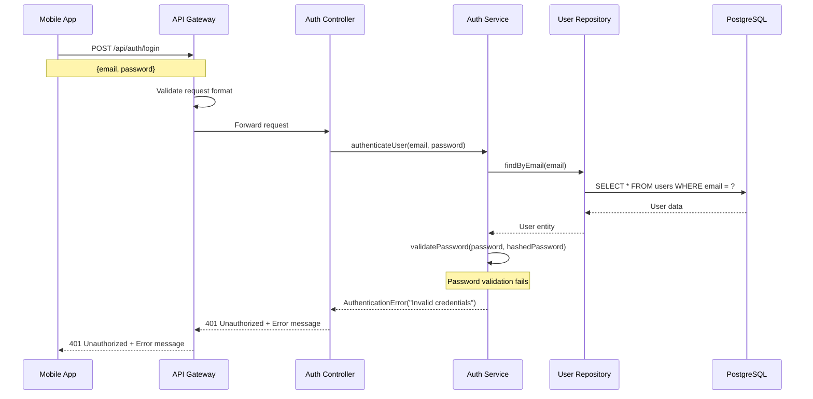
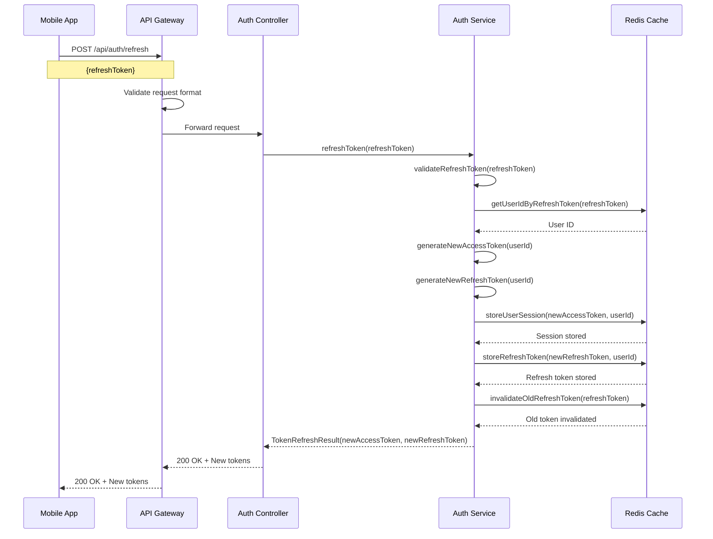
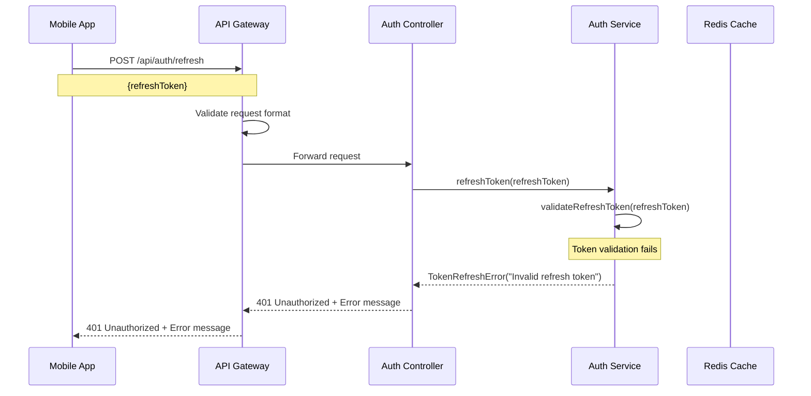
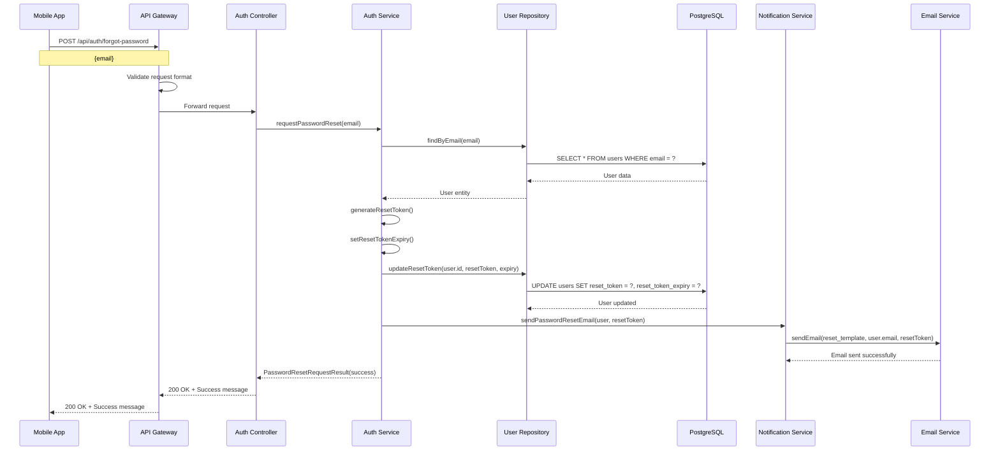
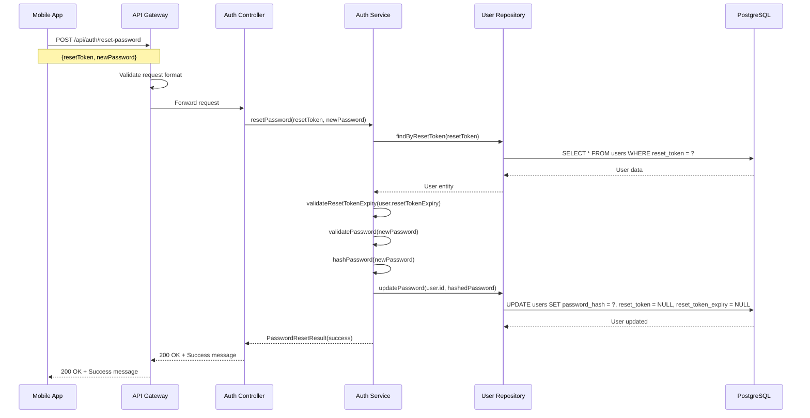
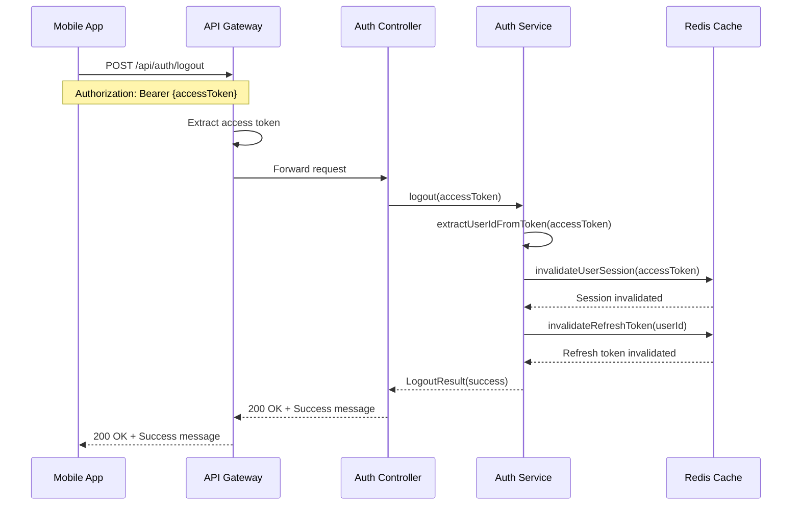

# User Authentication Sequence Diagrams

## Tổng quan

Tài liệu này mô tả các luồng sequence cho quá trình xác thực người dùng trong hệ thống RepeatWise, bao gồm đăng ký, đăng nhập, refresh token và reset password.

## 1. User Registration Sequence

### 1.1 Successful Registration

### 1.2 Registration with Existing Email

## 2. User Login Sequence

### 2.1 Successful Login

### 2.2 Login with Invalid Credentials

## 3. Token Refresh Sequence

### 3.1 Successful Token Refresh

### 3.2 Token Refresh with Invalid Token

## 4. Password Reset Sequence

### 4.1 Request Password Reset

### 4.2 Reset Password with Token

## 5. Logout Sequence

### 5.1 User Logout

## Ghi chú kỹ thuật

### 1. Security Considerations
- Tất cả passwords được hash bằng bcrypt với salt
- JWT tokens có expiration time
- Refresh tokens được rotate sau mỗi lần sử dụng
- Session được lưu trong Redis với TTL

### 2. Error Handling
- Validation errors trả về 400 Bad Request
- Authentication errors trả về 401 Unauthorized
- Duplicate email trả về 409 Conflict
- Server errors trả về 500 Internal Server Error

### 3. Performance
- User lookup được cache trong Redis
- Email sending được xử lý async
- Database queries được optimize với indexes

### 4. Monitoring
- Login attempts được log để detect brute force
- Failed authentication được track
- Email delivery status được monitor
