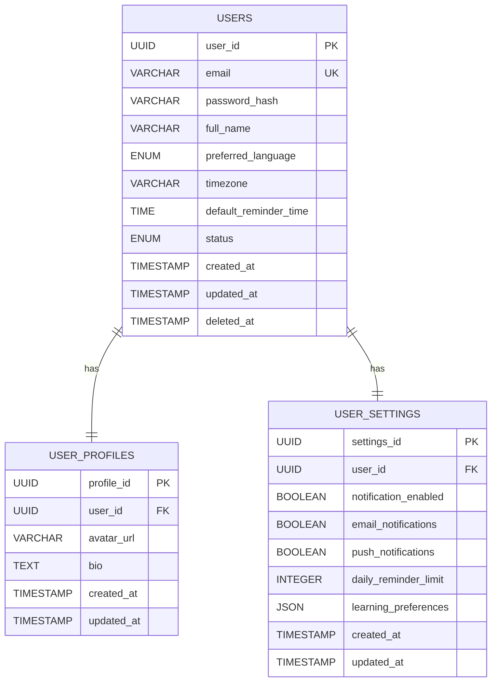
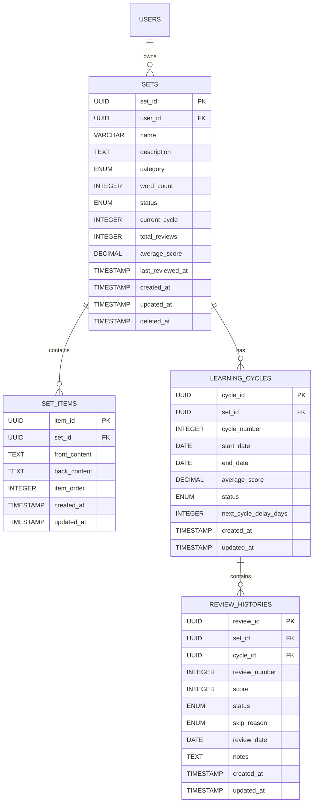
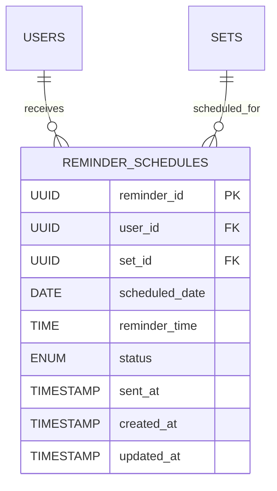
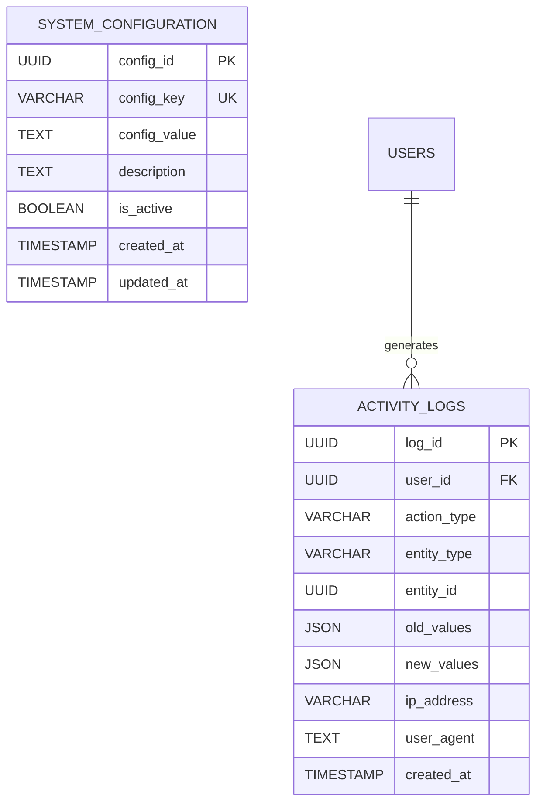
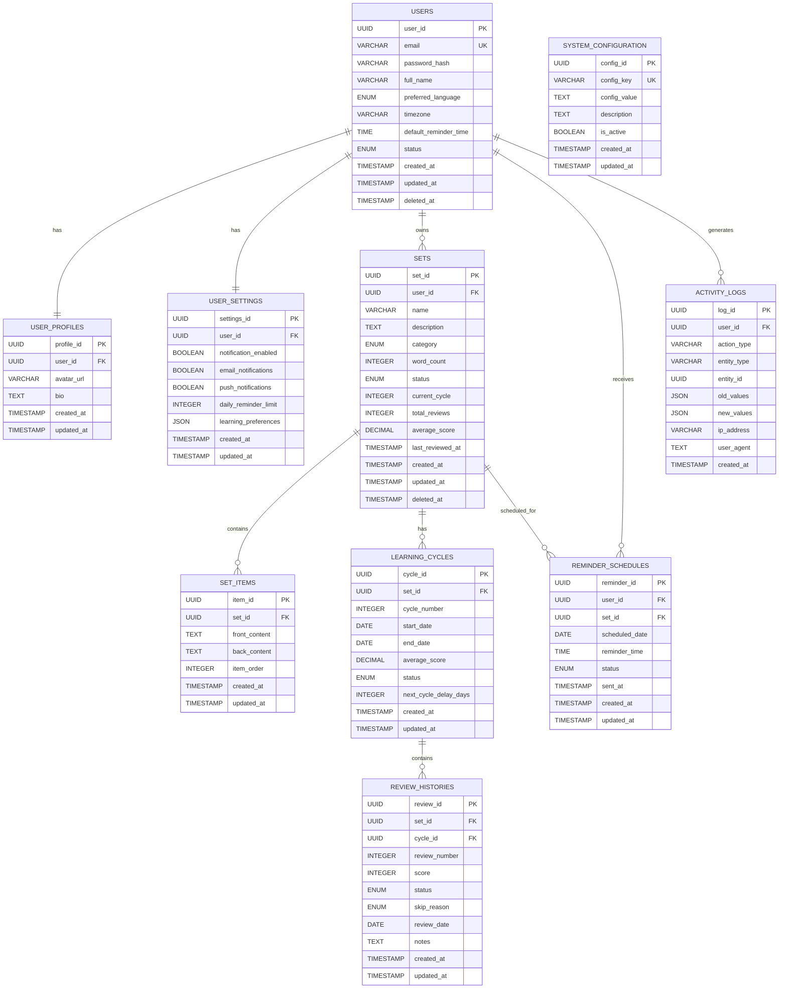

# Entity Relationship Diagram (ERD)

## 1. Overview

Entity Relationship Diagram của RepeatWise mô tả mối quan hệ giữa các entities chính trong hệ thống Spaced Repetition System. ERD này được thiết kế để hỗ trợ các use cases chính của ứng dụng.

## 2. Core Entities

### 2.1 User Management Entities

### 2.2 Learning Management Entities

### 2.3 Scheduling and Notification Entities

### 2.4 Audit and Configuration Entities

## 3. Complete ERD

## 4. Relationship Details

### 4.1 One-to-One Relationships
- **User ↔ UserProfile**: Mỗi user có đúng 1 profile
- **User ↔ UserSettings**: Mỗi user có đúng 1 settings

### 4.2 One-to-Many Relationships
- **User → Sets**: Mỗi user có thể có nhiều sets
- **Set → SetItems**: Mỗi set có thể có nhiều items
- **Set → LearningCycles**: Mỗi set có thể có nhiều cycles
- **LearningCycle → ReviewHistories**: Mỗi cycle có thể có nhiều reviews
- **User → ReminderSchedules**: Mỗi user có thể có nhiều reminders
- **Set → ReminderSchedules**: Mỗi set có thể có nhiều reminders
- **User → ActivityLogs**: Mỗi user có thể có nhiều activity logs

### 4.3 Cardinality Rules
- **Mandatory**: Tất cả relationships đều là mandatory (không có optional relationships)
- **Cascade Delete**: Khi xóa parent record, tất cả child records sẽ bị xóa
- **Soft Delete**: Chỉ áp dụng cho Users và Sets, các bảng khác sử dụng hard delete

## 5. Business Rules Implementation

### 5.1 User Management Rules
- Email phải duy nhất trong hệ thống
- User chỉ có thể access dữ liệu của mình
- Soft delete cho users để bảo toàn dữ liệu

### 5.2 Learning Management Rules
- Mỗi set thuộc về đúng 1 user
- Mỗi cycle có đúng 5 reviews
- Set status được update dựa trên performance
- Average score được tính từ review histories

### 5.3 Scheduling Rules
- Tối đa 3 reminders/user/ngày
- Reminder được tạo dựa trên cycle schedule
- Status tracking cho reminder delivery

### 5.4 Audit Rules
- Tất cả thay đổi quan trọng được log
- Activity logs không bao giờ bị xóa
- IP address và user agent được capture

## 6. Data Integrity Constraints

### 6.1 Primary Keys
- Tất cả tables đều có UUID primary key
- UUID được generate tự động

### 6.2 Foreign Keys
- Tất cả foreign keys đều có CASCADE DELETE
- Foreign keys được index để tối ưu performance

### 6.3 Unique Constraints
- Email trong users table
- Config_key trong system_configuration table
- Set_id + cycle_number trong learning_cycles table

### 6.4 Check Constraints
- Score phải từ 0-100 trong review_histories
- Word_count phải > 0 trong sets
- Daily_reminder_limit phải từ 1-10 trong user_settings 
