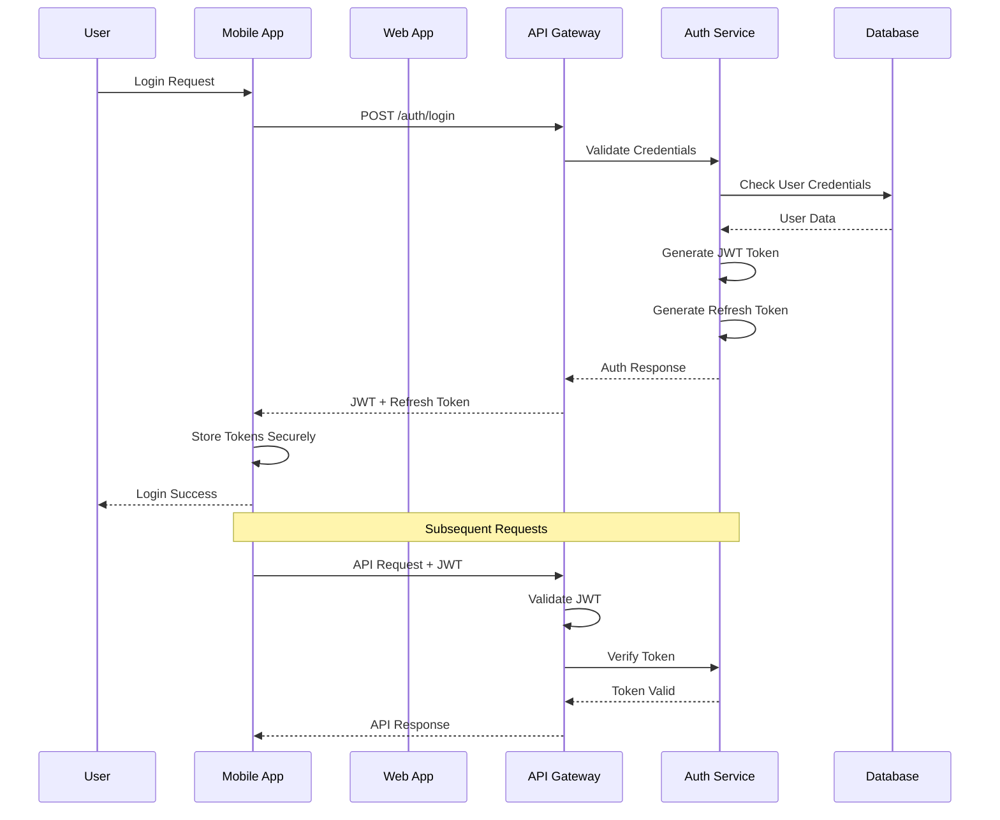
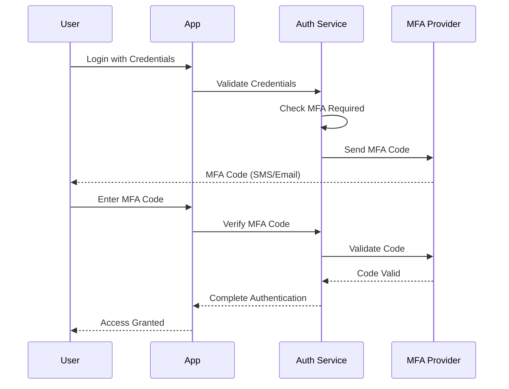

# Authentication and Authorization Model

## 1. Overview

Authentication và Authorization Model của RepeatWise được thiết kế để đảm bảo bảo mật truy cập vào hệ thống Spaced Repetition System. Model này tuân theo các best practices về bảo mật và tuân thủ các quy định về bảo vệ dữ liệu cá nhân.

## 2. Authentication Architecture

### 2.1 Authentication Flow



### 2.2 Multi-Factor Authentication (MFA)

#### 2.2.1 MFA Implementation
```json
{
  "mfa_config": {
    "enabled": true,
    "methods": [
      {
        "type": "sms",
        "enabled": true,
        "provider": "twilio"
      },
      {
        "type": "email",
        "enabled": true,
        "provider": "sendgrid"
      },
      {
        "type": "totp",
        "enabled": true,
        "algorithm": "SHA1",
        "digits": 6,
        "period": 30
      },
      {
        "type": "biometric",
        "enabled": true,
        "platform": "mobile_only"
      }
    ],
    "enforcement": {
      "required_for_admin": true,
      "required_for_sensitive_operations": true,
      "grace_period_days": 7
    }
  }
}
```

#### 2.2.2 MFA Flow


### 2.3 Password Policy

#### 2.3.1 Password Requirements
```json
{
  "password_policy": {
    "min_length": 8,
    "max_length": 128,
    "require_uppercase": true,
    "require_lowercase": true,
    "require_numbers": true,
    "require_special_chars": true,
    "forbidden_patterns": [
      "password",
      "123456",
      "qwerty",
      "admin"
    ],
    "history_count": 5,
    "max_age_days": 90,
    "lockout_policy": {
      "max_attempts": 5,
      "lockout_duration_minutes": 30,
      "reset_after_hours": 24
    }
  }
}
```

#### 2.3.2 Password Strength Validation
```java
public class PasswordValidator {
    private static final String PASSWORD_PATTERN = 
        "^(?=.*[0-9])(?=.*[a-z])(?=.*[A-Z])(?=.*[@#$%^&+=!])(?=\\S+$).{8,}$";
    
    public boolean isValidPassword(String password) {
        // Check length
        if (password.length() < 8 || password.length() > 128) {
            return false;
        }
        
        // Check pattern
        if (!password.matches(PASSWORD_PATTERN)) {
            return false;
        }
        
        // Check forbidden patterns
        String lowerPassword = password.toLowerCase();
        for (String forbidden : FORBIDDEN_PATTERNS) {
            if (lowerPassword.contains(forbidden)) {
                return false;
            }
        }
        
        return true;
    }
}
```

## 3. Token Management

### 3.1 JWT Token Structure

#### 3.1.1 Access Token
```json
{
  "header": {
    "alg": "RS256",
    "typ": "JWT"
  },
  "payload": {
    "sub": "user-uuid",
    "iss": "repeatwise-api",
    "aud": "repeatwise-app",
    "iat": 1640995200,
    "exp": 1640998800,
    "nbf": 1640995200,
    "jti": "token-uuid",
    "roles": ["STUDENT"],
    "permissions": [
      "read:own_sets",
      "write:own_sets",
      "read:own_profile"
    ],
    "mfa_verified": true,
    "device_id": "device-uuid"
  }
}
```

#### 3.1.2 Refresh Token
```json
{
  "header": {
    "alg": "HS256",
    "typ": "JWT"
  },
  "payload": {
    "sub": "user-uuid",
    "iss": "repeatwise-api",
    "aud": "repeatwise-app",
    "iat": 1640995200,
    "exp": 1641600000,
    "jti": "refresh-token-uuid",
    "token_type": "refresh",
    "device_id": "device-uuid",
    "fingerprint": "device-fingerprint"
  }
}
```

### 3.2 Token Security

#### 3.2.1 Token Storage
```java
// Mobile App - Secure Storage
public class SecureTokenStorage {
    private static final String ACCESS_TOKEN_KEY = "access_token";
    private static final String REFRESH_TOKEN_KEY = "refresh_token";
    
    public void storeTokens(String accessToken, String refreshToken) {
        // Use platform-specific secure storage
        // iOS: Keychain
        // Android: EncryptedSharedPreferences
        // Web: HttpOnly cookies
    }
    
    public String getAccessToken() {
        // Retrieve from secure storage
    }
    
    public void clearTokens() {
        // Remove from secure storage
    }
}
```

#### 3.2.2 Token Rotation
```java
public class TokenRotationService {
    public TokenResponse rotateTokens(String refreshToken) {
        // Validate refresh token
        if (!isValidRefreshToken(refreshToken)) {
            throw new InvalidTokenException();
        }
        
        // Generate new tokens
        String newAccessToken = generateAccessToken();
        String newRefreshToken = generateRefreshToken();
        
        // Invalidate old refresh token
        invalidateRefreshToken(refreshToken);
        
        // Store new refresh token
        storeRefreshToken(newRefreshToken);
        
        return new TokenResponse(newAccessToken, newRefreshToken);
    }
}
```

## 4. Authorization Model

### 4.1 Role-Based Access Control (RBAC)

#### 4.1.1 User Roles
```java
public enum UserRole {
    STUDENT("student", "Regular user learning with sets"),
    TEACHER("teacher", "User who can create and share sets"),
    ADMIN("admin", "System administrator with full access"),
    MODERATOR("moderator", "Content moderator with review access");
    
    private final String code;
    private final String description;
}
```

#### 4.1.2 Permissions
```java
public enum Permission {
    // User Management
    READ_OWN_PROFILE("read:own_profile"),
    UPDATE_OWN_PROFILE("update:own_profile"),
    DELETE_OWN_ACCOUNT("delete:own_account"),
    
    // Set Management
    CREATE_OWN_SETS("create:own_sets"),
    READ_OWN_SETS("read:own_sets"),
    UPDATE_OWN_SETS("update:own_sets"),
    DELETE_OWN_SETS("delete:own_sets"),
    
    // Learning Management
    START_LEARNING("start:learning"),
    COMPLETE_REVIEW("complete:review"),
    SKIP_REVIEW("skip:review"),
    
    // Analytics
    READ_OWN_STATISTICS("read:own_statistics"),
    EXPORT_OWN_DATA("export:own_data"),
    
    // Admin Permissions
    READ_ALL_USERS("read:all_users"),
    UPDATE_USER_ROLES("update:user_roles"),
    READ_SYSTEM_STATISTICS("read:system_statistics"),
    MANAGE_SYSTEM_CONFIG("manage:system_config");
}
```

#### 4.1.3 Role-Permission Mapping
```java
public class RolePermissionMapper {
    private static final Map<UserRole, Set<Permission>> ROLE_PERMISSIONS = Map.of(
        UserRole.STUDENT, Set.of(
            Permission.READ_OWN_PROFILE,
            Permission.UPDATE_OWN_PROFILE,
            Permission.DELETE_OWN_ACCOUNT,
            Permission.CREATE_OWN_SETS,
            Permission.READ_OWN_SETS,
            Permission.UPDATE_OWN_SETS,
            Permission.DELETE_OWN_SETS,
            Permission.START_LEARNING,
            Permission.COMPLETE_REVIEW,
            Permission.SKIP_REVIEW,
            Permission.READ_OWN_STATISTICS,
            Permission.EXPORT_OWN_DATA
        ),
        UserRole.TEACHER, Set.of(
            // All student permissions plus:
            Permission.SHARE_SETS,
            Permission.CREATE_PUBLIC_SETS,
            Permission.MANAGE_OWN_CONTENT
        ),
        UserRole.ADMIN, Set.of(
            // All permissions
            Permission.values()
        )
    );
}
```

### 4.2 Resource-Based Authorization

#### 4.2.1 Resource Ownership
```java
public class ResourceAuthorizationService {
    public boolean canAccessResource(String userId, String resourceId, Permission permission) {
        // Check if user has permission
        if (!hasPermission(userId, permission)) {
            return false;
        }
        
        // Check resource ownership
        if (isOwnResource(userId, resourceId)) {
            return true;
        }
        
        // Check public/shared resources
        if (isPublicResource(resourceId)) {
            return hasReadPermission(permission);
        }
        
        return false;
    }
    
    private boolean isOwnResource(String userId, String resourceId) {
        // Check if user owns the resource
        return resourceService.getOwnerId(resourceId).equals(userId);
    }
}
```

#### 4.2.2 API Authorization
```java
@RestController
public class SetController {
    
    @GetMapping("/api/sets/{setId}")
    @PreAuthorize("@resourceAuth.canAccessResource(#userId, #setId, 'read:own_sets')")
    public ResponseEntity<Set> getSet(@PathVariable String setId, 
                                     @AuthenticationPrincipal String userId) {
        Set set = setService.getSet(setId);
        return ResponseEntity.ok(set);
    }
    
    @PostMapping("/api/sets")
    @PreAuthorize("hasPermission('create:own_sets')")
    public ResponseEntity<Set> createSet(@RequestBody CreateSetRequest request,
                                        @AuthenticationPrincipal String userId) {
        Set set = setService.createSet(request, userId);
        return ResponseEntity.created(URI.create("/api/sets/" + set.getId())).body(set);
    }
}
```

## 5. Session Management

### 5.1 Session Configuration
```yaml
session:
  timeout:
    access_token_minutes: 60
    refresh_token_days: 7
    session_timeout_minutes: 480
  security:
    concurrent_sessions_max: 3
    force_logout_on_password_change: true
    require_mfa_for_sensitive_operations: true
  storage:
    type: "redis"
    encryption: true
    ttl_seconds: 28800
```

### 5.2 Session Tracking
```java
public class SessionManager {
    public void createSession(String userId, String deviceId, String userAgent) {
        Session session = Session.builder()
            .userId(userId)
            .deviceId(deviceId)
            .userAgent(userAgent)
            .ipAddress(getClientIp())
            .createdAt(Instant.now())
            .lastActivity(Instant.now())
            .build();
        
        sessionRepository.save(session);
    }
    
    public void updateLastActivity(String sessionId) {
        sessionRepository.updateLastActivity(sessionId, Instant.now());
    }
    
    public void invalidateSession(String sessionId) {
        sessionRepository.deleteById(sessionId);
    }
    
    public void invalidateAllUserSessions(String userId) {
        sessionRepository.deleteByUserId(userId);
    }
}
```

## 6. Security Headers and Configuration

### 6.1 Security Headers
```java
@Configuration
public class SecurityHeadersConfig {
    
    @Bean
    public SecurityFilterChain filterChain(HttpSecurity http) throws Exception {
        http.headers()
            .frameOptions().deny()
            .contentTypeOptions()
            .and()
            .httpStrictTransportSecurity()
            .and()
            .contentSecurityPolicy("default-src 'self'; script-src 'self' 'unsafe-inline'")
            .and()
            .referrerPolicy(ReferrerPolicyHeaderWriter.ReferrerPolicy.STRICT_ORIGIN_WHEN_CROSS_ORIGIN)
            .and()
            .permissionsPolicy(permissionsPolicyConfig -> permissionsPolicyConfig
                .policy("camera=(), microphone=(), geolocation=()"));
        
        return http.build();
    }
}
```

### 6.2 CORS Configuration
```java
@Configuration
public class CorsConfig {
    
    @Bean
    public CorsConfigurationSource corsConfigurationSource() {
        CorsConfiguration configuration = new CorsConfiguration();
        configuration.setAllowedOrigins(Arrays.asList(
            "https://app.repeatwise.com",
            "https://web.repeatwise.com"
        ));
        configuration.setAllowedMethods(Arrays.asList("GET", "POST", "PUT", "DELETE", "OPTIONS"));
        configuration.setAllowedHeaders(Arrays.asList("*"));
        configuration.setAllowCredentials(true);
        configuration.setMaxAge(3600L);
        
        UrlBasedCorsConfigurationSource source = new UrlBasedCorsConfigurationSource();
        source.registerCorsConfiguration("/**", configuration);
        return source;
    }
}
```

## 7. Rate Limiting

### 7.1 Rate Limiting Configuration
```yaml
rate_limiting:
  authentication:
    login_attempts_per_minute: 5
    mfa_attempts_per_minute: 3
    password_reset_per_hour: 3
  api:
    requests_per_minute: 100
    burst_limit: 200
    user_specific_limit: 1000
  endpoints:
    /api/auth/login:
      requests_per_minute: 5
    /api/auth/register:
      requests_per_hour: 10
    /api/sets:
      requests_per_minute: 60
```

### 7.2 Rate Limiting Implementation
```java
@Component
public class RateLimitingService {
    
    private final RedisTemplate<String, String> redisTemplate;
    
    public boolean isAllowed(String key, int maxRequests, Duration window) {
        String script = """
            local current = redis.call('incr', KEYS[1])
            if current == 1 then
                redis.call('expire', KEYS[1], ARGV[1])
            end
            return current <= tonumber(ARGV[2])
            """;
        
        List<String> keys = List.of(key);
        List<String> args = List.of(
            String.valueOf(window.getSeconds()),
            String.valueOf(maxRequests)
        );
        
        Long result = redisTemplate.execute(
            new DefaultRedisScript<>(script, Long.class),
            keys,
            args.toArray()
        );
        
        return result != null && result == 1;
    }
}
```

## 8. Audit and Monitoring

### 8.1 Authentication Events
```java
public enum AuthEventType {
    LOGIN_SUCCESS,
    LOGIN_FAILURE,
    LOGOUT,
    PASSWORD_CHANGE,
    PASSWORD_RESET,
    MFA_ENABLED,
    MFA_DISABLED,
    MFA_VERIFICATION_SUCCESS,
    MFA_VERIFICATION_FAILURE,
    SESSION_CREATED,
    SESSION_EXPIRED,
    SESSION_INVALIDATED,
    ACCOUNT_LOCKED,
    ACCOUNT_UNLOCKED
}
```

### 8.2 Audit Logging
```java
@Component
public class AuthAuditService {
    
    public void logAuthEvent(AuthEventType eventType, String userId, 
                           String ipAddress, String userAgent, 
                           Map<String, Object> details) {
        AuthAuditLog log = AuthAuditLog.builder()
            .eventType(eventType)
            .userId(userId)
            .ipAddress(ipAddress)
            .userAgent(userAgent)
            .timestamp(Instant.now())
            .details(details)
            .build();
        
        auditLogRepository.save(log);
    }
}
```

## 9. Compliance and Privacy

### 9.1 GDPR Compliance
```java
public class PrivacyService {
    
    public void handleDataSubjectRequest(String userId, DataSubjectRequestType type) {
        switch (type) {
            case ACCESS:
                generateDataExport(userId);
                break;
            case RECTIFICATION:
                // Allow user to update their data
                break;
            case ERASURE:
                anonymizeUserData(userId);
                break;
            case PORTABILITY:
                exportUserData(userId);
                break;
        }
    }
    
    private void anonymizeUserData(String userId) {
        // Anonymize personal data but keep learning progress
        userService.anonymizeUser(userId);
        setService.anonymizeUserSets(userId);
        reviewHistoryService.anonymizeUserReviews(userId);
    }
}
```

### 9.2 Data Retention
```java
@Component
public class DataRetentionService {
    
    @Scheduled(cron = "0 0 2 * * *") // Daily at 2 AM
    public void cleanupExpiredData() {
        // Remove expired sessions
        sessionRepository.deleteExpiredSessions();
        
        // Archive old audit logs
        auditLogRepository.archiveOldLogs();
        
        // Clean up expired tokens
        tokenRepository.deleteExpiredTokens();
    }
}
```

## 10. Security Testing

### 10.1 Authentication Testing
```java
@SpringBootTest
class AuthenticationSecurityTest {
    
    @Test
    void shouldPreventBruteForceAttack() {
        // Attempt multiple failed logins
        for (int i = 0; i < 6; i++) {
            loginAttempt("user@example.com", "wrongpassword");
        }
        
        // Verify account is locked
        assertThat(accountService.isLocked("user@example.com")).isTrue();
    }
    
    @Test
    void shouldEnforcePasswordPolicy() {
        // Test weak password
        assertThat(passwordValidator.isValid("123456")).isFalse();
        
        // Test strong password
        assertThat(passwordValidator.isValid("StrongP@ss123")).isTrue();
    }
    
    @Test
    void shouldRequireMFAForSensitiveOperations() {
        // Login without MFA
        String token = loginWithoutMFA("user@example.com", "password");
        
        // Attempt sensitive operation
        assertThat(performSensitiveOperation(token)).isForbidden();
    }
}
```

### 10.2 Authorization Testing
```java
@SpringBootTest
class AuthorizationSecurityTest {
    
    @Test
    void shouldPreventUnauthorizedAccess() {
        String userToken = loginAsUser("user@example.com", "password");
        String adminToken = loginAsAdmin("admin@repeatwise.com", "password");
        
        // User should not access admin endpoints
        assertThat(accessAdminEndpoint(userToken)).isForbidden();
        
        // Admin should access admin endpoints
        assertThat(accessAdminEndpoint(adminToken)).isOk();
    }
    
    @Test
    void shouldEnforceResourceOwnership() {
        String user1Token = loginAsUser("user1@example.com", "password");
        String user2Token = loginAsUser("user2@example.com", "password");
        
        // Create set for user1
        String setId = createSet(user1Token, "My Set");
        
        // User2 should not access user1's set
        assertThat(accessSet(user2Token, setId)).isForbidden();
    }
}
``` 
