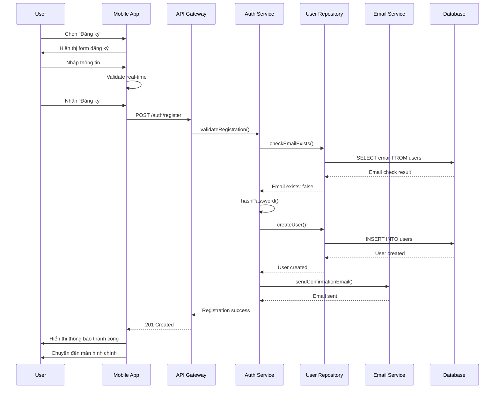
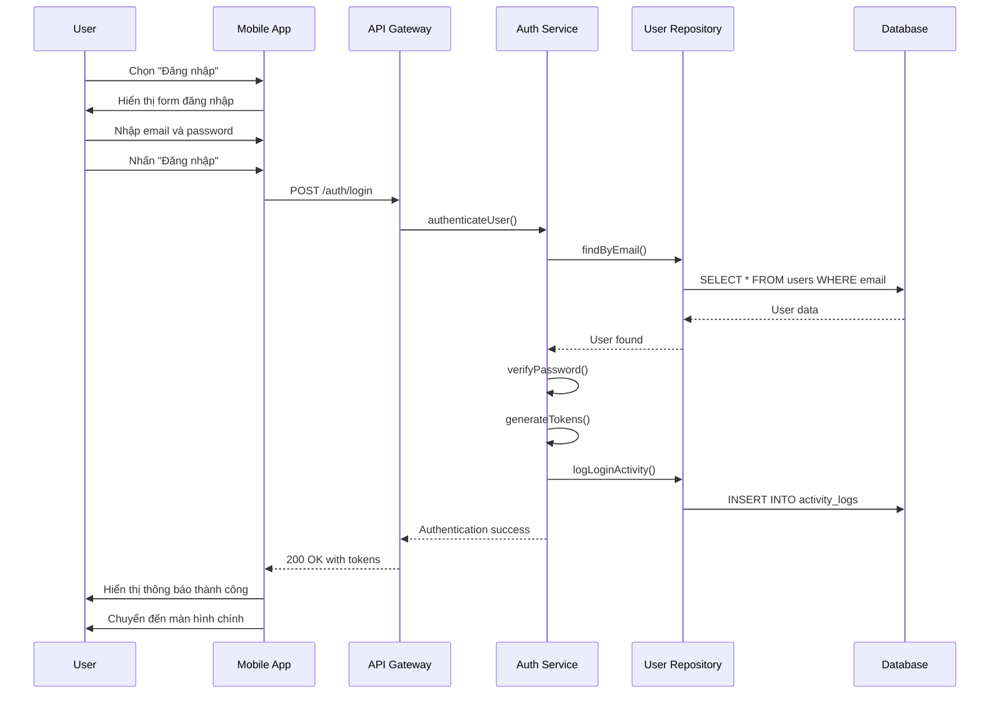
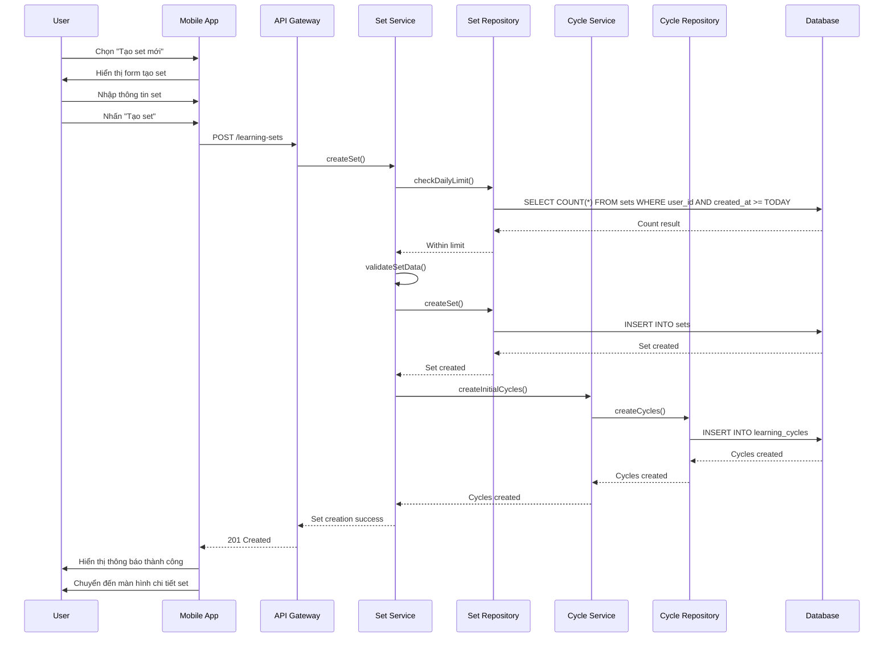
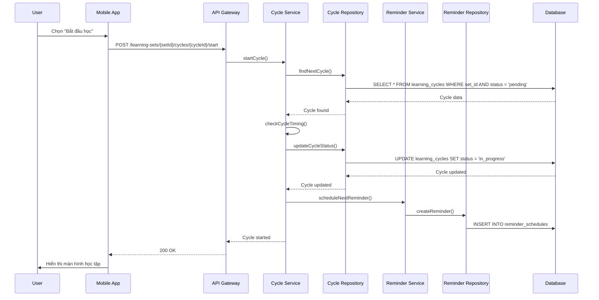

# Use Cases - RepeatWise

## 1. Overview

Use Cases mô tả chi tiết các luồng xử lý chính, luồng thay thế, sequence diagrams và business rules cho từng tính năng của RepeatWise. Tài liệu này cung cấp thông tin đầy đủ để developer implement logic và QA test các scenarios.

## 2. User Authentication Use Cases

### 2.1 UC-001: User Registration

#### 2.1.1 Main Flow
```
1. User mở app và chọn "Đăng ký"
2. System hiển thị form đăng ký
3. User nhập thông tin:
   - Email address
   - Password (8-20 ký tự)
   - Confirm password
   - Họ tên đầy đủ
   - Ngôn ngữ ưa thích (VI/EN)
   - Timezone
   - Thời gian nhắc nhở mặc định
4. System validate real-time input
5. User nhấn "Đăng ký"
6. System validate tất cả thông tin
7. System kiểm tra email không trùng lặp
8. System tạo user account với UUID
9. System hash password với BCrypt
10. System set status = 'active'
11. System tạo email xác nhận
12. System gửi email qua Email Service
13. System hiển thị thông báo thành công
14. System chuyển user đến màn hình chính
15. System tạo welcome tour cho user mới
```

#### 2.1.2 Alternative Flows

**A1: Email Already Exists**
```
1. System hiển thị thông báo lỗi: "Email đã được sử dụng"
2. System highlight trường email
3. User có thể:
   - Nhập email khác
   - Chọn "Đăng nhập" nếu đã có tài khoản
4. Return to Step 3
```

**A2: Password Validation Failed**
```
1. System hiển thị yêu cầu password:
   - Tối thiểu 8 ký tự
   - Tối đa 20 ký tự
   - Có ít nhất 1 chữ hoa
   - Có ít nhất 1 chữ thường
   - Có ít nhất 1 số
2. System highlight trường password
3. User nhập password mới
4. Return to Step 3
```

**A3: Network Connection Error**
```
1. System hiển thị thông báo lỗi kết nối
2. System lưu draft form data locally
3. User có thể:
   - Thử lại khi có kết nối
   - Lưu form để đăng ký sau
4. Return to Step 1
```

#### 2.1.3 Sequence Diagram


#### 2.1.4 Business Rules
- **BR-020**: Email phải unique và valid format
- **BR-021**: Password phải được hash với BCrypt (cost=12)
- **BR-015**: User ID sử dụng UUID format
- **BR-016**: Bắt buộc có created_at, updated_at

### 2.2 UC-002: User Login

#### 2.2.1 Main Flow
```
1. User mở app và chọn "Đăng nhập"
2. System hiển thị form đăng nhập
3. User nhập thông tin:
   - Email address
   - Password
4. System validate input format
5. User nhấn "Đăng nhập"
6. System validate credentials
7. System hash input password
8. System so sánh với stored hash
9. System tạo JWT access token
10. System tạo refresh token
11. System set token expiry (1 hour)
12. System log login activity
13. System hiển thị thông báo thành công
14. System chuyển user đến màn hình chính
15. System lưu tokens locally
```

#### 2.2.2 Alternative Flows

**A1: Invalid Credentials**
```
1. System hiển thị thông báo lỗi: "Email hoặc mật khẩu không đúng"
2. System highlight trường email và password
3. User có thể:
   - Nhập lại thông tin
   - Chọn "Quên mật khẩu"
4. Return to Step 3
```

**A2: Account Locked**
```
1. System hiển thị thông báo: "Tài khoản đã bị khóa"
2. System hiển thị thời gian unlock
3. User có thể liên hệ support
4. End flow
```

#### 2.2.3 Sequence Diagram


## 3. Learning Set Management Use Cases

### 3.1 UC-005: Create Learning Set

#### 3.1.1 Main Flow
```
1. User chọn "Tạo set mới"
2. System hiển thị form tạo set
3. User nhập thông tin:
   - Tên set (bắt buộc, ≤ 100 ký tự)
   - Mô tả (tùy chọn, ≤ 500 ký tự)
   - Danh mục (vocabulary, grammar, mixed, other)
4. System validate input real-time
5. User nhấn "Tạo set"
6. System validate tất cả thông tin
7. System kiểm tra giới hạn set/ngày
8. System tạo set với UUID
9. System set status = 'not_started'
10. System set current_cycle = 1
11. System tạo 5 learning cycles
12. System lưu set vào database
13. System log activity
14. System hiển thị thông báo thành công
15. System chuyển đến màn hình chi tiết set
```

#### 3.1.2 Alternative Flows

**A1: Daily Limit Exceeded**
```
1. System hiển thị thông báo: "Đã đạt giới hạn tạo set trong ngày"
2. System hiển thị số set đã tạo hôm nay
3. User có thể:
   - Chờ đến ngày mai
   - Xóa set cũ để tạo set mới
4. End flow
```

**A2: Invalid Set Name**
```
1. System hiển thị thông báo lỗi: "Tên set không hợp lệ"
2. System hiển thị yêu cầu:
   - Tên không được trống
   - Tên không quá 100 ký tự
3. System highlight trường tên
4. User nhập tên mới
5. Return to Step 3
```

#### 3.1.3 Sequence Diagram


#### 3.1.4 Business Rules
- **BR-001**: Set name không được trống, ≤ 100 ký tự
- **BR-002**: Set description ≤ 500 ký tự
- **BR-003**: User chỉ được tạo tối đa 5 set/ngày
- **BR-006**: Mỗi set có 5 learning cycles

### 3.2 UC-006: Edit Set Information

#### 3.2.1 Main Flow
```
1. User chọn set từ danh sách
2. System hiển thị chi tiết set
3. User chọn "Chỉnh sửa"
4. System hiển thị form chỉnh sửa
5. User chỉnh sửa thông tin:
   - Tên set
   - Mô tả
   - Trạng thái (active, paused, completed)
6. System validate input real-time
7. User nhấn "Lưu"
8. System validate tất cả thông tin
9. System kiểm tra quyền truy cập
10. System cập nhật set trong database
11. System log activity
12. System hiển thị thông báo thành công
13. System chuyển về màn hình chi tiết set
```

#### 3.2.2 Alternative Flows

**A1: Access Denied**
```
1. System hiển thị thông báo: "Không có quyền chỉnh sửa set này"
2. System chuyển về màn hình danh sách set
3. End flow
```

**A2: Set Not Found**
```
1. System hiển thị thông báo: "Set không tồn tại"
2. System chuyển về màn hình danh sách set
3. End flow
```

#### 3.2.3 Business Rules
- **BR-004**: User chỉ có thể chỉnh sửa set của mình
- **BR-005**: Set status chỉ có thể chuyển theo quy tắc nhất định

### 3.3 UC-007: Delete Set

#### 3.3.1 Main Flow
```
1. User chọn set từ danh sách
2. System hiển thị chi tiết set
3. User chọn "Xóa set"
4. System hiển thị dialog xác nhận
5. User xác nhận xóa
6. System kiểm tra quyền truy cập
7. System xóa tất cả dữ liệu liên quan:
   - Set items
   - Learning cycles
   - Review histories
   - Reminder schedules
8. System xóa set
9. System log activity
10. System hiển thị thông báo thành công
11. System chuyển về màn hình danh sách set
```

#### 3.3.2 Alternative Flows

**A1: User Cancels Deletion**
```
1. User chọn "Hủy" trong dialog xác nhận
2. System đóng dialog
3. System chuyển về màn hình chi tiết set
4. End flow
```

**A2: Set Has Active Cycles**
```
1. System hiển thị cảnh báo: "Set đang có chu kỳ học tập đang hoạt động"
2. System hỏi user có muốn xóa không
3. User có thể:
   - Xác nhận xóa (xóa tất cả)
   - Hủy xóa
4. Return to Step 5 hoặc End flow
```

#### 3.3.3 Business Rules
- **BR-004**: User chỉ có thể xóa set của mình
- **BR-008**: Xóa set sẽ xóa tất cả dữ liệu liên quan

## 4. Learning Cycle Use Cases

### 4.1 UC-010: Start Learning Cycle

#### 4.1.1 Main Flow
```
1. User chọn set từ danh sách
2. System hiển thị chi tiết set
3. User chọn "Bắt đầu học"
4. System kiểm tra set có cycles chưa
5. System tìm cycle tiếp theo cần học
6. System kiểm tra thời gian có phù hợp không
7. System cập nhật cycle status = 'in_progress'
8. System tạo reminder cho cycle tiếp theo
9. System hiển thị màn hình học tập
10. System bắt đầu timer
11. System log activity
```

#### 4.1.2 Alternative Flows

**A1: No Cycles Available**
```
1. System hiển thị thông báo: "Set chưa có chu kỳ học tập"
2. System chuyển về màn hình chi tiết set
3. End flow
```

**A2: Cycle Not Ready**
```
1. System hiển thị thông báo: "Chu kỳ học tập chưa đến thời gian"
2. System hiển thị thời gian còn lại
3. User có thể:
   - Chờ đến thời gian
   - Chọn "Học sớm"
4. Return to Step 7 hoặc End flow
```

#### 4.1.3 Sequence Diagram


### 4.2 UC-011: Perform Review

#### 4.2.1 Main Flow
```
1. User đang trong màn hình học tập
2. System hiển thị câu hỏi từ set
3. User trả lời câu hỏi
4. System validate câu trả lời
5. System tính điểm (0-100)
6. System cập nhật review history
7. System cập nhật cycle statistics
8. System kiểm tra có còn câu hỏi không
9. Nếu còn: Return to Step 2
10. Nếu hết: System tính điểm trung bình
11. System cập nhật cycle status
12. System log activity
13. System hiển thị kết quả
```

#### 4.2.2 Alternative Flows

**A1: User Skips Question**
```
1. User chọn "Bỏ qua"
2. System hiển thị dialog xác nhận
3. User chọn lý do bỏ qua:
   - Quên
   - Bận
   - Khác
4. System ghi nhận skip
5. System cập nhật review history
6. Return to Step 8
```

**A2: Timeout**
```
1. System hiển thị thông báo: "Hết thời gian"
2. System tự động submit câu trả lời hiện tại
3. System tính điểm dựa trên câu trả lời
4. Return to Step 6
```

#### 4.2.3 Business Rules
- **BR-009**: Điểm số từ 0-100
- **BR-007**: Bỏ qua phải có lý do
- **BR-004**: Mỗi cycle có tối đa 5 reviews

### 4.3 UC-012: Complete Review Session

#### 4.3.1 Main Flow
```
1. User hoàn thành tất cả câu hỏi
2. System tính điểm trung bình
3. System cập nhật cycle status = 'completed'
4. System cập nhật set statistics
5. System tính toán cycle tiếp theo
6. System tạo reminder cho cycle tiếp theo
7. System hiển thị kết quả chi tiết
8. System hiển thị thông báo chúc mừng
9. System log activity
10. System chuyển về màn hình chi tiết set
```

#### 4.3.2 Alternative Flows

**A1: Low Score**
```
1. System hiển thị thông báo: "Điểm số thấp, cần ôn tập thêm"
2. System đề xuất học lại
3. User có thể:
   - Học lại ngay
   - Học sau
4. Return to Step 6 hoặc End flow
```

**A2: Perfect Score**
```
1. System hiển thị thông báo: "Xuất sắc! Điểm hoàn hảo"
2. System tăng độ khó cho cycle tiếp theo
3. System cập nhật learning preferences
4. Return to Step 6
```

#### 4.3.3 Business Rules
- **BR-005**: Cycle delay dựa trên điểm số và word count
- **BR-006**: Mỗi set có tối đa 5 cycles
- **BR-010**: Reminder limit tối đa 3/ngày

## 5. Reminder Management Use Cases

### 5.1 UC-016: Reschedule Reminder

#### 5.1.1 Main Flow
```
1. User chọn reminder từ danh sách
2. System hiển thị chi tiết reminder
3. User chọn "Lên lịch lại"
4. System hiển thị form lên lịch
5. User chọn thời gian mới
6. System validate thời gian
7. System kiểm tra giới hạn reminder/ngày
8. System cập nhật reminder schedule
9. System log activity
10. System hiển thị thông báo thành công
11. System chuyển về màn hình danh sách reminder
```

#### 5.1.2 Alternative Flows

**A1: Invalid Time**
```
1. System hiển thị thông báo: "Thời gian không hợp lệ"
2. System hiển thị yêu cầu:
   - Thời gian phải trong tương lai
   - Không được trùng với reminder khác
3. User chọn thời gian mới
4. Return to Step 6
```

**A2: Daily Limit Exceeded**
```
1. System hiển thị thông báo: "Đã đạt giới hạn reminder trong ngày"
2. System hiển thị số reminder đã có
3. User có thể:
   - Chọn ngày khác
   - Hủy lên lịch
4. Return to Step 5 hoặc End flow
```

#### 5.1.3 Business Rules
- **BR-010**: Tối đa 3 reminders/ngày
- **BR-011**: Reminder phải trong tương lai
- **BR-012**: Không được trùng thời gian

## 6. Statistics Use Cases

### 6.1 UC-019: View Learning Statistics

#### 6.1.1 Main Flow
```
1. User chọn "Thống kê" từ menu
2. System hiển thị màn hình thống kê
3. User chọn khoảng thời gian (week, month, year, all)
4. System tính toán thống kê:
   - Tổng số set
   - Set đang hoạt động
   - Set đã hoàn thành
   - Tổng số cycle
   - Cycle đã hoàn thành
   - Điểm trung bình
   - Chuỗi học tập
5. System hiển thị thống kê dạng biểu đồ
6. System hiển thị thống kê chi tiết
7. User có thể xem thống kê theo set
8. System log activity
```

#### 6.1.2 Alternative Flows

**A1: No Data Available**
```
1. System hiển thị thông báo: "Chưa có dữ liệu thống kê"
2. System hiển thị gợi ý tạo set mới
3. User có thể:
   - Tạo set mới
   - Quay lại màn hình chính
4. End flow
```

**A2: Invalid Time Period**
```
1. System hiển thị thông báo: "Khoảng thời gian không hợp lệ"
2. System reset về khoảng thời gian mặc định
3. Return to Step 4
```

#### 6.1.3 Business Rules
- **BR-013**: Thống kê chỉ hiển thị dữ liệu của user
- **BR-014**: Thống kê được cache để tối ưu hiệu suất

## 7. Data Management Use Cases

### 7.1 UC-018: Export Learning Data

#### 7.1.1 Main Flow
```
1. User chọn "Xuất dữ liệu" từ menu
2. System hiển thị form xuất dữ liệu
3. User chọn loại dữ liệu:
   - Tất cả dữ liệu
   - Chỉ set học tập
   - Chỉ thống kê
4. User chọn định dạng:
   - JSON
   - CSV
   - Excel
   - PDF
5. User nhấn "Xuất dữ liệu"
6. System validate lựa chọn
7. System tạo file export
8. System nén file (nếu cần)
9. System lưu file vào storage
10. System gửi link download qua email
11. System hiển thị thông báo thành công
12. System log activity
```

#### 7.1.2 Alternative Flows

**A1: Large Data Volume**
```
1. System hiển thị thông báo: "Dữ liệu lớn, sẽ xử lý trong background"
2. System tạo background job
3. System gửi email khi hoàn thành
4. User có thể:
   - Chờ email thông báo
   - Quay lại màn hình chính
5. End flow
```

**A2: Export Failed**
```
1. System hiển thị thông báo: "Xuất dữ liệu thất bại"
2. System hiển thị lý do lỗi
3. User có thể:
   - Thử lại
   - Liên hệ support
4. Return to Step 5 hoặc End flow
```

#### 7.1.3 Business Rules
- **BR-015**: Export chỉ bao gồm dữ liệu của user
- **BR-016**: File export có thời hạn 7 ngày
- **BR-017**: Export lớn được xử lý background

### 7.2 UC-022: Import Learning Data

#### 7.2.1 Main Flow
```
1. User chọn "Nhập dữ liệu" từ menu
2. System hiển thị form nhập dữ liệu
3. User chọn file để upload
4. System validate file format
5. System parse file content
6. System validate data structure
7. System kiểm tra conflicts
8. System hiển thị preview dữ liệu
9. User xác nhận import
10. System import dữ liệu vào database
11. System tạo activity logs
12. System hiển thị thông báo thành công
13. System chuyển về màn hình danh sách set
```

#### 7.2.2 Alternative Flows

**A1: Invalid File Format**
```
1. System hiển thị thông báo: "Định dạng file không hỗ trợ"
2. System hiển thị định dạng được hỗ trợ
3. User có thể:
   - Chọn file khác
   - Chuyển đổi định dạng
4. Return to Step 3
```

**A2: Data Conflicts**
```
1. System hiển thị danh sách conflicts
2. System hỏi user cách xử lý:
   - Ghi đè
   - Bỏ qua
   - Đổi tên
3. User chọn cách xử lý
4. System xử lý conflicts
5. Return to Step 10
```

#### 7.2.3 Business Rules
- **BR-018**: Import chỉ chấp nhận file hợp lệ
- **BR-019**: Conflicts phải được xử lý trước khi import
- **BR-020**: Import tạo backup trước khi thay đổi

## 8. Cross-Cutting Concerns

### 8.1 Error Handling
- **Validation Errors**: Hiển thị lỗi cụ thể cho từng trường
- **Business Rule Violations**: Hiển thị lỗi business logic
- **System Errors**: Hiển thị thông báo lỗi chung
- **Network Errors**: Hiển thị thông báo kết nối

### 8.2 Logging and Auditing
- **User Actions**: Log tất cả actions của user
- **Data Changes**: Log tất cả thay đổi dữ liệu
- **System Events**: Log các sự kiện hệ thống
- **Error Events**: Log tất cả lỗi và exceptions

### 8.3 Performance Considerations
- **Caching**: Cache dữ liệu thường xuyên truy cập
- **Pagination**: Sử dụng pagination cho danh sách lớn
- **Background Jobs**: Xử lý tasks nặng trong background
- **Database Optimization**: Tối ưu queries và indexes

---

**Document Version**: 1.0  
**Last Updated**: 2024-12-19  
**Next Review**: 2024-12-26  
**Owner**: Business Analyst  
**Stakeholders**: Development Team, QA Team, Product Owner
