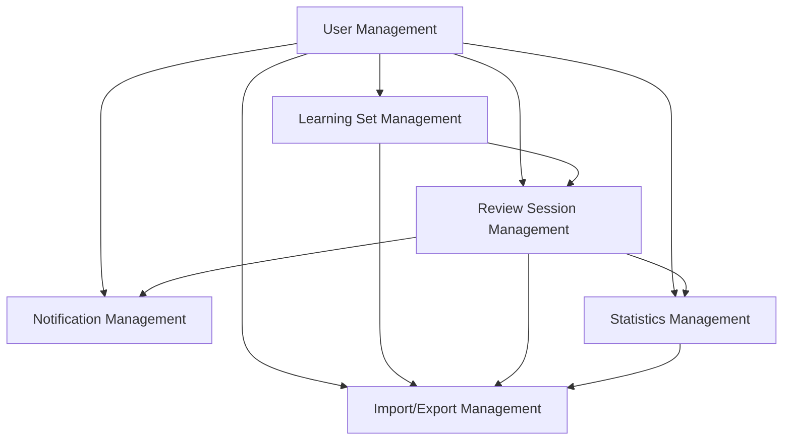

# Module Detail Designs - RepeatWise

## 1. Tổng quan

Module Detail Designs cung cấp thông tin chi tiết về implementation cho từng module chính của hệ thống RepeatWise. Mỗi module được thiết kế để xử lý một nhóm chức năng cụ thể và có thể được phát triển độc lập.

## 2. Danh sách Modules

### 2.1 Core Modules

#### [User Management Module](./user-management-detail-design.md)
**Mục đích**: Quản lý người dùng và xác thực
- **Chức năng chính**: Đăng ký, đăng nhập, quản lý profile, reset password
- **API Endpoints**: 15+ endpoints cho authentication và profile management
- **Database Tables**: users, user_preferences, notification_preferences
- **Dependencies**: Email Service, JWT Service, BCrypt
- **Status**: ✅ Hoàn thành

#### [Learning Set Management Module](./learning-set-detail-design.md)
**Mục đích**: Quản lý bộ học tập và nội dung
- **Chức năng chính**: CRUD operations cho learning sets, quản lý set items
- **API Endpoints**: 12+ endpoints cho set management
- **Database Tables**: learning_sets, set_items, user_learning_sets
- **Dependencies**: File Storage Service, User Service
- **Status**: ✅ Hoàn thành

#### [Review Session Management Module](./review-session-detail-design.md)
**Mục đích**: Xử lý chu kỳ học tập và ôn tập
- **Chức năng chính**: SRS algorithm, review sessions, progress tracking
- **API Endpoints**: 10+ endpoints cho session management
- **Database Tables**: learning_cycles, review_sessions, review_items, item_progress
- **Dependencies**: SRS Algorithm, Notification Service
- **Status**: ✅ Hoàn thành

### 2.2 Support Modules

#### [Notification Management Module](./notification-detail-design.md)
**Mục đích**: Quản lý thông báo và nhắc nhở
- **Chức năng chính**: Email/push notifications, reminder scheduling
- **API Endpoints**: 8+ endpoints cho notification management
- **Database Tables**: notification_preferences, reminder_schedules, notifications
- **Dependencies**: Email Service, Push Notification Service, Scheduler
- **Status**: ✅ Hoàn thành

#### [Statistics Management Module](./statistics-detail-design.md)
**Mục đích**: Thống kê và phân tích dữ liệu học tập
- **Chức năng chính**: Dashboard metrics, progress analytics, achievements
- **API Endpoints**: 6+ endpoints cho statistics và analytics
- **Database Tables**: learning_statistics, user_achievements, achievements, progress_snapshots
- **Dependencies**: Analytics Service, Reporting Service
- **Status**: ✅ Hoàn thành

#### [Import/Export Management Module](./import-export-detail-design.md)
**Mục đích**: Nhập xuất dữ liệu và backup
- **Chức năng chính**: Data import/export, backup/restore, file management
- **API Endpoints**: 8+ endpoints cho import/export operations
- **Database Tables**: export_jobs, import_jobs, backup_history
- **Dependencies**: File Storage Service, Email Service
- **Status**: ✅ Hoàn thành

## 3. Kiến trúc Module

### 3.1 Module Dependencies


### 3.2 Data Flow
1. **User Management** → Tạo và quản lý user accounts
2. **Learning Set Management** → Tạo và quản lý learning sets
3. **Review Session Management** → Thực hiện review sessions
4. **Notification Management** → Gửi reminders và notifications
5. **Statistics Management** → Thu thập và tính toán statistics
6. **Import/Export Management** → Backup và restore data

## 4. Implementation Guidelines

### 4.1 Development Order
1. **User Management** (Foundation)
2. **Learning Set Management** (Core functionality)
3. **Review Session Management** (Main feature)
4. **Notification Management** (Support feature)
5. **Statistics Management** (Analytics)
6. **Import/Export Management** (Data management)

### 4.2 Testing Strategy
- **Unit Tests**: Mỗi module có test coverage > 80%
- **Integration Tests**: Test inter-module communication
- **API Tests**: Test tất cả endpoints
- **Performance Tests**: Test với large datasets

### 4.3 Security Considerations
- **Authentication**: JWT tokens cho tất cả API calls
- **Authorization**: Role-based access control
- **Data Validation**: Input validation cho tất cả endpoints
- **Rate Limiting**: Implement rate limiting cho tất cả APIs

## 5. API Standards

### 5.1 Common Response Format
```json
{
  "success": true|false,
  "message": "Human readable message",
  "data": { ... },
  "error": {
    "code": "ERROR_CODE",
    "message": "Error message",
    "details": [ ... ]
  }
}
```

### 5.2 Pagination Format
```json
{
  "content": [ ... ],
  "pagination": {
    "page": 1,
    "size": 20,
    "totalElements": 100,
    "totalPages": 5,
    "hasNext": true,
    "hasPrevious": false
  }
}
```

### 5.3 Error Handling
- **4xx**: Client errors (validation, authorization)
- **5xx**: Server errors (internal, external service)
- **Standardized error codes**: MODULE_XXX format

## 6. Database Design

### 6.1 Common Patterns
- **UUID Primary Keys**: Tất cả entities sử dụng UUID
- **Audit Fields**: createdAt, updatedAt cho tất cả tables
- **Soft Delete**: Sử dụng status field thay vì hard delete
- **Versioning**: Optimistic locking với @Version

### 6.2 Naming Conventions
- **Tables**: snake_case (users, learning_sets)
- **Columns**: snake_case (user_id, created_at)
- **Indexes**: idx_tablename_columnname
- **Foreign Keys**: fk_tablename_referencedtable

## 7. Performance Considerations

### 7.1 Database Optimization
- **Indexes**: Strategic indexing cho frequently queried columns
- **Partitioning**: Large tables được partition theo date
- **Connection Pooling**: Efficient database connection management

### 7.2 Caching Strategy
- **Redis**: Cache frequently accessed data
- **Application Cache**: In-memory caching cho static data
- **CDN**: Static content delivery

### 7.3 Async Processing
- **Background Jobs**: Long-running operations
- **Message Queues**: Inter-module communication
- **Event-driven**: Loose coupling between modules

## 8. Monitoring và Observability

### 8.1 Logging
- **Structured Logging**: JSON format với correlation IDs
- **Log Levels**: ERROR, WARN, INFO, DEBUG
- **Sensitive Data**: Never log passwords, tokens, PII

### 8.2 Metrics
- **Business Metrics**: User registrations, learning sessions
- **Technical Metrics**: Response times, error rates
- **Infrastructure Metrics**: CPU, memory, disk usage

### 8.3 Alerts
- **Error Rate**: > 5% error rate
- **Response Time**: > 2 seconds average
- **Resource Usage**: > 80% CPU/memory

## 9. Deployment Strategy

### 9.1 Environment Setup
- **Development**: Local development với Docker
- **Staging**: Production-like environment
- **Production**: High availability setup

### 9.2 CI/CD Pipeline
- **Build**: Automated build và testing
- **Deploy**: Blue-green deployment
- **Rollback**: Automated rollback capability

## 10. Maintenance và Updates

### 10.1 Version Control
- **API Versioning**: /api/v1/ format
- **Database Migrations**: Versioned schema changes
- **Backward Compatibility**: Maintain compatibility for 2 versions

### 10.2 Documentation
- **API Documentation**: OpenAPI/Swagger specs
- **Code Documentation**: Javadoc cho Java code
- **Architecture Documentation**: Updated với mỗi major change

---

**Document Version**: 1.0  
**Last Updated**: 2024-12-19  
**Next Review**: 2024-12-26  
**Owner**: Technical Lead  
**Stakeholders**: Development Team, QA Team, DevOps Team, Product Team
